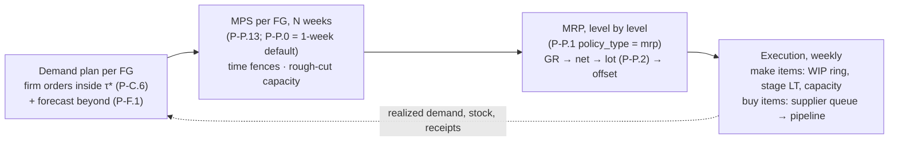

# Dependent-demand planning: MPS → MRP → multi-stage execution

| | |
|---|---|
| **Status** | Proposed design and work plan (v0.1). Adopted into the blueprint as gap **G20** and workstream **B2**. No engine code changes yet. |
| **Date** | 2026-10-02 |
| **Serves** | Blueprint **G20** (new). It touches G1 (what the user configures is what runs), G11 (a demand-side event class) and G19 (inventory by stage). It also absorbs engine RFC 4 (finished-goods initial inventory) and depends on RFC 3 (non-stationary demand). Both RFCs are listed in `docs/PLAN.md` §14. |
| **Governs** | The engine (`scsim`) planning chain: forecasting, master production schedule (MPS), material requirements planning (MRP), and a multi-level item model. Data-layer consequences go to `docs/PLAN.md`, which owns them. This document cites the data layer **by D-number only**, never by `file:line` (`npm run check:docs`). |
| **Preserves** | A1 (phase pipeline, owned state keys), A2/A3 (plugin interface, planned policies raise), A6 (registry export as single source), A7 (CRN seed tree), A15 (golden traces stay byte-identical under default policies). |

---

## 0. Verdict in one paragraph

**The concern is correct.** The engine has **no MRP** and **no multi-stage planning**.
The blueprint (§5.2, before this change) said *"PH-70 material planning … is the
MRP-lite"* and therefore declined to define an MRP policy. That statement does not hold
up against the code. PH-70's "material demand" is a **constant**: the stationary mean of
finished-good (FG) demand multiplied through the BOM (forecast × BOM for MTS products).
It never reads the production plan, the backlog or any future time bucket. Procurement
is then a reorder-point rule sized on that constant. Separately, the engine models a
**single BOM level** (product → purchased material), and the worker **flattens**
multi-level BOMs before the engine sees them. So a sub-assembly's stock, lead time and
capacity disappear. The planning chain the request describes is: *set the demand of the
finished good → derive the demand of materials from it → plan material supply*. That is
textbook MPS → MRP, and it is absent. This document is the plan to build it without
breaking any preserved asset.

---

## 1. What the engine does today (verified 2026-10-02, engine 0.2.9)

### 1.1 The weekly chain, as code

| Step | Where (symbol) | What it actually computes |
|---|---|---|
| FG demand | `core/engine.py::_mech_demand` | Realized demand = this week's column of a pre-drawn world schedule. The forecast is one number per product (`ForecastModel`: naive / MA / exp-smoothing / perfect). |
| Production plan ("MPS-lite") | `core/engine.py::_mech_default_plan` | **This week only.** MTO: demand + backlog. MTS: gap to the FG target + unserved backlog. Clipped to per-product capacity. No horizon. |
| Production | `core/engine.py::_mech_production_execute`, `core/mechanics.py::greedy_feasible` | Consumes purchased materials through the single-level BOM. **Same-week completion** (W^FG = 0). No WIP. No production lead time. |
| Material demand ("MRP-lite") | `core/engine.py::_mech_material_demand` | MTO: `exp_demand_m` = BOMᵀ · stationary mean demand, **a compile-time constant**. MTS: BOMᵀ · this week's forecast. **Never the production plan, the backlog or future buckets.** |
| Material levels | `policies/builtin/p_p1_inventory_control.py::_set_levels` | s = E[D_m]·L, S = E[D_m]·(L+κ). Reorder-point sizing on the constant above. The `forward_visible` basis sums the realized future schedule (P-C.6), which is a perfect-information MTO special case. |
| Safety stock | `policies/strategic/p_p3_safety_stock.py` | From the *stationary* variance `var_demand_m`. |
| Procurement | `p_p1_inventory_control.py::_release` | min-max / base-stock / (R,Q) / periodic against **total** position (on-hand + pipeline + queue). Receipts are not netted by date. No lot sizing: P-P.2 is registered as planned and raises. |
| BOM | `entities/network.py::BomLine`, `core/context.py` (`bom` CSR, products × materials) | **Single level.** |
| Multi-level BOM data | worker `datamap.py::_flatten_multi_level_bom` (PLAN.md §4 D136, D174, D191) | Collapsed root → leaf: rate = Σ over paths of Π edge rates. Intermediates are excluded from the product list with a mapping warning. A sub-assembly that also ships loses its own demand (D174's warn). |

### 1.2 Probe 1: the planner does not see what production needs

Method: the engine's own dispatch loop, run week by week on the golden-#1 chain
(1 supplier → 1 material → 1 MTO product, deterministic demand 100/wk, lead time 2 wk,
backorders allowed). At each week it records `material_demand` against the **true
dependent requirement** BOMᵀ · `production_plan`.

| Scenario | `material_demand` over 60 weeks | True requirement | s / S levels |
|---|---|---|---|
| A. Supplier outage, weeks 20–26 | **100 every week** (one distinct value) | 100 | 200 / 1000 (S rises to 1400 only through the crisis κ strip) |
| B. Demand step 100 → 150 at week 25 | **100 every week** | **150 from week 25** (max gap 100/wk) | **200 / 1000, unchanged** |

The default 8-week coverage κ hides the error in scenario A by over-buying. Orders
arrive as **900-unit lumps every ~9 weeks** while the plant consumes 100 every week.

### 1.3 Probe 2: does the gap matter? (lean cover, κ = 2)

Today's min-max is compared with a ~15-line time-phased MRP prototype. The prototype is
single-level and lot-for-lot. Its gross requirement is a 4-week moving average of
*realized* demand (no look-ahead) plus the backlog. It nets on-hand, dated pipeline
receipts and the supplier queue over the lead time, with **SS = 0** (equal stock under
stationary demand). It was a throwaway patch for the probe; it is not engine code.

| Demand | Policy | Fill (units) | Lost units | Avg on-hand | Order CV |
|---|---|---|---|---|---|
| Stationary 100 | min-max (today) | 1.000 | 0 | 200 | 1.43 |
| | MRP prototype | 1.000 | 0 | 200 | **0.00** |
| Step 100 → 150 | min-max (today) | **0.933** | **650** | 199 | 1.07 |
| | MRP prototype | **1.000** | **0** | 273 | 0.16 |
| Drop 100 → 60 | min-max (today) | 1.000 | 0 | **239** | 1.65 |
| | MRP prototype | 1.000 | 0 | **141** | 0.28 |

**Read this carefully.** It is one deterministic chain with one seed, which is motivation
and not validation (§7 is the validation plan). The direction is what the theory predicts:

- A planner that reads the plan follows the demand level in both directions.
- Order variability (bullwhip) drops by roughly 5–10×.
- The cost is forecast dependence, which only a stochastic study can price.

### 1.4 Probe 3: multi-level BOM

`FG1 ← 2×SUB1 + 1×RM3`, `SUB1 ← 3×RM1 + 0.5×RM2` reaches the engine as
`FG1 ← 6×RM1 + 1×RM2 + 1×RM3`. SUB1 is gone, and with it everything a stage carries:

- stock
- production lead time
- capacity
- its own demand
- the timing offset between building SUB1 and building FG1

---

## 2. Gap G20, broken down

**G20 — No dependent-demand planning.** Material requirements are not derived from the
finished-good plan, and production has one stage. The numbered sub-gaps below are what
the work packages in §6 close.

| # | Sub-gap | Evidence | Consequence |
|---|---|---|---|
| G20.1 | Material gross requirement is a constant (MTO) or this week's forecast (MTS), never BOM explosion of the production plan | §1.1, Probe 1 | Material planning cannot react to backlog, demand shifts or a changed production plan; it reacts only *after* stock is consumed |
| G20.2 | No time-phasing: one bucket, no horizon, no lead-time offsetting, no netting of dated scheduled receipts | `_set_levels` / `_release` use total position | No planned orders; "when must I release" cannot be answered |
| G20.3 | No MPS: the production plan covers this week only | `_mech_default_plan` | FG demand cannot be "set" over a horizon; no time fences, rough-cut capacity or pre-build |
| G20.4 | Demand plan = one forecast number; P-F.1 is not built; demand is stationary (RFC 3) | `ForecastModel` enum, `_update_forecast` | MRP's value shows under non-stationary demand, which the engine cannot generate today except through disruptions |
| G20.5 | No lot sizing (P-P.2 registered, raises) | `policies/planned.py` | MRP planned orders cannot be lot-sized; setup economics are invisible |
| G20.6 | Single-level BOM; multi-level data flattened (D136, D174, D191) | Probe 3 | Sub-assembly stock, WIP, stage lead time, stage capacity and spare-part demand cannot be modelled; where disruptions propagate through stages is wrong |
| G20.7 | Same-week production, no WIP, capacity per product only | `_mech_production_execute`, `Product.production_capacity` | Production lead time is invisible; a multi-stage chain would collapse into one week |
| G20.8 | No FG or intermediate initial inventory (RFC 4) | `core/context.py` builds on-hand from materials only | An MRP projection has no starting point for anything but purchased materials |
| G20.9 | The planning trust surface is absent: no MRP record (GR/SR/POH/NR/POR) in any output | `ScenarioResult.item_series` keys | A planner cannot check *why* an order was released (T1) |

---

## 3. Target design: the planning chain



### 3.1 Design decisions (with the recommended choice)

| # | Decision | Recommended | Why |
|---|---|---|---|
| D-1 | Where MRP lives in the catalog | **A `policy_type="mrp"` variant of P-P.1**, selectable per material through the existing `material_overrides` | This matches `policy-specification.md` §III.11 (MRP is an inventory policy type per *(facility, item)*, ALX-style). It allows the ERP-realistic mix of MRP for A-items and reorder point for C-items in one project. It reuses P-P.1's PH-70/PH-80 hooks and its per-material grid rows: *extend, don't replace*. |
| D-2 | Where MPS lives | **A new occupant of the production-planning slot: P-P.13 `master_production_schedule`**. P-P.0 stays the default and is the 1-week MPS. | The blueprint already says "a future MPS optimizer is just another occupant of the production-planning slot" (§5.2). The slot-and-default rule (§4.4) keeps old projects byte-identical. |
| D-3 | Lot sizing | **Activate P-P.2** as the modifier MRP applies to net requirements | It is already registered (A3). The spec defines it as a modifier (§IV.2.b). |
| D-4 | Multi-stage | **A model capability, not a policy**: intermediate items with their own BOM, stock, production lead time and capacity, planned by the *same* MRP | "Multi-stage" is a property of the network. Make items get MRP *production* orders; buy items get *purchase* orders. One algorithm covers both. |
| D-5 | When component demand occurs | **At the parent order's release** (standard MRP: components are issued when the order starts) | It makes lead-time offsetting compose across levels. With W = 0 it reduces exactly to today's same-week consumption. |
| D-6 | Information honesty | The demand plan sees **only** history (forecast) and the P-C.6 committed book inside τ*. It **never** reads the world schedule beyond τ*. | Otherwise MRP becomes a perfect-information oracle and the comparison with reorder point is meaningless. Forecast error is the phenomenon being simulated. |
| D-7 | Defaults | Every new behaviour is **opt-in**. Under default policies, every golden trace stays byte-identical. | A15. The `.0` promoted-default convention. |

### 3.2 New state keys (A1: one owner each, hook-validated)

| Key | Kind | Owner (phase) | Shape | Meaning |
|---|---|---|---|---|
| `demand_plan` | transient | PH-10 | [n_prods, N] | D̂_{p,τ}: the firm book inside the demand time fence and τ*, forecast beyond, with forecast consumption |
| `mps` | transient | PH-40 | [n_prods, N] | Planned FG production per bucket. Column 0 **is** `production_plan`, so the PH-50 contract is unchanged. |
| `gross_requirements` | transient | PH-70 | [n_items, N] | GR_{i,τ}, exploded level by level |
| `planned_orders` | transient | PH-70 | [n_items, N] | POR release schedule after netting, lot sizing and offset |
| `state.item_on_hand` | persistent | PH-50, PH-90 | [n_intermediates] | Intermediate (sub-assembly) stock; `state.on_hand` stays purchased materials, so existing indexing does not move |
| `state.wip` | persistent | PH-50 | [n_make_items, W_ring] | Production pipeline of make items, mirroring the purchase pipeline ring |
| `state.firm_plan` | persistent | PH-40, PH-70 | [n_items, N] | The previous plan, kept for the frozen fence and the nervousness KPI |

`material_demand` remains. Under default policies it is computed exactly as today. Under
MPS/MRP it becomes the first bucket of `gross_requirements`, which also gives
reorder-point materials a plan-driven signal (the new P-P.1 basis `planned_requirements`,
§3.5).

### 3.3 The algorithm per week (weekly buckets; N = planning horizon)

Notation: items *i* ∈ FG ∪ intermediates ∪ purchased. r_{j,i} = units of *i* per unit
of parent *j*. ℓ(i) = low-level code (the deepest level at which *i* appears). L_i =
procurement lead time (buy) or production lead time W_i (make).

**Step 1. Demand plan (PH-10, P-F.1 + P-C.6).** For each FG *p*, bucket τ = t…t+N−1:
D̂_{p,τ} = firm_{p,τ} for τ < t + DTF; max(firm_{p,τ}, F_{p,τ}) between DTF and τ*;
F_{p,τ} beyond. Here F is the P-F.1 forecast projection: flat for naive/MA/SES, trend for
Holt, seasonal for Holt-Winters once RFC 3's calendar exists.

**Step 2. MPS (PH-40, P-P.13).**
- MTS: POH^FG_{p,τ} = POH^FG_{p,τ−1} + MPS_{p,τ} − D̂_{p,τ} and
  MPS_{p,τ} = lot( (SS^FG_p + D̂_{p,τ} − POH^FG_{p,τ−1})⁺ ).
- MTO: MPS_{p,t} = D̂_{p,t} + backlog, with MPS_{p,τ} = D̂_{p,τ} beyond.
- Rough-cut capacity: MPS ≤ cap_p per bucket. Overflow goes to `push_late` (backlog) or
  `pull_early` (pre-build, MTS).
- Frozen fence: buckets τ < t + frozen keep `state.firm_plan`.
- P-P.0 (the default) writes N = 1 with today's formula, which is byte-identical.

**Step 3. MRP (PH-70, P-P.1 `mrp` rows), level ℓ = 0 … ℓ_max**, vectorized over all
items at one level (R4):
1. GR_{i,τ} = Σ_j r_{j,i} · POR^rel_{j,τ} (dependent) + independent demand_{i,τ} (service parts; closes D174's warn)
2. SR_{i,τ}: purchase pipeline arrivals by slot (`ctx.pipeline_arrivals_between`, which already exists) or WIP completions. The supplier queue is **undated**: it is treated as a receipt at t + L_i (stated assumption; option `queue_receipt = at_lead_time | past_due`)
3. POH_{i,τ} = POH_{i,τ−1} + SR_{i,τ} + POR^recv_{i,τ} − GR_{i,τ}, starting from on-hand
4. NR_{i,τ} = (SS_i + GR_{i,τ} − POH_{i,τ−1} − SR_{i,τ})⁺, where SS_i comes from P-P.3 when active (one source of SS, never double-counted)
5. POR^recv_{i,τ} = lot(NR_{i,τ}) via P-P.2 (L4L default · FOQ · POQ · EOQ), floored to MOQ
6. POR^rel_{i,τ−L_i} = POR^recv_{i,τ}. A release dated before *t* is released now and counted as a **past-due release**, which is the signal P-T.2 expediting and P-X.1 can read.

**Step 4. Release (PH-80) and execution (PH-50/PH-90).**
- Buy items: POR^rel_{i,t} becomes this week's purchase order. The existing queue →
  pipeline → arrivals path is untouched.
- Make items: POR^rel_{i,t} becomes a production order. Components are issued at release,
  limited by availability (`greedy_feasible` generalized to the item BOM; P-P.9 when
  active for shared components) and by item capacity. The order enters `state.wip` and
  completes after W_i weeks into `state.item_on_hand`. FG production consumes
  intermediate stock like any other component.
- **W = 0 equivalence:** with zero stage lead time, no intermediate stock and L4L, the
  stages execute deepest level first in the same week. The run must then be
  **byte-identical to the flattened network**. This becomes golden test #8, the same
  shape as golden #5's lane-split equivalence.

### 3.4 Policy catalog changes

| ID | Name | Stage | Domain | Horizon | Status | Notes |
|---|---|---|---|---|---|---|
| P-P.1 | `inventory_control` → **`policy_type="mrp"`** variant | plant | inventory control | tactical | ✚ (G20) | Per material. Params: `planning_horizon_weeks` N, `safety_stock` (or P-P.3), `queue_receipt`, `reschedule` (`none` / `in` / `in_out`), `frozen_weeks`. Consumes `gross_requirements`. |
| P-P.1 | basis **`planned_requirements`** | plant | inventory control | tactical | ✚ (G20) | Reorder-point types sized from the plan's GR over L (+κ) instead of the stationary mean |
| P-P.2 | `lot_sizing` | plant | production planning | tactical | 🧩 → activate | Applied to MRP net requirements and to the MPS |
| P-P.13 | **`master_production_schedule`** | plant | production planning | tactical | ✚ (G20) | Time-phased FG plan: horizon N, demand/planning time fences, rough-cut `push_late` / `pull_early`. P-P.0 stays the default. |
| P-F.1 | `forecasting_method` | plant | forecasting | tactical | ✚ (prerequisite) | Must emit an N-bucket projection, not one number |
| P-C.6 | `forward_visibility` | customer | demand modeling | operational | ✅ | Unchanged. It becomes the *firm-order* half of the demand plan rather than the only forward signal. |

No new namespace. P-P.12 stays retired, so it is not reused.

### 3.5 KPIs the planning chain must publish (T1: no number without a source)

- **Planning trust surface:** per item, the MRP record GR / SR / POH / NR / POR-recv /
  POR-rel for the current plan, in inspection mode (extends `item_series`).
- **Schedule attainment:** production output ÷ MPS bucket 0.
- **Material shortage weeks:** weeks in which GR could not be issued.
- **Past-due releases:** count and quantity.
- **Plan nervousness:** Σ|POR_t − POR_{t−1}| over unfrozen buckets ÷ Σ POR.
- **Forecast error:** bias, MAPE, RMSE (P-F.1).
- **WIP and intermediate stock:** in units and value. This makes the G19 *stage* rollup
  measurable for the first time, because intermediate stock becomes a real engine bucket
  rather than an allocation.

---

## 4. Data-model requirements (owned by `docs/PLAN.md`, listed here as demands)

The engine cannot read fields the data layer does not carry. Every row below becomes a
`data_requirements` entry on the policy that needs it, so the required-data manifest
(§8.1) and the pre-run gate enforce it structurally (§5.7: *parameters mean data*).

| Field (proposed) | Needed by | Note |
|---|---|---|
| multi-level BOM passed **through**, not flattened | multi-stage (G20.6) | It reverses the worker flatten for projects whose engine supports levels. Touches D136, D174 and D191: the "which BOM table" rule must be settled first. |
| `make_or_buy` per item | multi-stage | Derived default: has children ⇒ make; has an inbound lane ⇒ buy |
| `production_lead_time_weeks` per make item | multi-stage, MPS | Default 0, so equivalence holds |
| `capacity_per_week` per make item | multi-stage | Per item. Shared work-centre capacity waits for routings (D139, the WP 8.5 data side). |
| `initial_on_hand` for FG and intermediates | MPS / MRP projection start | Absorbs RFC 4: capability first, column second, in that order |
| lot-sizing params (`lot_rule`, fixed lot, POQ periods, setup cost) | P-P.2 | Item master |
| planning horizon, time fences | P-P.13, P-P.1 `mrp` | Policy params, not master data |
| independent demand on an intermediate (service parts) | MRP GR | Closes D174's "not simulated" warn |

---

## 5. What does not change

- Weekly buckets and fluid quantities (§2.4, §5.8). This is **not** finite-capacity
  scheduling (APS); sub-weekly sequencing stays deferred.
- Single focal plant. "Multi-stage" here means **multiple production stages inside the
  plant**, not multi-plant, which stays in Phase E.
- Realized demand is still the pre-drawn world schedule. CRN pairing (A7) is untouched
  because MRP draws no random numbers.
- Disruptions still act on suppliers, the plant and lanes. A plant event throttles every
  make item's capacity. Per-stage targets are a later extension.

---

## 6. Work plan: engine milestone **M9 "Dependent-demand planning"**, workstream **B2**

Each package ends in a mergeable state: tests green, golden traces byte-identical unless
the package *declares* a behavioral change with an `ENGINE_VERSION` bump and an ADR. Each
package also ends with the repository's own discipline: a gap check, and the blueprint
and this document updated in the same PR.

| WP | Scope | Closes | Exit criteria (all must hold) |
|---|---|---|---|
| **M9.0** | Decide and record (this change): G20, the corrected blueprint §5.2, catalog rows, this plan | the false claim | Blueprint, policy spec and this doc agree; `check:docs` green |
| **M9.1 — Make the gap visible (behavior-neutral)** | Compute `gross_requirements` as an N-bucket *projection of today's signal*. Publish "planned material demand vs actual consumption" in inspection `item_series`. Turn Probe 1 into a pinned test. | G20.9 (partly) | Golden traces byte-identical. A user can *see*, on a single-seed inspection run, that planned demand stays flat while consumption moves. |
| **M9.2 — Demand plan** | P-F.1 with N-bucket projection (naive / MA / SES / Holt / Croston). Forecast consumption by the P-C.6 book with a demand time fence. A **demand-surge / step event class**, the minimal non-stationarity needed to test MRP (shares G11 and RFC 3's first slice). | G20.4 | Forecast KPIs published. Demand-step and surge events are available in scenarios. The default forecast stays byte-identical. |
| **M9.3 — MPS** | P-P.13: horizon N, MTS netting against FG stock, MTO book, time fences, rough-cut capacity, `state.firm_plan`. FG `initial_on_hand` (RFC 4, capability side). | G20.3, G20.8 (FG) | P-P.0 runs byte-identical. A P-P.13 run with N = 1 and no fences equals P-P.0 exactly (equivalence test). Schedule-attainment KPI. |
| **M9.4 — Single-level MRP + lot sizing** | P-P.1 `policy_type="mrp"` (per-material, mixable with reorder-point rows). P-P.2 activated (L4L / FOQ / POQ / EOQ). Basis `planned_requirements`. Past-due releases, shortage, nervousness KPIs. MRP record in inspection mode. ADR 0002 (time-phased planning). | G20.1, G20.2, G20.5, G20.9 | **Golden #7:** the engine reproduces a published textbook MRP record bucket-for-bucket (e.g. a standard L4L / FOQ / POQ worked example). Default runs byte-identical. Performance at TRON scale (17 × 560): ≤ +20 % s/rep at N = 13. |
| **M9.5 — Multi-level item model** | Intermediate items, item × item BOM, low-level codes, `state.item_on_hand`, `state.wip`, production lead time, per-item capacity, service-part demand on intermediates, intermediate initial stock. MRP explodes level by level and releases production orders. ADR 0003 (item model). | G20.6, G20.7, G20.8 | **Golden #8:** a W = 0, zero-stock, L4L multi-level network is byte-identical to its flattened twin. Conservation invariant holds per stage (issued = consumed + WIP Δ). Stage-delay test: W_SUB = 2 shifts FG output by exactly 2 weeks. |
| **M9.6 — Data path and contract** *(data-layer: becomes a `docs/PLAN.md` work package)* | Pass `bom_multi_level` levels through instead of flattening when the engine declares level support. §4 fields with sidecars, `data_requirements`, gate findings. | the data half of G20.6 / G20.8 | `contract:check` green. The D174 warn disappears for supported projects. The pre-run gate blocks an MRP material with no lead time and a make item with no BOM. |
| **M9.7 — UI** | Registry-driven columns appear for P-P.1 `mrp`, P-P.13 and P-P.2 with zero hand-written schema (A6). An MRP-record viewer next to the item-series explorer. The BOM tree shows stage stock and WIP. | the UI half of G20.9 | Selecting `mrp` on a material shows exactly its engine params and data demands. An inspection run shows the MRP record of any material. |
| **M9.8 — Validation study** | CRN-paired comparisons (§7). Published as a parity/characterization page. | evidence | §7 questions answered with confidence intervals. Findings recorded. Presets updated only if the study supports it. |

**Order and parallelism.** M9.1 → M9.2 → M9.3 → M9.4 are sequential, because each reads
the previous one's state key. M9.5 (engine) and M9.6 (data) run in parallel after M9.4,
coupled by one contract: the engine's "supports levels" capability flag. M9.7 lands
incrementally with each package. M9.8 runs last but can start on M9.4 output.

**Why this order.** It is visible before it is clever (M9.1), and the signal comes before
the planner that uses it (M9.2 → M9.3 → M9.4). Single-level MRP delivers most of the
value on today's data (every current project is MTO/MTS single-stage after flattening).
Multi-level comes after, because it is the larger, Tier-3 entity change and depends on
settling the BOM-table question (D191).

---

## 7. Validation: how we prove the engine got better

1. **Correctness, deterministic.**
   - Golden #7 (textbook MRP record).
   - Golden #8 (multi-level ≡ flattened at W = 0).
   - P-P.13 with N = 1 ≡ P-P.0.
   - Per-stage conservation invariants.
   - All existing golden traces byte-identical under default policies.
2. **Behaviour, CRN-paired** (A7, sequential-CI stopping A12), on the reference networks
   and Project TRON, under stationary demand, demand step and surge, seasonality (when
   RFC 3 lands), and the ST-1 supplier-outage battery. Questions:
   - At equal average inventory, does MRP raise fill rate versus min-max / (R,Q)?
   - At equal fill rate, how much stock does it save?
   - How does forecast error (bias lever, MAPE) erode the advantage, and where is the
     crossover?
   - Under a supplier outage, which recovers faster (TTR), and how much nervousness does
     MRP add?
   - Multi-stage: does holding sub-assembly stock (decoupling) beat raw-material stock for
     the same capital?
3. **Face validity.** Reproduce known qualitative results: MRP beats reorder point under
   lumpy dependent demand; lot-for-lot minimizes stock and maximizes order count; frozen
   fences trade responsiveness for stability.

---

## 8. Risks and open questions

| Risk | Mitigation |
|---|---|
| **Information leak:** MRP silently reads the realized schedule and looks brilliant | D-6 is enforced by a test: perturbing the world schedule beyond τ* must not change any plan |
| **Golden-trace breakage** | Opt-in only (D-7). Every package carries the byte-identical check. Behavioral changes need an ADR and a version bump. |
| **Performance (R4):** N × items × levels per week | Vectorize per level. N defaults to 13. Benchmark gate in M9.4. |
| **Safety stock double-counted** between P-P.3 and MRP SS | One source: when P-P.3 is active it *is* the MRP SS, and the manual SS field shows as overridden |
| **Plan nervousness swamps results** | Frozen fence and `reschedule` option. Nervousness is a published KPI, not hidden. |
| **Scope creep into APS / finite scheduling** | Out of scope by the weekly fidelity boundary (§5.8). Rough-cut only. |

**Open questions for the team** (each defaults to the recommended choice in §3.1 unless decided otherwise):

1. MRP as a P-P.1 variant (recommended) or a separate policy ID?
2. Component demand at parent release (recommended) or at parent completion?
3. Undated supplier queue: receipt at t + L (recommended) or treated as past due?
4. May an intermediate be *both* made and bought (make-or-buy with sourcing)? v1 proposes make-only.
5. Default horizon N and fences: N = 13, frozen = 0 for comparability with today?

---

## Appendix — the Probe 2 prototype (reproducibility only; not engine code)

The probe swapped P-P.1's release step for this function, with all else unchanged:

```python
def mrp_release(self, ctx):                       # single-level, lot-for-lot
    m, t = ctx.model, ctx.week
    L = int(m.link_lt[m.primary_link][0])
    n = ctx.demand_history_n; w = min(4, n)
    idx = [(n - 1 - k) % 26 for k in range(w)]
    fc_p = ctx.demand_history[:, idx].mean(axis=1) if w else m.mean_demand_p
    gr = m.bom.T @ fc_p                            # weekly gross requirement, exploded
    backlog_req = m.bom.T @ ctx.backlog
    sr = ctx.pipeline_arrivals_between(t + 1, t + L + 1)   # dated scheduled receipts
    q = m.link_to_mat @ ctx.queue                  # undated supplier queue
    poh = ctx.on_hand + sr + q - gr * L - backlog_req      # projected on-hand at t+L
    nr = np.maximum(SS + gr - poh, 0.0)            # net requirement, lot-for-lot
    orders = np.zeros(m.n_links); orders[m.primary_link] = nr
    ctx.write_purchase_orders(orders)
```

Setup: golden-#1 network, deterministic demand, `unmet_demand_handling.rule = lost_sales`,
P-P.1 coverage κ = 2 (nominal = alert = crisis), horizon 80, measurement from week 10,
demand step applied to the pre-drawn schedule at week 25.
