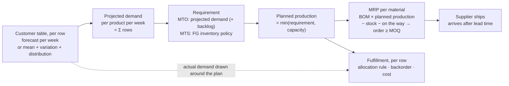

# Demand-driven planning: customer demand → planned production → MRP → fulfillment

| | |
|---|---|
| **Status** | v0.2 work plan, 2026-10-02. **Executed as `docs/PLAN.md` §24 (Phase 14)**, with prompts in `docs/design/demand-driven-planning-prompts.md`. It replaces v0.1 (same file, same day) after a design discussion with the project owner. v0.1's separate MPS policy (P-P.13), time fences, rough-cut capacity and lot-sizing rules are **dropped** in favour of one simple flow. Adopted into the blueprint as gap **G20** and workstream **B2**. No engine code changes yet. |
| **Serves** | Blueprint **G20**. It also delivers P-C.4 `demand_model` (catalogued ✚), makes P-C.1/P-C.2 work per row, makes the declared-but-unread `Product.fg_policy` real, and absorbs engine RFC 4 (finished-goods initial inventory, `docs/PLAN.md` §14). |
| **Governs** | The engine (`scsim`) planning and fulfillment chain. Data-layer consequences are listed in §6 and owned by `docs/PLAN.md` (engine RFC 6). This document cites the data layer **by D-number and symbol only**, never by `file:line` (`npm run check:docs`). |
| **Preserves** | A1 (phase pipeline, one owner per state key), A2/A3 (plugin interface), A6 (registry export generates the UI), A7 (CRN seed tree), A15 (golden traces byte-identical for projects that do not opt in). |

---

## 0. Decisions agreed with the project owner (2026-10-02)

| # | Question | Decision |
|---|---|---|
| 1 | Cap planned production at capacity? | **Yes. Planned production = min(requirement, capacity).** The requirement is the projected demand (MTO) or the quantity the FG inventory policy asks for (MTS). |
| 2 | Where does MTO's future demand come from? | **From the customer table, row by row (customer × product).** Per row the user either enters a **forecast** (quantity per week, week by week) or a **demand model**: mean per week, variation, and distribution (normal, triangular, triangularAV, …). |
| 3 | FG inventory policies for MTS | **base-stock, min-max, days of cover**, each defined exactly (§3.2). |
| 4 | Allocation when supply is short | **One allocation rule per project.** The values the rule needs (priority, price, service-level target) are set **row by row** in the customer table. |
| 5 | Backorder per row now or later? | **Now.** Backorder allowed, max backorder days and backorder cost are per row (customer × product), which needs a per-row backlog in the engine. |
| 6 | When planned demand exceeds capacity, what carries to next week? | **Only the shortfall of rows that allow backorder** (and only within their max backorder window). A lost-sales row's shortfall is dropped from the plan. So the plan and fulfillment use the same rule, and the backorder setting affects both. |
| 7 | A forecast entered per month | **Spread evenly over its weeks.** The run says so. |
| 8 | `normal` demand with a high CV | **Negative draws are set to 0.** The run reports how many draws were clipped and how much that raised the realized mean. |

Principle behind all five: **the flow always starts from future finished-good demand.**
For MTO that means the projected or forecast demand; for MTS it means what the FG
inventory policy requires. That demand is converted to material demand through the BOM,
and materials are ordered with supplier lead time and MOQ. One rule regulates the whole
flow.

---

## 1. Why: what the engine does today (verified, engine 0.2.9)

| Topic | Today | Problem |
|---|---|---|
| Material demand | `core/engine.py::_mech_material_demand`: average demand × BOM (MTO), a constant computed before the run; this week's forecast × BOM (MTS) | Never the production plan. In a test with demand stepping 100 → 150/wk, material demand read **100 in all 60 weeks**. |
| Material ordering | P-P.1 reorder point: s = avg·L, S = avg·(L+κ) | Reacts to consumption, not to the plan. With 2 weeks of cover, the demand step cost **650 lost units (fill 0.933)**; a simple time-phased prototype lost **0** at equal stock. Orders arrive in lumps (900 units every ~9 weeks in the default setup). |
| Production plan | `_mech_default_plan`: this week only | No look-ahead, so nothing to explode into future material needs |
| Demand | One distribution **per product**, from `products.demand_*`. Customer split is a fixed share. | No per-customer demand, no forecast series. `normal` is **silently run as triangularAV** (with a warning). `demand_cv` is used as triangularAV's ± fraction, which is not a coefficient of variation. |
| FG inventory (MTS) | Target = 1 week of forecast + FG safety stock (P-P.4). Produce the gap. | `Product.fg_policy = min_max` exists but **no code reads it**. There is no FG starting stock (RFC 4). |
| Fulfillment | Backlog **per product**. Backorder allowed / max days / cost and the allocation rule are applied **project-wide only**; per-row values are dropped with a warning. `revenue_max` runs as `priority`. | The customer table cannot express "customer A waits, customer B cancels", and priority/price/service floors cannot differ by row |
| BOM | Single level; multi-level BOMs are flattened (PLAN.md §4 D136, D174) | Sub-assemblies lose stock, lead time and capacity (phase F) |

The probe method and numbers are in the appendix.

---

## 2. The flow, end to end



**Plan versus reality.** The plan uses the row's *forecast or mean*. Actual weekly
demand is *drawn* around it with the row's variation and distribution. The difference
between the two is exactly what the simulation measures. The plan never sees the actual
future draws.

### Worked example (MTO, one product, two customer rows)

Setup:
- **Demand rows.** Customer C1 has a forecast of 60, 60, 80, 160, 100 … per week. Customer C2 has a demand model with mean 40/week. **Both rows allow backorder.** The project allocation rule is `fair_share`.
- **Plant.** P1 has a capacity of 180/week, and each P1 needs 2 units of material M1.
- **Material.** M1 has a lead time of 2 weeks and an MOQ of 250. On hand at start: 400. 200 more units arrive at the start of week 2.

| Week | 1 | 2 | 3 | 4 | 5 | 6 |
|---|---|---|---|---|---|---|
| Projected demand P1 (C1 + C2) | 100 | 100 | 120 | 200 | 140 | 140 |
| Planned production = min(req, 180) | 100 | 100 | 120 | **180** | **160** (140 + 20 carried) | 140 |
| M1 need = 2 × planned production | 200 | 200 | 240 | 360 | 320 | 280 |

MRP decision for M1 each week. The order covers the next L = 2 weeks:

| Week | On hand after this week's production | On the way | Need, next 2 weeks | Net = need − on hand − on the way | Order (≥ MOQ) | Arrives |
|---|---|---|---|---|---|---|
| 1 | 200 | 200 | 440 | 40 | **250** | week 3 |
| 2 | 200 | 250 | 600 | 150 | **250** | week 4 |
| 3 | 210 | 250 | 680 | 220 | **250** | week 5 |

What to notice:
- The week-4 peak above capacity is pre-planned. 20 units are short, split by `fair_share` as 16 for C1 and 4 for C2, and both carry into week 5 because both rows allow backorder.
- **If C1 did not allow backorder**, only C2's 4 units would carry. Week 5 would plan 144, not 160, and C1 would lose 16 units in week 4: the backorder setting changes the plan *and* the fulfillment.
- Material orders follow the plan, not past consumption.
- MOQ leftovers are absorbed automatically by the next week's netting.

---

## 3. Definitions (what each setting means, exactly)

### 3.1 Demand per customer row (customer × product) — P-C.4 `demand_model`

Each row chooses **one** of two input modes.

| Mode | User enters | Plan uses | Actual demand each week |
|---|---|---|---|
| **Forecast** | Quantity per week, week by week (a series), plus a variation and a distribution | The series value for that week | Drawn around that week's series value with the row's variation and distribution |
| **Demand model** | Mean per week, variation, distribution | The mean | Drawn from the distribution |

Distributions and what **variation** means for each, defined once and shown in the UI
next to the field:

| Distribution | Parameters | Variation means | Example (mean 100) |
|---|---|---|---|
| `deterministic` | mean | none | always 100 |
| `normal` **(new in the engine)** | mean, **CV** | standard deviation ÷ mean | CV 0.2 → σ = 20. Negative draws are set to 0 (decision 8), and the run reports how often that happened. |
| `triangularAV` | average, **± fraction** | half-width as a fraction of the average | 0.3 → triangular(70, 100, 130) |
| `triangular` | min, mode, max | explicit bounds; no fraction | (60, 100, 150) |
| `poisson` | mean | none (variance = mean) | — |

Today `demand_cv` feeds triangularAV's ± fraction. Under this plan the column is
interpreted by the row's distribution, as in the table above, so "CV" means a CV again.

Rules:
- A row with neither mode filled falls back to today's **product-level** demand
  (`products.demand_*`, split by the existing customer shares). Old projects therefore
  run unchanged.
- **Product demand = the sum of its rows.** Projected (plan) and actual (drawn) demand
  are both computed per row and then summed.
- Time unit: the engine runs in weeks, so a forecast entered in another unit is
  converted at promotion. Monthly is spread evenly over its weeks, and the run says so.

### 3.2 FG inventory policy per product (MTS) — `Product.fg_policy`, made real

All levels are **end-of-week finished-goods stock targets**. The plant produces what is
needed to reach them, capped by capacity (§3.3).

| Policy | Parameters | Production requirement for week τ | Example |
|---|---|---|---|
| **base-stock** (order-up-to) | S (units) | requirement = S + projected demand(τ) − FG stock at start of τ, if positive | S = 300, demand 100, start stock 250 → produce 150 |
| **min-max** (s, S) | s, S (units), s < S | If FG stock at start of τ − projected demand(τ) < s, produce up to S: requirement = S + projected demand(τ) − start stock. Otherwise 0. | s = 100, S = 400, demand 100, start 180 → 180 − 100 = 80 < 100 → produce 320 |
| **days of cover** | D (days) | Target = D/7 × projected weekly demand(τ); then as base-stock with S = that target. **The target moves with the forecast.** | D = 14, forecast 70/wk → target 140; when the forecast rises to 140/wk → target 280 |

Notes:
- **Days of cover** means *how many days of future demand the stock should cover*. It
  scales with demand. Base-stock and min-max use **fixed units** and do not.
- **FG starting stock** per product is a new input (RFC 4). Empty means start at the
  policy target, which is today's behaviour.
- **One source per number.** If the user types S (or s, S, or D), that *is* the
  target. P-P.4 FG safety stock becomes an optional way to *compute* S from a service
  level instead of typing it. It is never added on top of a typed S, so nothing is
  counted twice.
- **Defaults.** With `fg_policy = base_stock` and S empty, the target stays today's
  derivation (1 week of forecast + P-P.4), so existing MTS projects are byte-identical.

### 3.3 Planned production per product — P-P.0, extended over a horizon

For each week τ = t … t+H, where H is the planning horizon (§3.4):

```
requirement(τ) = MTO:  projected demand(τ) + projected backlog(τ)
                 MTS:  FG-policy requirement(τ) + projected backlog(τ)    (§3.2)
planned production(τ) = min(requirement(τ), capacity)

shortfall(τ)  = projected demand the plan cannot serve in τ
                (MTO: from production; MTS: from FG stock + production)
split shortfall(τ) across the product's rows with the project's allocation rule
                (the SAME function fulfillment uses, §3.5)
projected backlog(τ+1) = Σ shortfall of rows with backorder allowed,
                         minus units older than that row's max backorder weeks
rows without backorder: their shortfall is dropped (lost in the plan, as in reality)
```

Week t starts from the **actual** per-row backlog. Week t's planned production is what
the plant builds this week, so the existing execution step is unchanged. Later weeks
exist so MRP can see them.

**Why one rule for plan and fulfillment (decision 6).** If the plan carried every
shortfall, MRP would buy material for demand that lost-sales customers have already
walked away from, and stock would build. If it carried none, backorder customers would
wait longer than necessary. Because the split uses the project's allocation rule:
- a high-priority row that allows backorder is planned first;
- a lost-sales row's shortfall leaves the plan the same week it leaves the order book.

The backorder setting therefore affects both the plan and fulfillment, as intended.

### 3.4 MRP per material — P-P.1 `policy_type = "mrp"`

Selectable per material in the existing **Policy type** column of the Supplier stage.
Materials using MRP and materials using reorder point can sit in one project.

```
need(m, τ)  = Σ_p BOM(p, m) × planned production(p, τ)
L           = lead time of the material's primary supplier (+ lane transit)
order(m, t) = need(m, t+1 … t+L) + safety stock(m)
              − on hand(m)          (after this week's production)
              − on the way(m)       (in transit + waiting at the supplier)
if order > 0:  order = max(order, MOQ(m))     → sent to the primary supplier
```

- **Horizon H** is automatic: the longest MRP lead time + 1 week. There is no user
  parameter.
- **Safety stock** reuses the existing per-material safety-stock days:
  units = days/7 × average weekly need over the horizon.
- **The supplier delivers after lead time** through the existing queue → in-transit →
  arrival path. A finite supplier capacity or a disruption delays delivery. The planner
  still counts the order as "on the way", which is realistic, and the run reports
  **late receipts** so the effect is visible.
- **Multi-sourcing** (P-S.2) still splits the order across sources, and **backup
  supplier** (P-S.1) still reroutes it.

### 3.5 Fulfillment per row — P-C.1 + P-C.2, row by row

Each week, per product, the plant has a quantity it can ship: production output (MTO) or
FG stock (MTS). It is split across the product's rows:
1. **Within a row**, the oldest backlog is served first, then this week's demand.
2. **Across rows**, the project's **allocation rule** decides who is served first.

| Allocation rule (project) | Uses per row | Behaviour |
|---|---|---|
| `priority` | priority (number) | Highest priority is filled completely before the next row gets anything |
| `fair_share` | — | Every row gets the same fill rate (pro-rata to its demand + backlog) |
| `proportional` | weight (default: the row's demand share) | Pro-rata to the weight |
| `revenue_max` | **price** | Highest price first. With linear revenue inside a week, this *is* revenue-maximizing, so the rule becomes honest instead of running as `priority`. |
| `sla_tier` | **service-level target %** | First give each row its target % of its demand + backlog (scaled down if supply cannot cover all targets), then the rest by priority |

Per row, whatever is not served:

| Row setting | Meaning |
|---|---|
| **Backorder allowed** (yes/no) | yes: it waits in this row's backlog. no: it is a lost sale. |
| **Max backorder (days)** | How long a unit may wait before it becomes lost. The engine counts whole weeks, so it rounds to the nearest week (half up) and **the UI shows the rounded value**: 14 → 2 wk, 10 → 1 wk, 3 → 0 wk (lost the same week). |
| **Backorder cost (per unit per day)** | Charged on every waiting unit: ×7 per week |

The row's backlog feeds next week's MTO requirement (§3.3), so planning and fulfillment
share one backlog.

---

## 4. What the user enters, by table

| Where | Row key | New or changed fields |
|---|---|---|
| **Customer table** (Customer · Product) | customer × product | Demand mode (forecast / demand model) · mean per week · variation · distribution · min/max (triangular) · forecast series (week → qty) · backorder allowed · max backorder (days) · backorder cost / unit / day · priority · price · service-level target %. Only the field the project's allocation rule needs is shown. |
| **Plant table** (Focal plant · Product) | product | FG policy (base-stock / min-max / days of cover) · S · s · days · FG starting stock (MTS only) · capacity (exists) |
| **Supplier table** (Material · Supplier) | material × supplier | Policy type gains **MRP** · MOQ (exists) · safety-stock days (exists) · lead time (exists) |
| **Project settings** | project | Allocation rule: priority / fair_share / proportional / revenue_max / sla_tier. The UI label becomes **"Customer allocation"**; "material allocation" is the plant-side P-P.9, a different decision. |

---

## 5. Engine changes (scsim)

| # | Change | State / phase (A1) | Default behaviour |
|---|---|---|---|
| E1 | **Demand per row.** Rows (customer × product) get their own demand spec. The pre-drawn world schedule becomes `[rows × weeks]`, drawn per row in a fixed order from the world demand stream. Product demand = the row sum. New `normal` sampler. A forecast series becomes the per-week centre of the distribution. | PH-10 owns `demand` (product) + new `demand_rows`; new transient `demand_plan` (rows × H) | No rows → today's per-product draw, **byte-identical** |
| E2 | **Planned production over a horizon** (P-P.0 extended): §3.3, with MTO/MTS requirement, min(·, capacity), and carry-forward of backorder rows' shortfall (split by the allocation rule) | PH-40 owns `production_plan` (week t, unchanged) + new `planned_production` (products × H) | H = 1 and no FG policy → today's formula |
| E3 | **FG policies made real**: base-stock / min-max / days of cover; FG starting stock | PH-70 `state.fg_target` (existing writer); `Product` fields | base-stock with empty S → today |
| E4 | **MRP type** in P-P.1: §3.4 | PH-70 new `gross_requirements` (materials × H); PH-80 `purchase_orders` (existing writer) | Only materials set to `mrp` change |
| E5 | **Per-row fulfillment**: backlog becomes per row with per-row age buckets, max-backorder horizon and cost. P-C.1 stays the **single writer** of fulfillment/backlog; P-C.2 publishes its rule and per-row ordering at setup (the P-C.6 publish pattern) and keeps its KPIs. `revenue_max` uses row price; `sla_tier` uses row targets. MTS: PH-30 still decides how much FG ships; the per-row split happens at PH-60. | `state.backlog` becomes per row; `ctx.backlog` stays available as the product sum for planners | One row per product, project-wide settings → today, **byte-identical** |
| E6 | **KPIs**: fill rate per row and per customer; backorder cost per row; planned vs actual production; material shortage weeks; late receipts; projected vs actual demand error (bias, MAPE) | PH-99, `kpi_contribution` | Additive |
| E7 | **Inspection record**: per material, week by week: need, on hand, on the way, net, order. Per product: projected demand, requirement, planned, built. | extends `item_series` | Inspection runs only |

Every change is opt-in at the data level. A project that sets none of the new fields runs
byte-identically, and each package re-proves that against the golden traces.

---

## 6. Data changes (requested from `docs/PLAN.md`, engine RFC 6)

| Need | Proposed home | Note |
|---|---|---|
| Demand model per row (mode, mean, variation, distribution, min, max) | `outbound_logistics` (already customer × product, with `volume`, `time_unit` and `unit_price`) or a new `customer_demand` table | The data plan decides. `volume` is today's per-row demand fallback. |
| Forecast series per row | New table: customer × product × period → quantity, with `time_unit` | Lands through the ingestion contract (tier 0/1 → promotion), normalized to weeks at promotion (`normalize-at-promotion`) |
| Per-row backorder allowed / days / cost, priority, service target | `policy_overrides` at row scope; the grid already stores per-row overrides | **The mapper stops dropping them**; today they raise "per-node fulfillment override(s) not applied" |
| Per-row price | `outbound_logistics.unit_price` (exists; today only a fallback for the product price) | Becomes the row price for `revenue_max` and revenue |
| Per-row service target default | `customers.sla_fill_floor_pct` (exists, read by nothing; a declared gap in its sidecar) | Becomes the row default |
| Priority default | `customers.priority_weight` (exists) | `contract:check` R13 currently warns that it has no grading binding; fixed in the same package |
| FG policy, S, s, days, FG starting stock | `products` | FG starting stock = RFC 4's column, after the capability (RFC 4's own order) |
| MRP per material | the existing P-P.1 policy-type field (supplier grid) | No new column |

---

## 7. Work plan (engine milestone M9, blueprint workstream B2, **PLAN.md Phase 14**)

The packages below are executed as **`docs/PLAN.md` §24, Phase 14**, which owns the sequencing, preconditions and drift log. Each has a copy-paste prompt in `docs/design/demand-driven-planning-prompts.md`.

| Package here | Phase 14 work package |
|---|---|
| — (baseline + shared allocation helper) | WP 14.0 |
| A — demand per row | WP 14.1 (engine) + WP 14.2 (data, ingestion, snapshot, Customer table) |
| D — per-row fulfillment | WP 14.3 |
| B — planned production + FG policies | WP 14.4 |
| C — MRP for materials | WP 14.5 |
| E — validation + gate | WP 14.6 |
| F — multi-stage | WP 14.7 (starts on the owner's word) |

Each package ships engine, mapping, data and UI together, so it is usable when it
merges. Each ends with golden traces byte-identical for non-opted-in projects, the
blueprint and this file updated in the same PR, and a `docs/PLAN.md` §16 drift entry.

| Pkg | Scope | Exit criteria (all must hold) |
|---|---|---|
| **A — Demand per row** | E1 + the §6 demand fields + Customer-table columns. `normal` sampler. Forecast series ingestion. Projected demand published per row and per product. | A project with two rows per product (one forecast, one demand model) runs. Product demand = row sum. Choosing `normal` gives a normal draw: no silent triangular, and the warning disappears. Variation is labelled per distribution. Old projects byte-identical. |
| **B — Planned production + FG policies** | E2 + E3 + FG starting stock + Plant-table columns. Needs package D's allocation function for the shortfall split; until D lands, the split falls back to pro-rata and says so. | MTO plan = projected demand capped at capacity. Carry-forward only for backorder rows: §2's example plans 160 in week 5, and 144 when C1 is lost-sales. Each FG policy reproduces its §3.2 example exactly. Days of cover moves with the forecast. Existing MTS projects byte-identical. |
| **C — MRP for materials** | E4 + E7 + the MRP choice in the Supplier table | **Golden #7:** the engine reproduces §2's worked example week by week (orders 250/250/250 arriving weeks 3/4/5). A textbook MRP record test passes. MRP and reorder-point materials coexist in one run. Under the demand-step probe, MRP loses no sales where lean min-max lost 650 units. Performance at TRON scale (17 products × 560 materials) ≤ +20 % time per replication. |
| **D — Per-row fulfillment** | E5 + E6 + the §6 fulfillment fields + the mapper stops dropping per-row values | Two rows of one product: one backorders, one loses. Their backlogs, costs and fill rates are reported separately. Each allocation rule passes a scarcity test, including `revenue_max` by row price and `sla_tier` by row target. The "not applied" warning is gone. Max-backorder rounding is shown in the UI. |
| **E — Validation study** | CRN-paired comparisons on reference networks and Project TRON: reorder point vs MRP at equal average stock; demand step / surge; supplier outage (ST-1); forecast quality (bias lever) | Published with confidence intervals: fill rate, lost units, average stock, order variability, time to recover. Preset changes only if the evidence supports them. |
| **F — Multi-stage (later)** | Sub-assemblies as real items (stock, WIP, production lead time, capacity) with the same MRP applied level by level. `bom_multi_level` passed through instead of flattened (D136, D174, D191). | **Golden #8:** a zero-lead-time multi-level network is byte-identical to its flattened twin. A 2-week sub-assembly lead time shifts FG output by exactly 2 weeks. |

**Order:** A first, because everything reads demand. Then **B → C** (the MRP chain) and **D** in parallel; they touch different phases (PH-40/70/80 vs PH-30/60). One coupling: B's carry-forward splits a shortfall with D's allocation function. Write that function first, as a pure helper both packages import, so B never needs a fallback for long. E runs after C and D. F follows once single-level MRP is validated.

---

## 8. Out of scope for this version (deliberately)

- Lot-sizing rules beyond MOQ (P-P.2 stays 🧩), time fences, rough-cut or finite
  scheduling, plan-nervousness controls. Revisit only if the validation study shows they
  matter.
- History-based forecasting (P-F.1). The user's forecast series *is* the forecast in
  this version.
- Sub-weekly time steps (the weekly fidelity boundary, blueprint §5.8).
- Multi-plant and warehouse echelons (Phase E).

## 9. Open points

None left. The last three were decided on 2026-10-02 (§0, decisions 6–8). New questions
found during implementation are recorded here, each with its default, before the package
that raises them merges.

Found by WP 14.1 (defaults shipped; the owner may overrule):

1. **What "centre" means for a forecast.** The forecast value is the week's **expected
   value**: normal's μ, poisson's λ, triangularAV's mode (= its mean), deterministic's value.
   For an explicit **triangular** row (min, mode, max) the triangle is **scaled** so its mean
   equals the week's forecast — its shape is kept, its bounds move proportionally. Without a
   forecast, the plan reads the triangle's mean (min + mode + max)/3, and `demand_mean` is
   its mode, as `products.demand_mean` is for a product.
2. **A row without a spec, beside rows with one.** It takes its product's distribution scaled
   by its share of the product's volume (normalized over all the product's rows). The
   product's stationary mean becomes the sum of its rows' means, so P-P.1 sizes on the rows.
3. **A product no customer row names** gets one implicit row (no customer, share 1).
4. **Week 0 of a forecast series** is the first simulated week. Where a stored series carries
   dates, WP 14.2 decides how a date maps to a simulated week (below, point 5).

Found by WP 14.2 (defaults shipped; the owner may overrule):

5. **Which simulated week a dated bucket is.** Week 0 starts on the project's **earliest**
   `period_start` — one calendar for every row, so two customers' weeks line up. Week *w* is
   the seven days starting 7·*w* days later; its value is the sum over those days of each
   covering bucket's daily rate (its weekly rate ÷ 7), so a week straddling two months takes
   some of each and decision 7's even spread survives the boundary. A row's series ends at
   its last week that lies wholly before its last bucket's end; a day no bucket covers adds
   nothing (`sim_worker/datamap.py::forecast_series`).
6. **Where a row's demand spec lives.** On `outbound_logistics`, whose natural key
   (project, plant, customer, product) is the row the engine keys by (customer, product) once
   a project has one plant. A forecast is its own table, `demand_forecasts`, keyed
   (project, customer, product, `period_start`) — no plant, because demand belongs to the
   customer row, not the lane that serves it. The monthly spread happens **at promotion**
   (`weekly_quantity` = quantity × 7 ÷ the period's days; `period_end` exclusive).
7. **`demand_mode` is derived, not uploaded.** A row with forecast buckets runs on them; an
   override `row_demand_mode = model` on /policies sets the series aside and the row runs on
   its mean + distribution. There is no stored mode column a second upload could contradict.


---

## Appendix — probe method (reproducibility; not engine code)

- **Probe 1** runs the engine's own dispatch loop week by week on the golden-#1 chain:
  1 supplier → 1 material → 1 MTO product, deterministic demand 100/wk, lead time 2,
  backorders allowed. It records `material_demand` against BOMᵀ × `production_plan`.
  - Scenario A: a supplier outage over weeks 20–26.
  - Scenario B: demand stepped to 150/wk from week 25 by editing the pre-drawn schedule.
  - Result: `material_demand` = 100 in every week of both.
- **Probe 2** runs the same chain with P-P.1 coverage κ = 2, lost sales, horizon 80,
  measured from week 10. It swaps P-P.1's release step for a single-level lot-for-lot
  MRP with SS = 0. That MRP takes a 4-week moving average of realized demand plus
  backlog, and nets on-hand, dated in-transit and the supplier queue over the lead time.
  Results:

| Demand | Policy | Fill | Lost | Avg stock | Order CV |
|---|---|---|---|---|---|
| Stationary 100 | min-max | 1.000 | 0 | 200 | 1.43 |
| | MRP | 1.000 | 0 | 200 | 0.00 |
| Step 100 → 150 | min-max | 0.933 | 650 | 199 | 1.07 |
| | MRP | 1.000 | 0 | 273 | 0.16 |
| Drop 100 → 60 | min-max | 1.000 | 0 | 239 | 1.65 |
| | MRP | 1.000 | 0 | 141 | 0.28 |

One deterministic chain with one seed: this is motivation, and package E is the proof.
