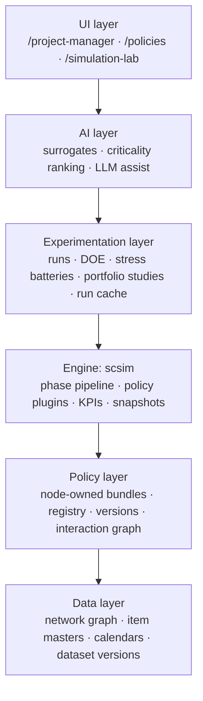
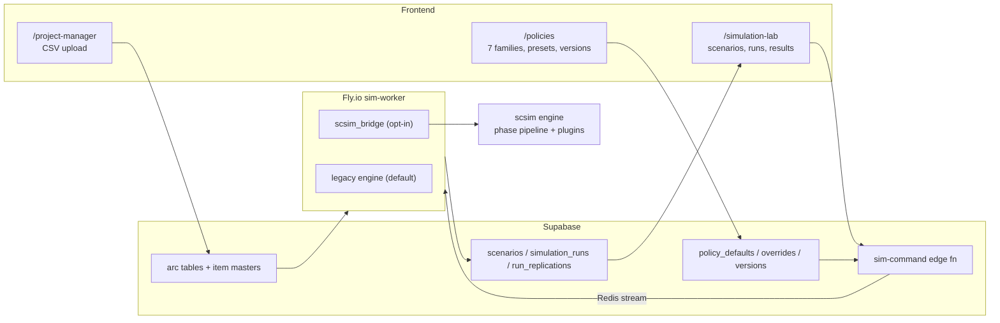
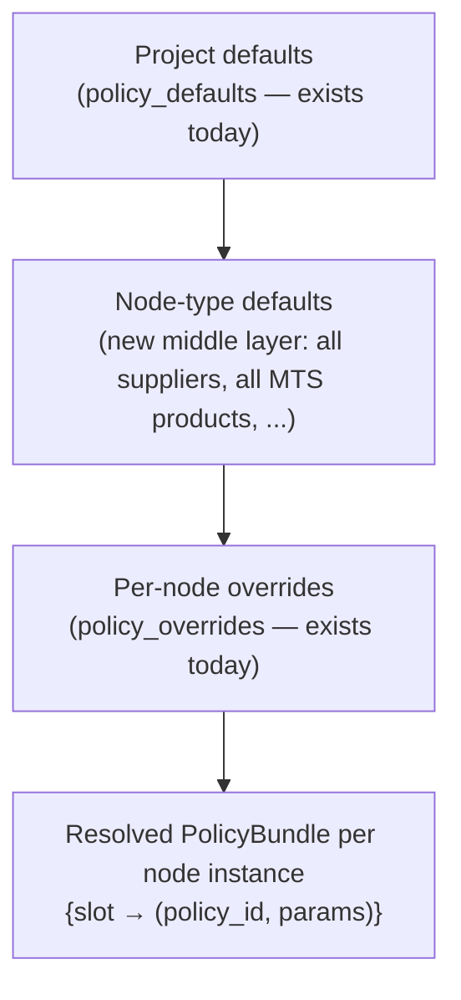
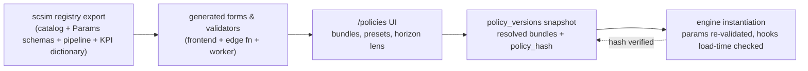
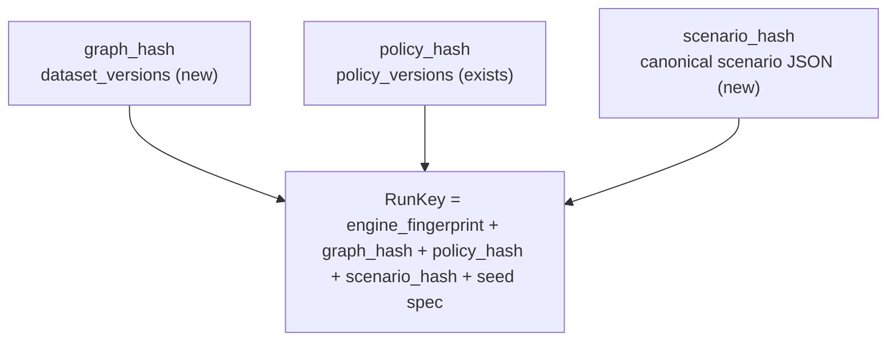
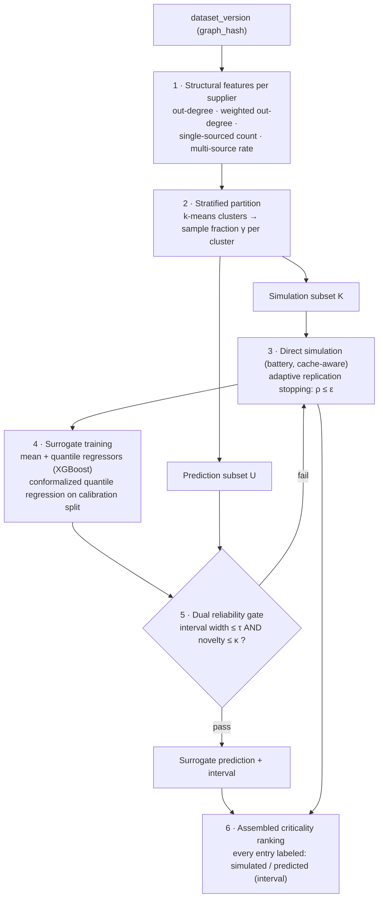

# SuReSuite Next-Generation Simulation Platform — Design Blueprint

| | |
|---|---|
| **Status** | Draft v0.2 — v0.1 reviewed against the Phase A implementation; adds the model-credibility (V&V) pipeline (§9.5), gap G13, the policy-picker interaction contract (§6.3), and a re-sequenced Phase B that puts the CORE (picker + V&V) first |
| **Date** | 2026-07-06 (v0.1: 2026-07-02) |
| **Altitude** | Platform-wide conceptual architecture: data model → policy layer → engine → experimentation → AI/surrogates → UI |
| **Non-goals** | Implementation details, code, SQL DDL, dated schedules |
| **Authority** | This document governs the *platform* design. `scsim/docs/architecture.md` remains authoritative for engine mechanics; `scsim/docs/roadmap.md` for engine milestones. Where this document proposes changes to either, it says so explicitly. |

## 0. Reading guide

This blueprint answers a single question: **how does SuReSuite evolve from its current state into a simulation platform that surpasses commercial tools such as AnyLogistix** — not by feature-matching, but by belonging to a different architecture class: modular, extensible, transparent, policy-driven, AI-native, and research-grade.

The document was produced by first studying the existing system in depth (the `/policies` page, `/project-manager`, `/simulation-lab`, the `scsim` engine, the `sim-worker`, and the Supabase schema). Every proposal in it **extends an artifact that already exists** in the repository; nothing here replaces the current direction. The recurring rhetorical form is deliberate: *"X already exists as Y — we complete and generalize it."*

Section map against the design brief:

| Brief step | Where answered |
|---|---|
| 1. Study the existing direction | §2 (assessment, preserved assets, gap catalog), §3 (engine strategy) |
| 2. Complete policy architecture; node-owned policies; required data | §4 (architecture), §8 (parameter-requirement contract) |
| 3. Policies for every supply chain stage (MTS/MTO scope) | §5 (v1 catalog), Appendix A |
| 4. Planning horizons | §4.1 (horizon axis), §5 tables |
| 5. Standardized policy interface, configured in `/policies` | §6 |
| 6. Policy interactions | §7 |
| 7. AnyLogistix benchmark | §10 |
| 8/9. Stress testing, surrogate model, data/model/version management | §9 (experimentation), §11 (surrogate architecture) |
| Verification & validation → confident decision support (v0.2 review) | §9.5 (model-credibility pipeline), G13 |
| Programmatic access & access control (API workstream) | G15, §13 cross-cutting workstream, `docs/design/public-api-and-access-control.md` |
| Roadmap | §13 |

Companion descriptive document: `docs/design/platform-architecture-report.md` — the platform described *as built* from technical and supply-chain-management viewpoints, framed as a scientific report skeleton. This blueprint stays normative (what to build and why); the report is descriptive (what exists and how to present it).

Companion documents: `docs/data-simulation-mapping.md` (current field-mapping contract), `docs/simulation-data-lifecycle.md` (current state tiers), `docs/design/ai-agents.md` (authoritative AI-agent design — supersedes the §12 roster sketch), `scsim/docs/architecture.md`, `scsim/docs/roadmap.md`, `scsim/docs/stress-tests.md`, `scsim/docs/synergy.md`, `scsim/docs/adr/0001-mts-fulfillment-mode.md`.

**Working agreement.** This document governs all platform work: before starting a task, locate it in the gap catalog (§2.3) and roadmap (§13); commits and PRs reference the section, gap, and phase they serve (e.g. `Phase A / G4 / §8.3`). If implementation must deviate from this blueprint, the blueprint is updated **in the same PR** — the document and the code move together and this file is never allowed to go stale. The same rules are stated for tooling sessions in the repository-root `CLAUDE.md`.

---

## 1. Vision and design pillars

The long-term objective is a simulation engine and platform that treats **every operational decision in the supply chain as an explicit, replaceable policy** — configured by users without coding, validated before it runs, versioned and hashed for reproducibility, and observable after the fact — and that uses that policy fabric as the substrate for AI-driven experimentation at a scale exhaustive simulation cannot reach.

Six pillars, each already seeded in the codebase:

1. **Modular.** Policies are plugins with declared phase residencies, parameter schemas, feasibility rules, and cost contributions (`scsim/scsim/policies/base.py`). The simulation engine never changes when a policy is added: *"Adding a Tier-1 policy = one plugin file + a registry entry + a docs row (CI-enforced) + one validation experiment. No engine edits"* (`base.py` docstring). This blueprint extends that property from resilience policies to **all** operational decisions.

2. **Extensible.** Different algorithms plug into the same decision slot — a reorder policy can be `min_max`, `base_stock`, `(R,Q)`, periodic review, or a learned policy — without touching the engine or the UI, because forms, validators, and docs are all generated from one registry (`scsim/scsim/io/registry_export.py`).

3. **Transparent.** Open engine, load-time-validated interaction contracts (`scsim/scsim/core/phases.py::validate_hooks`), immutable versioned snapshots with content hashes (`policy_versions.policy_hash`), golden-trace regression tests, and — new in this design — per-decision observability records (§6, facet 11). A user can always answer *"why did the model do that?"*.

4. **Policy-driven.** No hidden behavior. Every default the engine applies today implicitly (greedy production planning, the built-in forecast, the world demand generator) becomes a **named default policy occupying a declared slot** (§4.4), visible in the UI, included in the behavioral fingerprint, and replaceable.

5. **AI-native.** Surrogate models with calibrated uncertainty replace brute-force simulation where they are provably reliable, and fall back to simulation where they are not (§11). LLM assistance configures and explains — but never fabricates — simulation results (§12).

6. **Research-grade.** Common random numbers with a keyed seed tree (`scsim/scsim/stats/seeds.py`), MSER-5 warm-up detection, sequential confidence-interval stopping, conformal prediction intervals, CRN-paired portfolio comparison with bootstrap significance (`scsim/scsim/synergy/decompose.py`) — statistics as a first-class design concern, not an afterthought.

Target platform layering:



---

## 2. Where we are: assessment of the current platform

### 2.1 Architecture today

SuReSuite is a four-tier system:

| Tier | Technology | Key artifacts |
|---|---|---|
| Frontend | React/Vite + shadcn | `src/pages/ProjectPolicies.tsx` (`/policies`), `src/pages/DataManager.tsx` (`/project-manager`), `src/pages/SimulationLab.tsx` (`/simulation-lab`), four network views |
| Data & control plane | Supabase (Postgres + edge functions + Realtime) | arc tables, item masters, `policy_defaults` / `policy_overrides` / `policy_versions`, `scenarios` / `simulation_runs` / `run_replications`, `supabase/functions/sim-command/index.ts` |
| Execution | Fly.io worker consuming Upstash Redis streams | `sim-worker/sim_worker/worker.py`, `datamap.py`, `scsim_bridge.py` |
| Engine | Python package `scsim` | `scsim/scsim/core/`, `policies/`, `stress/`, `synergy/`, `kpi/`, `stats/`, `io/` |

**The engine paradigm.** `scsim` is a vectorized, weekly time-stepped simulator organized as a **phase pipeline**: every simulated week executes the named sequence PH-00 (week start / disruption state) → PH-10 (demand realization + forecast) → PH-20 (detection) → PH-30 (fulfill from stock, MTS) → PH-40 (production planning) → PH-50 (production execute) → PH-60 (fulfillment) → PH-70 (material planning) → PH-80 (procurement) → PH-90 (logistics) → PH-99 (accounting). Each phase owns a write-contract over named state keys; hooks are validated at load time for read-before-write, write authorization, and write-conflict resolution (`scsim/scsim/core/phases.py`). The docstring says it precisely: *"The weekly cycle is data, not code."* The network is three echelons — suppliers → a single focal plant (materials, BOM, products) → customers — supporting mixed MTO and MTS products per ADR 0001.

**Two policy vocabularies.** The platform currently speaks two different policy languages, connected by a translation layer:

- The **UI/database vocabulary**: seven policy *families* — sourcing, inventory, transport, fulfillment, production, recovery, demand — hand-written as Zod schemas in `src/lib/policies/schemas.ts`, mirrored as Pydantic in `sim-worker/sim_worker/policies.py`, stored per project in `policy_defaults` (JSONB per family) with sparse per-node/per-edge patches in `policy_overrides`, edited on `/policies` through a four-stage flow (supplier → plant → customer → run & validate, `src/lib/policies/stages.ts`), gated by fulfillment strategy (`src/lib/policies/strategyGating.ts`), seeded by eight data-aware presets (`src/lib/policies/presets/`), and snapshotted immutably into `policy_versions` with a SHA-256 `policy_hash`.
- The **engine vocabulary**: a catalog of 21 named policy plugins with IDs `P-S.x` (supplier), `P-P.x` (plant), `P-T.x` (transport), `P-C.x` (customer), `P-X.x` (cross-cutting), registered in `scsim/scsim/policies/registry.py`. Nine are implemented and runnable; twelve are *planned* — registered with full parameter schemas but raising `PolicyNotImplementedError` when enabled, never silently no-oping.

- The **translation layer**: `scsim/scsim/io/project_map.py::_map_policies` converts family dictionaries into plugin activations. It is lossy (§2.3, G1).

**Two engines.** The worker selects between a legacy discrete-time engine (`sim-worker/sim_worker/engine.py`, the code-level default, `code_version="worker-legacy"`) and scsim (via `SCSIM_ENGINE=1`). The legacy engine reads the family fields more completely but is architecturally a dead end; scsim reads fewer fields but is the platform's real asset. §3 resolves this.

> **Implementation note (Phase A, deployment).** The production worker now actually runs scsim: the Fly image bundles the engine (`sim-worker/Dockerfile` builds from the repo root and installs `scsim/`; previously the image shipped without it, so the worker could not even import `datamap.py`) and `sim-worker/fly.toml` sets `SCSIM_ENGINE=1`. The deploy workflow also redeploys on `scsim/**` changes. The in-code default remains legacy until gate E3 (Phase B) flips it; unsetting the env var is the escape hatch E3 requires.



### 2.2 Design assets we preserve

These are the load-bearing good decisions in the current system. The rest of this document builds on them; none is discarded.

| # | Asset | Where | Why it is kept |
|---|---|---|---|
| A1 | Phase pipeline with owned state keys and load-time hook validation | `scsim/scsim/core/phases.py` | The single most valuable artifact in the codebase: it makes policy interactions *machine-checkable* (§7) and the weekly cycle declarative |
| A2 | `PolicyPlugin` ABC: ClassVar metadata, `hooks`, Pydantic `Params` (`extra="forbid"`), `feasibility()`, `cost_contribution()`, keyed RNG | `scsim/scsim/policies/base.py` | Already the standardized policy interface in embryo; §6 completes it |
| A3 | Registry with implemented + *planned* entries; planned policies raise, never silently no-op | `scsim/scsim/policies/registry.py`, `planned.py` | Honest capability surface; the catalog doubles as the roadmap |
| A4 | Catalog ID convention `P-S.x / P-P.x / P-T.x / P-C.x / P-X.x` with Stage / StrategyClass / ConstraintTag metadata | `scsim/scsim/entities/enums.py` | Stable reference scheme; §4.2 extends it without renaming anything |
| A5 | Immutable policy snapshots with SHA-256 `policy_hash`, lineage, dirty detection, restore | `supabase/migrations/20260612000001_policy_version_snapshots.sql`, `src/hooks/usePolicies.tsx` | The provenance pattern the whole platform generalizes to datasets and runs (§8.4, §9.2) |
| A6 | "Pydantic is canonical" registry export: forms, validators, and docs generated from one source | `scsim/scsim/io/registry_export.py` | Declared but not yet enforced platform-wide; §6.2 elevates it to law |
| A7 | Keyed seed tree: world streams independent of policy set; policy streams keyed by policy-ID digest | `scsim/scsim/stats/seeds.py` | CRN across scenarios and portfolios; the statistical bedrock of §9 and §11 |
| A8 | Warm-state `SnapshotStore` keyed by a family digest (network + settings + policies + engine version, excluding events) | `scsim/scsim/io/snapshots.py` | The in-engine precedent for content-addressed reuse; §11.3 generalizes it |
| A9 | Stress batteries ST-1/ST-2 with scorecards and `vulnerability_ranking` | `scsim/scsim/stress/battery.py` | The ground-truth generator for the surrogate architecture (§11) |
| A10 | Portfolio study + synergy decomposition (CRN-paired, bootstrap significance, breadth ladder) | `scsim/scsim/core/engine.py::run_portfolio_study`, `scsim/scsim/synergy/decompose.py` | Research capability no commercial tool offers; §9 productizes it |
| A11 | Worker as sole authoritative writer of results; idempotent by `run_id`; runs bound to a `policy_version_id` | `sim-worker/sim_worker/worker.py`, `supabase/functions/sim-command/index.ts` | Correct ownership discipline; extended, not changed |
| A12 | Statistics machinery: MSER-5 + Conway warm-up detection, sequential CI stopping, replication grid | `scsim/scsim/stats/warmup.py`, `core/engine.py` | Reused directly by adaptive replication stopping (§11.2) |
| A13 | Docs CI gate: reference docs generated from the registry; drift fails the build | `scsim/scripts/gen_docs.py` | The enforcement pattern §6.2 copies for UI codegen |
| A14 | Four-stage `/policies` UX (supplier → plant → customer → run & validate), data-aware presets with per-field `why`, strategy gating | `src/components/policies/`, `src/lib/policies/presets/` | The right mental model for non-coding users; §5/§6 give it more to configure, not a new paradigm |
| A15 | Golden-trace test suite (byte-identical determinism, conservation invariants, manuscript reproduction) | `scsim/tests/` | The safety net for every migration this document proposes |

### 2.3 Gap catalog

Numbered gaps, each cited to evidence. Later sections reference these IDs; §13's roadmap phases declare which they close. This table is the requirements-traceability spine of the document.

| ID | Gap | Evidence | Consequence |
|---|---|---|---|
| **G1** | **Lossy family→plugin mapping.** Absolute `reorder_point`/`order_up_to` discarded in favor of coverage-κ; `s_S` and `continuous_review` collapsed to `min_max`; sourcing `ratios` and failover parameters ignored; transport and demand families never consumed; most per-node overrides silently fall back to project defaults (only `holding_cost_pct` and capacity survive: `legacy_graph.py::_SUPPORTED_OVERRIDE_FIELDS`) | `scsim/scsim/io/project_map.py::_map_policies` | What the user configures is not what runs; trust erosion masked only by `MappingWarning`s |
| **G2** | **Two engines, and the default is the weaker one.** Legacy `engine.py` honors more family fields but has no validated contracts, no CRN tree, no snapshots; scsim is opt-in | `sim-worker/sim_worker/worker.py` engine selection | Same configuration can produce different results depending on an env flag |
| **G3** | **Implemented-but-unreachable policies.** `proactive_multi_sourcing` (P-S.2), `fg_safety_stock` (P-P.4), `material_allocation` (P-P.9) are runnable but no UI family maps to them | `project_map.py` mapping rules vs. `scsim/scsim/policies/` | Engine capability invisible to users |
| **G4** | **No data-entry surface for the economics the engine actually reads.** `materials.cost`, `products.sell_price` / `production_capacity` / `demand_mean`, `suppliers.capacity_per_week` / `reliability_score` are auto-created NULL and silently defaulted — e.g. production capacity defaults to `max(2·demand, 1000)`, so capacity never binds | `supabase/migrations/20260614000001_item_master.sql`, `project_map.py` fallback rules | Simulations run on invented parameters; capacity/disruption analyses can be vacuous |
| **G5** | **Network/economics data is not versioned.** Only policies are snapshotted; the graph is read live at run time (*"the graph itself is not versioned"* — `sim-command/index.ts`) | `docs/simulation-data-lifecycle.md` | Re-uploading a CSV silently changes the world behind every past and future run; reproducibility is partial |
| **G6** | **Three non-aligned validation surfaces.** Client `verification.ts` checks fields the engine does not read; `get_project_dataset_status` checks only table presence; engine `MappingWarning`s arrive after the run is dispatched | `src/lib/policies/verification.ts`, DataManager RPCs, `project_map.py` | Users can pass all pre-run checks and still run a model full of silent defaults |
| **G7** | **Missing model entities.** No warehouse/DC node type; no calendars, working days, or seasonality objects; transport exists only as unused policy fields, not as first-class lanes with modes/costs/capacity | schema survey; `Lane.lead_time_weeks` schema-valid but engine-ignored (`scsim/docs/roadmap.md` known gaps) | Whole policy classes (DRP, mode choice, seasonal planning) have nothing to attach to |
| **G8** | **Orphaned frontend capabilities.** `ExperimentDesigner` + DOE library (`src/lib/sim/doe.ts`, full-factorial/LHS) are built but never rendered; the Compare pane is a stub | `src/components/sim/ExperimentDesigner.tsx` (unimported) | Multi-scenario experimentation exists on disk but not for users |
| **G9** | **Engine riches not productized.** ST-1/ST-2 batteries, `vulnerability_ranking`, portfolio/synergy studies, warm-state snapshots, sequential-CI stopping are never invoked by the worker or UI — the worker calls only `run_scenario` | grep across `sim-worker/`, `src/` | The platform's most differentiating capabilities are unreachable |
| **G10** | **No run caching or deduplication.** `policy_hash` is stored on `simulation_runs` but never queried for reuse; every Run re-executes the full Monte Carlo | `sim-worker/sim_worker/worker.py` | Identical simulations are recomputed; stress-test sweeps are unaffordable |
| **G11** | **Narrow disruption model.** Supplier-targeted only (plant targets hard-error; material/customer/edge presets in `StressTestCard` silently degrade), ≤5 events, two effect types (lead-time extension, capacity reduction), no demand-surge class | `project_map.py::_map_events`, `scsim/docs/roadmap.md` | Stress-testing scope far below research needs |
| **G12** | **No surrogate/ML layer.** No metamodels, no run-result reuse for training, no model registry (the former ml-service was removed) | repo-wide search | Every question costs a full simulation; large-scale stress testing is computationally prohibitive |
| **G13** | **V&V outcomes are not persisted — no model-credibility artifact.** *(added in v0.2)* The Run & Validate stage detects warm-up and checks replication adequacy, but the adopted warm-up, replication recommendation, and validation verdict live only in browser `localStorage`; `scenarios.warmup_mode/warmup_days` keep their defaults; nothing marks a `policy_versions` snapshot as validated | `src/components/policies/RunValidateStage.tsx` (persistKey → localStorage), `scenarios` schema defaults, `policy_versions` columns | The credibility established in `/policies` never reaches the Simulation Lab: decision runs neither inherit the adopted warm-up/replication settings nor show validation status — users can unknowingly base decisions on an unvalidated or drifted configuration. §9.5 defines the fix |
| **G14a** | **The Run & Validate surface under-uses persisted evidence and dilutes it with synthetic content.** *(added with §9.5.1)* Only 5 of the ~20 per-replication KPIs the engine persists were offered as focal KPIs; the cost decomposition and financial view were never shown; pre-run panels rendered invented traces (a client-side PRNG) and a decorative topology animation next to real engine output | `src/components/policies/RunValidateStage.tsx` (KPI_OPTIONS, `simulateKpiTrace`, `MaterialFlowAnimated`) | The trust-building surface undersells the model and — worse — teaches users that some of what they see there is invented, so they discount the rest. §9.5.1 defines the fix; steps (1)+(2) shipped in Phase B0 |
| **G15** | **No programmatic API or external access-control layer.** *(added with the API workstream)* The platform cannot be driven as software by external systems, and cannot be safely exposed as-is: `sim-command` authorizes by project-existence with the service role (`index.ts` — *"access control lives in that RPC layer, not here"*); identity is client-asserted (`set_current_user_context`); a single hardcoded anon key fronts all traffic (`src/integrations/supabase/client.ts`); no per-caller rate limits or compute quotas exist on the dispatch path | `supabase/functions/sim-command/index.ts`, `src/hooks/useAuth.tsx`, `src/integrations/supabase/client.ts` | Partners, CI jobs, and notebooks cannot integrate; exposing the current control plane directly would be an open door (spoofing, IDOR on `project_id`, cost amplification). `docs/design/public-api-and-access-control.md` defines the fix: a key-authenticated `/v1` gateway adding identity, scopes, tenancy, quotas, and audit in front of the existing operations |
| **G16** | **An agent that creates or populates a project can leave it un-runnable or invisible by construction.** *(added with the agent run-readiness contract, §12)* Two failure modes observed while driving the project-creation RPC lifecycle as an agent: **(a) wrong-org invisibility** — a project's `organization` is stamped at create time from the *caller's* identity by the `set_project_defaults` trigger (`NEW.organization := get_current_user_org()`), and `list_projects` returns only rows where `organization = get_current_user_org()`; an agent acting under the wrong/ambiguous identity creates a project its intended owner cannot see. **(b) not run-ready** — masters + arcs + graph are *not* sufficient: the pre-run gate (`verifyProjectPolicies`, mirrored server-side by `grading.ts`) blocks unless the project also carries **persisted policy selections** — exactly one primary supplier per material, one primary sourcing firm per customer/product, and a planning time unit — written as `policy_overrides` via `bulk_upsert_policy_overrides`; arcs alone don't imply them, so a freshly-seeded project *loads* but fails "Run & Validate" (e.g. *"Customer/product C1::P1 has no primary sourcing firm"*) | `supabase/migrations/20250820163748_…` (`set_project_defaults`, `list_projects`, `get_current_user_org`), `src/lib/policies/verification.ts`, `supabase/functions/_shared/grading.ts` | Agents cannot be enabled to create/populate projects until "done" means the SAME pre-run gate a human passes, in the correct org. §12 defines the fix: an **agent run-readiness contract** binding org-correct stamping + a complete gate-passing dataset + self-verification through the app's own read paths, with agent identity resolved through the access-control layer (`docs/design/public-api-and-access-control.md` §5–§6), never a parallel agent-only path |
| **G17** | **Run results are aggregate-only, non-exportable, and never reused.** *(added with the B0 follow-on trust-surface workstream)* Per-replication evidence exists in `run_replications` (per-rep KPIs, `seed_used`, four weekly series) but no figure could be filtered to a single seed; the version-history export (`usePolicies.exportVersion`) downloaded only the policy bundle and rendered unset fields with registry schema defaults — users mistake placeholders for real data; no export made the model (dataset) or its results verifiable outside the app; per-product/per-material weekly series never left the engine (the full-debug trace keeps them — `WeeklyTrace.D/Q/F/B/L/I_mat` — but the bridge exported only network-aggregate series); and identical runs were always recomputed on Fly — `policy_hash`/`graph_hash`/`scenario_hash` are stamped on every run (§8.4) yet were never queried for reuse (the run-identity read path of G10) | `src/components/policies/RunValidateStage.tsx`, `src/hooks/usePolicies.tsx::exportVersion`, `sim-worker/sim_worker/scsim_bridge.py`, `supabase/functions/_shared/dispatch.ts` | The persisted evidence stays under-used (G14a's residue): per-seed drill-down, external verification by a reviewer or an AI, and item-level inspection are impossible, and compute is wasted on identical re-runs. Closed by the four-part B0 follow-on workstream (§13); the reuse check is the first delivered slice of §9.2 |
| **G18** | **No inbound ERP/MRP data connector.** *(proposed, not yet adopted — see `docs/design/erp-mrp-integration-plan.md`)* Item masters, BOM, and logistics data can only be entered via manual Excel upload (`/project-manager`); no complementary path exists for a live external ERP to feed `materials`/`products`/`inbound_logistics`/`outbound_logistics` directly (upload stays the default/fallback path — this is additive, not a replacement), and no governance layer exists for external-system credentials | `src/pages/DataManager.tsx` (upload-only), no `external_source_links`/staging tables | Organizations with an existing ERP must re-key data by hand and cannot keep SuReSuite's masters in sync; the plan defines a staged connector with provenance columns and credential governance modeled on G15 |

### 2.4 Assumptions currently embedded in the simulation

Stated here so later sections can either preserve them deliberately or lift them explicitly:

- **Single focal plant, three echelons** (suppliers → plant → customers); `Supplier.tier` and `Lane.plant_id` are reserved extension points; tier-2/3 data can be uploaded but does not propagate into simulation.
- **Weekly, fluid quantities.** Fixed 1-week time step; continuous quantities, not integer units; FG production completes in the same week (W^FG = 0); review cadences of 1/2/4 weeks. This is a deliberate fidelity boundary, and §5.8 respects it.
- **MTO is the core; MTS shipped in 0.2.0 (ADR 0001); ATO is a reserved enum that hard-errors; ETO/CTO exist only as UI strategy labels.**
- **Demand and transport are data-driven, not policy-driven.** Demand comes from product data / outbound volume; transport lead times from network edges; the corresponding policy families are stored but hidden and unused (G1, G7).
- **Normality-based safety stock statistics**; ABC by annual value share; XYZ by demand CV.
- **Supplier capacity defaults to infinite** unless `capacity_per_week` is set (G4).
- **Recovery is a flat response list**, not a sequenced playbook — P-X.1 is planned.

### 2.5 What commercial tools do (context for the gaps)

Commercial supply chain simulation suites (AnyLogistix being the reference point, detailed in §10) typically provide: a structured input model with forms and table editors for every entity (sites, products, demand, sourcing rules, inventory policies per product-site pair, vehicles, paths); a fixed library of inventory/sourcing/shipment policies selectable per node from a GUI; experiment types (simulation, variation, comparison, safety-stock estimation, risk analysis) wrapped in wizards; and results dashboards with per-KPI drilldowns. Their strengths are completeness of the *input surface* and turnkey experiment packaging. Their weaknesses are closed engines, non-extensible policy sets (extension requires dropping into vendor-specific coding), no provenance/versioning of model+policy+scenario, no statistical machinery beyond replications, and no AI layer. The design below reaches parity on the input surface (§5, §8) and beats the category on extensibility, transparency, experimentation, and AI (§6, §7, §9, §11).

---

## 3. One engine: scsim as the strategic engine

Every section that follows assumes a single execution semantics. The platform therefore commits: **scsim is the strategic engine. The legacy worker engine (`sim-worker/sim_worker/engine.py`) is frozen and will be retired.** No new capability is added to the legacy engine from this document forward.

Why scsim wins despite the legacy engine currently reading more family fields (G2): validated hook contracts (A1), plugin extensibility (A2/A3), CRN and warm-up statistics (A7/A12), warm-state snapshots (A8), golden traces (A15). The legacy engine's only advantage — fuller consumption of the family schema — is exactly what §5 and §6 transfer into scsim by completing the catalog and eliminating the lossy mapping.

Retirement is gated on capability, not dates:

| Gate | Exit criterion |
|---|---|
| **E1 — Mapping-loss elimination** | Every field the `/policies` UI offers is either consumed by scsim or formally removed from the UI; `project_map.py` emits zero silent-fallback `MappingWarning`s for a fully-specified project (closes G1) |
| **E2 — Parity characterization** | The preset library (8 presets × representative projects) is run through both engines; differences are documented and accepted as corrections, with golden traces pinned |
| **E3 — Default flip** | `SCSIM_ENGINE=1` becomes the default; legacy behind an explicit escape hatch; `code_version` continues to record which engine produced every run |
| **E4 — Removal** | Legacy code deleted after two release cycles with no escape-hatch use |

> **Implementation note (Phase A, gate evidence).** E1 is now regression-tested:
> `scsim/tests/test_project_map.py::test_e1_fully_specified_project_has_no_silent_fallbacks`
> asserts a fully-specified project maps with zero warn-level `MappingWarning`s; the sole
> info-level residue is the absolute-`order_up_to` → coverage-κ note, which Phase B's
> extended P-P.1 parameterization retires. E2 has its first characterization:
> `scripts/parity_characterization.py` runs the 8 system presets (family-field reductions)
> through both engines on a BoM-peer-bottleneck reference network and regenerates
> `docs/parity-characterization.md` — differences documented there and accepted as
> corrections (coverage-κ sizing, fulfillment semantics, per-engine RNG, and the
> definitional `cost_of_resilience` mismatch). Golden-trace pinning across the full preset
> grid and the E3 default flip remain Phase B work.

---
## 4. Node-owned policy architecture

The central conceptual move of this design: **a node is not a type, it is a bundle of decisions.** Instead of viewing a node as merely "a supplier" or "a plant", every node instance *owns* a complete, explicit set of decision policies — one per decision domain relevant to its role — each independently configurable and replaceable. This section defines the organizing scheme; it extends the current 7-family + plugin-catalog architecture rather than replacing it.

### 4.1 Three orthogonal axes

Every policy in the catalog is classified along three independent axes.

**Axis 1 — Node role (who owns the decision).** Extends the existing `Stage` enum (`scsim/scsim/entities/enums.py`): `supplier`, `plant`, `customer`, `transport` (edge/lane scope), plus two additions: `warehouse` (reserved — no engine support until the distribution echelon lands, §13 Phase E) and `network` (cross-cutting `P-X` policies owned by the focal firm as a whole).

**Axis 2 — Decision domain (what is being decided).** The seven UI families remain the stable **storage and UI grouping** — `policy_defaults`' seven JSONB columns do not churn. Beneath them, the registry refines to ten engine-level domains:

| UI family (kept) | Engine domains (refined) | Rationale |
|---|---|---|
| sourcing | supplier selection & multi-sourcing; order placement | contingent rerouting vs. standing split are different decisions |
| inventory | inventory control; safety stock | control rule vs. buffer sizing are separable algorithms |
| production | production planning; capacity management | plan generation vs. capacity flexing |
| fulfillment | allocation; order management | who gets scarce supply vs. how orders ship (partial/split/consolidate) |
| transport | transport execution | mode, expedite, frequency, consolidation |
| demand | demand modeling; **forecasting** (new domain) | demand generation is a customer-side model; forecasting is a plant-side decision — today both are engine mechanics (PH-10), promoted to policy slots in §4.4 |
| recovery | recovery orchestration | sequenced playbooks (P-X.1), not a flat response list |

**Axis 3 — Planning horizon (when the decision binds).** New registry metadata. One critical subtlety: the existing `StrategyClass` enum (BUILT_IN / STRATEGIC / ANTICIPATION / IMPROVISATION) is a **resilience typology** — it classifies how a policy relates to disruptions. It must not be overloaded to mean planning horizon. Horizon is a separate attribute:

| Horizon | Binds | Examples |
|---|---|---|
| **Strategic** | Before the run; network/portfolio design choices | multi-sourcing shares (P-S.2), capacity reservation (P-S.3), safety stock design (P-P.3/P-P.4), lane portfolio (P-T.1) |
| **Tactical** | Weekly planning parameters, revisable at review cadence | forecast method (P-F.1), inventory control rule (P-P.1), lot sizing (P-P.2), consolidation rules (P-T.5), shipping frequency (P-T.6) |
| **Operational** | Within-week reactive behavior | expediting (P-T.2), backup activation (P-S.1), allocation LP (P-P.9), overtime (P-P.5), dispatching (P-P.11), backorder handling (P-C.1) |

The `/policies` UI gains a horizon lens: the same catalog can be browsed by stage (today's rail) or by horizon, so users see which knobs are design-time commitments and which are runtime behaviors.

### 4.2 Identifier scheme

The catalog ID convention is preserved exactly — every existing reference, docs row, and test keeps working:

- `P-S.x` supplier, `P-P.x` plant, `P-T.x` transport, `P-C.x` customer, `P-X.x` cross-cutting — **unchanged**.
- **New namespaces:** `P-F.x` for forecasting policies; `P-W.x` reserved for the future warehouse echelon.
- **New metadata, not new encoding:** `domain` and `horizon` become registry attributes alongside the existing `stage`, `strategy_class`, `constraint_targeted`. IDs stay semantically thin.
- **Convention for promoted defaults:** when an engine mechanic is promoted to a policy slot (§4.4), the promoted built-in takes the `.0` suffix in its namespace (e.g. `P-P.0 greedy_production_plan`) to signal "this is the default the engine always had."

### 4.3 The PolicyBundle: every node owns its decisions

Each node **instance** (not node type) carries a resolved **PolicyBundle**: a mapping `{domain slot → (policy_id, params)}` covering every slot its role defines. Resolution is a three-level cascade, a direct generalization of today's `policy_defaults` + `policy_overrides`:



Storage is additive: `policy_defaults` and `policy_overrides` remain; a node-type default layer slots between them. The resolved bundle — not the raw layers — is what gets snapshotted into `policy_versions`, so the `policy_hash` covers exactly what will execute (see §6 facet 12).

This answers the design brief's requirement directly: a supplier node owns its capacity model, lead-time model, allocation discipline, and shipment discipline; a plant owns forecasting, inventory control, production planning, and procurement; a customer owns its demand model and its unmet-demand / fulfillment discipline (backorder vs. lost sales and cross-customer allocation, P-C.1/P-C.2). Two suppliers in the same project can run different allocation disciplines without any engine change. Fulfillment discipline lives at the **customer** stage only — the engine has no plant-side fulfillment slot (the earlier P-P.12 proposal is retired, §5.2).

### 4.4 Slot-and-default: no hidden behavior

Every role defines a **required slot set**, and every slot is **always filled** — if the user configures nothing, the slot holds a named default policy, visible in the UI and hashed into the version. The engine's current implicit mechanics become the promoted defaults of their slots:

| Current engine mechanic | Becomes | Slot |
|---|---|---|
| Greedy production plan (PH-40 default, `core/engine.py::_MECHANIC_HOOKS`) | `P-P.0 greedy_production_plan` | plant / production planning |
| Built-in forecast update (PH-10, ADR 0001) | `P-F.0 builtin_forecast` (variants graduate into P-F.1, §5.3) | plant / forecasting |
| World demand generator (PH-10 demand draw) | `P-C.4 demand_model` variants | customer / demand modeling |
| FIFO fulfillment ordering (PH-60 default inside P-C.1) | stays inside `P-C.1 unmet_demand_handling` at the customer stage | customer / order management |
| Infinite supplier capacity assumption | `P-S.5 supplier_capacity_model = infinite` | supplier / capacity |
| Deterministic supplier lead time | `P-S.6 lead_time_model = deterministic` | supplier / lead time |

Consequences:

1. **Transparency.** There is no behavior the UI cannot show. "What will this node do?" is answered by reading its bundle, never by knowing engine internals.
2. **Complete fingerprint.** Because defaults are explicit bundle entries, `policy_hash` becomes a *complete behavioral fingerprint* of the decision layer — the property the run cache (§9.2) and surrogate validity scoping (§11.4) depend on.
3. **Graceful growth.** Introducing a new algorithm for a slot never breaks old projects: their bundles keep naming the old policy. This is how the platform absorbs research innovations (RL-based ordering, learned allocation) as just another slot occupant.
4. **Performance guardrail.** Per-node heterogeneity must resolve to *grouped vectorized execution* — nodes sharing `(policy_id, params)` are batched. This is the top engineering risk (§14, R4) and is stated here as a design constraint, not an afterthought: the bundle model must never force per-node Python loops in the hot path.

---

## 5. The v1 policy catalog: make-to-stock + make-to-order scope

This section selects the concrete catalog from the design brief's long candidate lists. Selection principles: (1) scope to MTS + MTO — the engine's shipped fulfillment modes (ADR 0001); (2) respect the weekly-bucket fidelity boundary — policies whose essence is sub-weekly (machine scheduling, queue discipline in minutes) are deferred with rationale, not faked; (3) prefer activating what exists — 9 implemented plugins, 13 planned schemas — before inventing; (4) every policy that needs data names it (`required data` column feeds the §8 manifest).

Status legend: ✅ implemented in scsim today · 🧩 planned (schema registered, raises until built) · ✚ new in this design · ⏸ deferred (§5.8).

### 5.1 Supplier policies (`P-S.x`)

Covers the brief's supplier list: production, capacity, lead time, order acceptance, allocation, priority rules, shipment, partial shipment, backorder, inventory (deferred), transportation selection (lane-scoped, §5.4), supplier selection / multi-sourcing / procurement timing & quantity (these are *plant-side procurement* decisions and live in §5.3 — the plant decides whom to buy from; the supplier decides how to serve).

| ID | Policy | Domain | Horizon | Status | Variants / algorithms | Required data |
|---|---|---|---|---|---|---|
| P-S.5 | `supplier_capacity_model` | capacity | strategic | ✚ | infinite · finite_queue (orders wait) · finite_reject (overflow rejected) — formalizes existing `ST_QUEUE` + capacity-gating mechanics as an explicit slot | `suppliers.capacity_per_week` (required for finite variants) |
| P-S.6 | `lead_time_model` | lead time | tactical | ✚ | deterministic · stochastic(lognormal/gamma, sampled at ship time — existing engine support) · empirical (deferred until sampling design resolved, currently hard-errors) | `inbound_logistics.lead_time`, `materials.lead_time_dist`, `lead_time_cv` |
| P-S.7 | `supplier_allocation` | allocation | operational | ✚ | FCFS · proportional · priority-class — how a capacity-constrained supplier serves competing orders (single-plant v1: binds when multiple materials queue; multi-customer-of-supplier later) | none beyond P-S.5 |
| P-S.8 | `shipment_discipline` | order management | operational | ✚ | ship_complete · partial_allowed · threshold(fill ≥ x%) — covers partial shipment and supplier-side backorder queueing | none |
| P-S.1 | `backup_supplier` | supplier selection | operational | ✅ | contingent reroute on visible disruption; selection rule min_cost / min_leadtime / reliability; cooldown | backup source links + `unit_price`, `reliability_score` |
| P-S.2 | `proactive_multi_sourcing` | multi-sourcing | strategic | ✅ (unreachable today — G3; §6.2 wires it) | standing order split across warm sources; weights; rebalance trigger | per-source ratios (today's ignored `sourcing.ratios` — G1) |
| P-S.3 | `capacity_reservation` | capacity | strategic | 🧩 | reserved capacity contracts at premium | reservation quantum, premium |
| P-S.4 | `early_warning_failover` | supplier selection | operational | ✅ (Phase A; unreachable from UI until Phase B wires it) | monitoring compresses detection lag (effective = min(monitored, scenario)); reactive policies engage earlier — rerouting stays P-S.1's job; standing monitoring cost | monitoring cost |

### 5.2 Plant / focal-firm policies (`P-P.x`, `P-F.x`)

Covers: demand management, production, fulfillment, FG inventory, MPS, MRP, dispatching, allocation (customer/product/inventory/capacity), shipment consolidation & splitting (transport side in §5.4), procurement.

| ID | Policy | Domain | Horizon | Status | Variants / algorithms | Required data |
|---|---|---|---|---|---|---|
| P-F.1 | `forecasting_method` | forecasting | tactical | ✚ (promoted from PH-10 mechanic) | moving_average · exponential_smoothing · seasonal_naive · user_supplied_series; forecast-error metrics exposed as KPIs | demand history window; calendar (for seasonal) |
| P-P.0 | `greedy_production_plan` | production planning | operational | ✚ (promoted default) | MTO: produce to demand+backlog; MTS: replenish to S^FG — today's PH-40 mechanic, named | none |
| P-P.1 | `inventory_control` | inventory control | tactical | ✅ **extended** | min_max ✅ · s_S · base_stock · (R,Q) · periodic — extension closes G1's biggest loss: absolute `reorder_point` / `order_up_to` / `moq` / `review_period_days` honored, coverage-κ retained as the default sizing heuristic | per-material control params; `materials.moq` |
| P-P.2 | `lot_sizing` | production planning | tactical | 🧩 | fixed · lot_for_lot · EOQ/EPQ · period_order_quantity | `production.setup_cost`, `setup_time_hours`, holding cost |
| P-P.3 | `safety_stock_materials` | safety stock | strategic | ✅ | fixed_days · service_level · king · abc_xyz (implemented; expose the abc_xyz variant the UI currently can't reach — G1) | service targets; demand/lead-time variability |
| P-P.4 | `fg_safety_stock` | safety stock | strategic | ✅ (MTS; unreachable today — G3) | service_level · fixed_days · fixed_units; uniform / abc_by_revenue segmentation | `products.sell_price`, demand stats |
| P-P.5 | `short_term_capacity` | capacity | operational | ✅ | overtime with premium, revenue-positive activation | `production.capacity_units_per_day`, overtime premium |
| P-P.6 | `standing_capacity_reserve` | capacity | strategic | 🧩 | pre-paid capacity buffer | reserve size, cost |
| P-P.9 | `material_allocation` | allocation | operational | ✅ (unreachable today — G3) | rolling-horizon LP (HiGHS) · greedy; objectives max_revenue / max_fill_rate / priority_weighted / fg_replenish | product priorities/prices |
| P-P.11 | `dispatching_rule` | order management | operational | ✚ | FIFO · EDD · priority_class · smallest-remaining — MTO backlog sequencing at weekly-bucket fidelity | order due dates / priority tiers |
| — | procurement timing & quantity | — | — | covered | procurement timing/quantity/prioritization are the PH-80 outputs of P-P.1 (+P-P.2 lots, +P-S.2 splits, +P-S.1 reroutes) — not separate policies | — |

> **Retired: P-P.12 `fulfillment_discipline` (plant-side).** An earlier draft placed a plant "fulfillment discipline" slot here (ship-complete vs. partial, backorder release ordering, order splitting). Those responsibilities already live at the **customer** stage inside P-C.1 `unmet_demand_handling` at PH-60 (partial/backorder rule + FIFO release order) and P-C.2 `customer_allocation` — a second PH-60 writer of the same fulfillment/backlog state would only duplicate them. Fulfillment stays customer-side (§4.3, §5.4); no plant fulfillment policy is defined, and the UI collects fulfillment at the project default scope only, not per plant node.

**MPS/MRP, named for what they are.** The brief asks for MPS and MRP policies. The engine already computes them at weekly granularity: **PH-40 production planning is the MPS-lite** (master schedule per product per week, adjusted by P-P.5/P-P.9), and **PH-70 material planning — the D_m projection (Eq. 1) exploded through the BOM with s_m/S_m levels — is the MRP-lite**. The design names this correspondence rather than inventing parallel policies: MPS behavior is configured through P-F.1 + P-P.0/P-P.2, MRP behavior through P-P.1 + P-P.3. A future finite-capacity MPS optimizer is just another occupant of the production-planning slot.

### 5.3 Transportation policies (`P-T.x`)

Prerequisite: lanes become first-class model entities (G7, §8.3) — today `Lane.lead_time_weeks` is schema-valid but folded into supplier lead time (roadmap known gap).

| ID | Policy | Domain | Horizon | Status | Variants | Required data |
|---|---|---|---|---|---|---|
| P-T.1 | `multimodal_lane_portfolio` | transport | strategic | 🧩 (activate first — prerequisite for modes) | lane set with per-mode lead time/cost/capacity | lane table: mode, cost, lead-time dist, capacity |
| P-T.2 | `expedited_shipments` | transport | operational | ✅ | premium freight pulls in-transit forward | expedite premium |
| P-T.3 | `mode_shift` | transport | operational | 🧩 | shift lanes to faster mode under disruption | P-T.1 data |
| P-T.5 | `shipment_consolidation` | transport | tactical | ✚ | consolidate orders per lane per window | min fill / window |
| P-T.6 | `shipping_frequency` | transport | tactical | ✚ | fixed weekly · quantity-threshold dispatch | dispatch threshold |

(P-T.4 `leadtime_hedging` stays catalogued 🧩 but is not v1 priority.)

### 5.4 Customer policies (`P-C.x`)

Demand-side behavior, promoted from engine mechanics and data fields into configurable slots:

| ID | Policy | Domain | Horizon | Status | Variants | Required data |
|---|---|---|---|---|---|---|
| P-C.4 | `demand_model` | demand modeling | strategic | ✚ (promoted from world demand mechanic) | distribution family (triangular/poisson/negbin/normal/empirical) · order frequency × size decomposition · seasonality/trend profile · forecast-error injection | `products.demand_mean`, `demand_cv`, seasonality profile (calendar, §8.3) |
| P-C.1 | `unmet_demand_handling` | order management | operational | ✅ | lost_sales ✅ · backorder · partial_backorder (expose the partial variant — G1) | backorder penalty, horizon |
| P-C.2 | `customer_allocation` | allocation | operational | ✅ (Phase A; wired to the UI's fulfillment allocation enum via the mappers) | fcfs · proportional · fair_share · priority · sla_tier (revenue_max deferred — needs per-customer pricing; mapped to priority with a warning) | customer segments/weights (`Network.customers` + `customer_links` from outbound volumes) |
| P-C.5 | `backorder_behavior` | demand modeling | operational | ✚ | patience window → cancellation; delivery-window flexibility; service-level expectation as a measured contract (α/β targets per customer) | patience days, SLA targets |

### 5.5 Cross-cutting (`P-X.x`)

| ID | Policy | Status | Content |
|---|---|---|---|
| P-X.1 | `recovery_playbook` | 🧩 (activate) | Sequenced, triggered, budgeted recovery orchestration — replaces the flat `recovery.response` string list; the Disruptions→Recovery interaction of §7 becomes explicit: triggers read `FIRM_KNOWLEDGE` (PH-20), actions enable/retune other policies' crisis modes (`ModeStrip`) |

### 5.6 Catalog summary

v1 active surface: **26 policies** (9 implemented, 6 planned-activated, 11 new — of which 4 are promotions of existing mechanics, so genuinely new engine behavior is limited). Appendix A lists all entries including deferred ones with full metadata.

### 5.7 Parameters mean data (forward reference)

Every `Required data` cell above is a contract: selecting the policy makes those fields *required inputs* that the user must supply in the simulation model before a run is allowed (§8). This is the design brief's "if policies need data/parameters, we require the user to update it in the simulation model" — enforced structurally, not by documentation.

### 5.8 Deferred, with rationale

| Candidate (from the brief) | Rationale for deferral |
|---|---|
| Machine priority, bottleneck scheduling, queue management, dispatching below weekly buckets | Violates the deliberate weekly-bucket fidelity boundary (`phases.py`); faking them at weekly resolution would produce untrustworthy results. Revisit only with a sub-weekly tick (§14 open question) |
| Supplier-held inventory / supplier inventory policy | Requires a supplier stock echelon (state beyond queue + lead time); belongs with the multi-echelon expansion (Phase E) |
| Product substitution (customer-side) | Material-side substitution is covered by planned P-P.8 `alternative_bom`; demand-side substitution needs a product-affinity model — defer |
| Pricing sensitivity, P-C.3 `demand_shaping` | Requires a price-elasticity/revenue-management model; currently a no-op mapping (G1) — keep catalogued, defer activation |
| Distribution planning / DRP, delivery scheduling to DCs | Requires the warehouse/DC echelon (`P-W.x`, Phase E) |
| Route optimization, milk runs | Network *design* optimization, not simulation policy — see §10 (ALX GFA concession) and §14 open questions |
| Order acceptance (quote/refuse at plant), ETO/CTO modes | Requires due-date promising and engineering lead times; out of MTS/MTO scope |

---

## 6. The standardized policy interface

### 6.1 Twelve facets

Every policy — implemented, planned, or future — is described by twelve facets. Facets 1–10 already exist in embryo in `PolicyPlugin` (A2) and the registry; facets marked **new** are additions this design introduces.

| # | Facet | Content | Today | Direction |
|---|---|---|---|---|
| 1 | **Identity** | `id`, `catalog_ref`, human name, summary | ✅ ClassVar metadata | add per-policy **implementation semver**, folded into the engine fingerprint (§9.2) |
| 2 | **Scope** | which node/edge instances the policy binds to | mostly global today (G1) | **new**: bundle binding per §4.3, resolved before compile |
| 3 | **Classification** | stage, strategy class, constraint tag + **domain, horizon** | ✅ enums | add the two new axes (§4.1) |
| 4 | **Triggers** | declared phase residencies: phase, priority, reads, writes, resolution | ✅ `Hook` model — *the gem; unchanged* | — |
| 5 | **Parameters** | Pydantic `Params`, `extra="forbid"`, units/ranges, `ModeStrip` nominal/alert/crisis | ✅ | add per-field **`data_requirements`** declarations (§8.1) |
| 6 | **Inputs** | state keys read + entity fields consumed | hooks declare state keys | **new**: entity-field references made machine-readable (feeds the manifest) |
| 7 | **Outputs** | state keys written + KPI/trace contributions | hooks + KPI rows | document per policy in registry payload |
| 8 | **State** | private per-replication state and its participation in warm snapshots | implicit | **new**: declared, so `SnapshotStore` reuse (§11.3) is provably correct per policy |
| 9 | **Feasibility** | `feasibility(scenario)` composition rules; portfolio-level submodularity/overlap warnings | ✅ + `check_portfolio` | — |
| 10 | **Cost** | `cost_contribution()` into the C^res ledger (`ST_COST_LEDGER`, append-only) | ✅ | — |
| 11 | **Observability** | structured **decision-trace record** per firing: week, node, trigger, input snapshot, decision, rationale code | **new** | the transparency pillar made concrete; substrate for LLM explanation (§12) |
| 12 | **Versioning** | params hashed into `policy_versions.policy_hash`; implementation version into the engine fingerprint | ✅ params side | complete both halves (§9.2) |

### 6.2 One source of truth: the registry export becomes platform law

`scsim/scsim/io/registry_export.py` already states the doctrine:

> *"Pydantic is canonical: this module renders the policy catalog (all, implemented + planned), each Params JSON Schema with units/ranges/defaults, the pipeline schema, the KPI dictionary, and the entity variable dictionary into one JSON document. The frontend renders forms from this ONLY (no hard-coded policies); Zod/Supabase validators are code-generated from the same schemas; the MkDocs catalog pages are generated from it too — so docs cannot drift from code."*

Today this is aspiration: the frontend actually renders from the hand-written parallel vocabulary in `src/lib/policies/schemas.ts`, and the lossy mapper reconciles the two (G1). **This design elevates the doctrine to platform law:**

- The `/policies` forms, the Supabase validation in `sim-command`, and the worker's Pydantic mirror are all **generated** from the registry payload. The hand-written Zod schema file is retired.
- A CI gate — mirroring the existing docs gate (A13) — fails the build when generated artifacts drift from the registry.
- Consequence: **the UI can only offer what the engine can execute, and everything the UI offers reaches the engine.** G1 and half of G6 are eliminated at the root, not patched. Planned-but-unbuilt policies appear in the UI as visible-but-disabled entries with their milestone — the registry's honest-catalog property (A3) surfaces to users.

> **Implementation note (Phase A delivered the rail; Phase B runs the forms on it).** The generation pipeline and its CI gate landed in Phase A: `scsim/scripts/gen_frontend_registry.py` emits a committed snapshot `src/lib/policies/registry.generated.json`, the `scsim-tests` workflow fails on drift (`--check`), the frontend reads it through `src/lib/policies/registryAccess.ts`, and the last residue of the lossy translation is centralized in one validated table (`src/lib/policies/engineBridge.json`, guarded by `scripts/check_registry_bridge.mjs`). What remains for **Phase B** (with the node-owned bundle UI) is switching the `/policies` forms from the 7-family Zod to forms rendered directly from each policy's registry param schema, and deleting the hand-written Zod — that is the point where the screen adopts the engine's plugin-by-plugin vocabulary.

### 6.3 Configuration flow



Users configure everything in `/policies` (per the brief): pick a policy per slot, fill its parameters, or accept preset-derived values — presets (A14) generalize naturally to bundle presets. Replacing a policy implementation never requires engine or UI changes: it is a new registry entry that immediately appears as a new selectable algorithm for its slot.

**The picker interaction contract (Phase B UX — the ALX-class selection experience, added in v0.2).** The reference interaction commercial users expect (§10.1 rows 3/5) — *select a policy, and the corresponding list of parameters to fill appears* — is delivered as a contract on the registry, not as hand-crafted screens:

1. **Slot → catalog.** For each slot of a node's bundle (§4.3/4.4), the UI lists exactly the catalog entries registered for that slot: implemented policies selectable; planned ones visible-but-disabled with their milestone (A3's honest catalog, surfaced to users).
2. **Selection → parameter form.** Choosing a policy renders its parameter form directly from the registry's `params_schema` — labels, units, ranges, enum options, defaults, and `ModeStrip` nominal/alert/crisis values all come from the engine's Pydantic models via `registry.generated.json`; nothing is re-typed by hand (`src/lib/policies/registryAccess.ts` is the only access path).
3. **Selection → data demands.** The same selection immediately re-compiles the required-data manifest (§8.1), so "what must I now supply in the model?" updates live: picking `finite_queue` capacity makes `suppliers.capacity_per_week` a required input on the spot, with a link that walks the user to the field.
4. **Always-valid default.** Every slot shows its named default policy when the user has chosen nothing (§4.4), so the form is never empty and behavior is never hidden.
5. **Validation before save.** Field-level validation uses the schema's own ranges; cross-field and cross-policy checks reuse `feasibility()`/`check_portfolio` findings rendered inline.

This is the point where the hand-written 7-family Zod vocabulary (`src/lib/policies/schemas.ts`, `columnSpecs.ts`) and the `engineBridge.json` translation retire: the forms speak the engine's plugin vocabulary natively.

---

## 7. Policy interaction framework

### 7.1 Derived, not designed

Most simulation tools document policy interactions in prose, which drifts. SuReSuite is in a rare position: the interaction graph can be **derived mechanically** from artifacts that already exist and are already enforced. Nodes of the graph are policy hooks and engine mechanics; a directed edge exists wherever one hook *writes* a state key another hook *reads* — intra-week ordering given by `PHASE_ORDER` and hook priorities, cross-week edges through persistent `state.*` keys (which carry week to week). Because `validate_hooks` (`scsim/scsim/core/phases.py`) already enforces read-before-write, single-owner transient writes, authorized persistent writes, and declared write-conflict resolution, **the derived interaction graph is guaranteed sound at load time** — a property no closed commercial engine can offer.

```mermaid
flowchart LR
    PH00["PH-00 week_start<br/>disruption_state"] --> PH10["PH-10 demand<br/>demand · forecast"]
    PH10 --> PH20["PH-20 detection<br/>firm_knowledge"]
    PH20 --> PH30["PH-30 fulfill from stock<br/>fg_fulfillment (MTS)"]
    PH30 --> PH40["PH-40 production planning<br/>production_plan · overtime"]
    PH40 --> PH50["PH-50 production execute<br/>production_output"]
    PH50 --> PH60["PH-60 fulfillment<br/>fulfillment"]
    PH60 --> PH70["PH-70 material planning<br/>material_demand · inventory_levels"]
    PH70 --> PH80["PH-80 procurement<br/>purchase_orders"]
    PH80 --> PH90["PH-90 logistics<br/>arrivals"]
    PH90 --> PH99["PH-99 accounting<br/>kpi_rows"]
    PH90 -.->|"state.on_hand, state.pipeline<br/>(next week)"| PH40
```



### 7.2 The nine canonical interactions, mapped to the pipeline

The design brief names nine interactions. Each is already — or becomes, with the v1 catalog — a concrete path through phase state keys:

| # | Interaction | Concrete path (writer → key → reader) |
|---|---|---|
| 1 | Forecasting → Inventory | P-F.1 writes `forecast` (PH-10) → PH-70 material planning projects D_m and sets s_m/S_m (P-P.1, P-P.3 read the forecast-driven projection) |
| 2 | Forecasting → Production | `forecast` (PH-10) → PH-40 `production_plan` (MTS replenish-to-target planning reads the forecast; ADR 0001) |
| 3 | Inventory → Procurement | `inventory_levels` (PH-70, P-P.1/P-P.3) → `purchase_orders` (PH-80 order release, Eqs. 4–6) |
| 4 | Procurement → Production | `purchase_orders` → `state.pipeline`/`state.queue` (PH-80/90) → `arrivals` → `state.on_hand` → next week's PH-50 material feasibility (`greedy_feasible`, Eq. 8) |
| 5 | Production → Transportation | `production_output` (PH-50) → PH-90 logistics (v1: FG completes same week; outbound lanes make this edge physical when P-T.1 lands) |
| 6 | Transportation → Customer service | `arrivals` (PH-90) → `state.on_hand` / `state.fg_on_hand` → PH-30/PH-60 `fulfillment` → fill-rate and backlog KPIs |
| 7 | Capacity → Lead time | finite supplier capacity (P-S.5) gates the ship queue (PH-90): congestion in `state.queue` *is* endogenous lead-time extension — the emergent interaction, not a parameter |
| 8 | Allocation → Service level | P-P.9 (PH-40) and P-C.2 (PH-60) reshape `fulfillment` → per-customer/per-product service KPIs (PH-99) |
| 9 | Disruptions → Recovery | `disruption_state` (PH-00) → `firm_knowledge` after detection lag (PH-20) → P-S.1/P-S.4/P-T.2/P-P.5 activations and P-X.1 playbook steps; crisis `ModeStrip` values engage while any event is firm-visible |

### 7.3 Publishing the graph

The interaction graph becomes a **generated artifact**: `gen_docs.py` (A13) and the registry export gain an interaction-graph payload (nodes, edges, key labels), rendered (a) in the reference docs and (b) in the `/policies` UI — when a user selects a bundle, the UI shows exactly how their chosen policies couple, which slots feed which. The statistical complement already exists: `check_portfolio`'s constraint-overlap and submodularity warnings (A3) tell users when stacked policies target the same constraint and will underdeliver jointly. Mechanical soundness (validate_hooks) + statistical composition advice (check_portfolio) + visible dependency graph = the interaction framework the brief calls for, with zero prose-drift risk.

---
## 8. Data model and the parameter-requirement contract

### 8.1 The required-data manifest

Policies need data; today the platform lets a run proceed without it and invents values at map time (G4) — the canonical anti-pattern being `products.production_capacity` defaulting to `max(2·demand, 1000)`, which guarantees capacity never constrains anything while the user believes they are simulating a capacity-constrained plant.

The fix is a **contract, not a checklist**. Facet 5 of the policy interface (§6.1) adds `data_requirements` to every parameter model: machine-readable references to entity fields (e.g. `suppliers.capacity_per_week`, `products.sell_price`, `lanes.mode_cost`) with one of three levels:

| Level | Meaning | Run behavior |
|---|---|---|
| `required` | The policy is meaningless without it | **Run blocked** until supplied |
| `recommended` | Defaults exist but materially affect results | Warning with the default shown, acknowledgment required |
| `defaulted` | Neutral default is genuinely fine | Informational note |

When the user selects policies for their bundles, the platform **compiles a required-data manifest** deterministically from the registry: the union of all `data_requirements` of all selected policies over all nodes in scope. Choosing `P-S.5 supplier_capacity_model = finite_queue` for a supplier makes that supplier's `capacity_per_week` a required input — the UI walks the user to it. This is the brief's "if policies need data, require the user to update it in the simulation model," enforced structurally.

> **Implementation note (Phase A, delivered).** `data_requirements` is facet-5
> metadata in the engine: `scsim/scsim/policies/base.py::DataRequirement`
> (field in the `dataset.column` vocabulary of the mapping contract, level,
> reason, fallback chain, optional condition), declared on the implemented
> plugins, carried through `CatalogEntry`, and exported in the registry
> payload. The always-on world-model inputs (economics, demand, capacity,
> lead times) live as `base_data_requirements` next to the reducers that
> consume them (`scsim/scsim/io/project_map.py::base_data_requirements`)
> until §4.4 promotes those mechanics into named default policies, at which
> point the entries migrate onto the promoted plugins. Contract-tested in
> `scsim/tests/test_registry_io.py::test_registry_exports_data_requirements`.
> Family configurations map to activated plugins pre-bundle via the same
> activation rules as `project_map.py::_map_policies`; requirements whose
> `condition` cannot be resolved client-side are graded one level softer
> rather than over-blocking.

### 8.2 One validation service

Three validation surfaces exist today and disagree (G6): `src/lib/policies/verification.ts` (client-side, checks fields the engine largely does not read), `get_project_dataset_status` (table presence only), and the engine's `MappingWarning`s (accurate, but delivered after dispatch). They are replaced by **one validation service driven by the same registry export** that generates the forms (§6.2):

- Input: project dataset + resolved bundles + scenario.
- Output: typed findings (`block` / `warn` / `info`), each naming the policy that demands the datum, the entity field, and the affected nodes.
- Rendered identically in the `/policies` run-&-validate stage (A14), the `/project-manager` completeness view, and the pre-dispatch gate in `sim-command`.
- The engine's `MappingWarning` stream remains as a final tripwire — but a fully validated project produces zero of them (this is also engine-retirement gate E1, §3).

Silent defaults become structurally impossible: any default the engine would apply is either declared `defaulted` in the manifest (visible pre-run) or is a validation failure.

> **Implementation note (Phase A, delivered — hardened after a real divergence).**
> Grading now lives in ONE canonical module, `supabase/functions/_shared/grading.ts`
> (dependency-free TS; Supabase bundles only that tree, and `src/` imports it
> by relative path), consumed by both the `/policies` verification surface
> (`validationService.ts`, a thin UI adapter) and the **pre-dispatch gate**
> in `sim-command` (`validationGate.ts`, a thin edge adapter). Mirrored-logic
> copies proved insufficient: the gate once blocked a run over fallbacks the
> engine (and the browser mirror) resolve. Severities mirror the engine:
> its one hard failure (unsourced BOM material) → `block`; neutral-constant
> fallbacks (price→1.0, lead time→2w) → acknowledgeable `warn`
> (`payload.acknowledge_warnings`); data-derived fallbacks → `info`.
> Fallback chains are data, not code: `DataRequirement.fallback_spec`
> (named reducer / constant steps with grades) exports through the registry
> snapshots, and graders dispatch on the shared reducer library. The gate
> reads the project tables with the **service role** (grading is read-only;
> anon-context reads once silently returned zero rows) and records
> fail-open skips on the run row (`simulation_runs.gate_skipped`). The
> browser grades RAW rows (display imputation can no longer mask gaps) and
> reports an explicit loading state instead of silently skipping. Parity is
> pinned by a golden fixture graded identically in `deno test`
> (`grading_test.ts`) and through the engine itself
> (`sim-worker/tests/test_validation_parity.py`: engine WARN MappingWarnings
> == grader warns row-for-row; new silent engine defaults fail the suite).
> **Implementation note (Phase A, delivered).** The Run & Validate stage now renders **persisted
> run output** instead of browser-synthesized previews: KPI options are the engine's own keys
> (`run_replications.kpis`); the multi-run panel shows real per-replication weekly fill-rate
> traces (`time_series.fill_rate`) with a cross-rep mean ± CI band, and running-mean convergence
> for scalar KPIs; warm-up auto-detect returns the engine's `warmup_detected_at` (or client-side
> Welch/MSER-5 over the real weekly series — `src/lib/sim/validationStats.ts`); replication
> adequacy and the KS/Welch-t validation are computed from real per-rep samples against the
> user's empirical CSVs. Pre-run, the only synthetic visuals left are the explicitly labeled
> "illustrative preview" panel and the material-flow animation. The engine mapping report
> (`simulation_runs.mapping_warnings`) renders in the run panel — "fully specified, no
> fallbacks" is the visible Phase A exit signal. The engine now exposes the weekly trace
> series it already records (`ScenarioResult.extra_series`: `backlog_units`, `on_hand_value`,
> `revenue_value`), the bridge persists them per replication into
> `run_replications.time_series`, and the V&V charts/tests use whichever weekly series exists
> per KPI (fill rate, max backlog, on-hand value, revenue) — `lost_sales_value` remains
> per-rep-scalar only (no weekly trace column).

### 8.3 Data model evolution

Conceptual additions to the input model, each unblocking policies from §5:

| Addition | Unblocks | Notes |
|---|---|---|
| **Item-master editing UI** — forms and grid editors for `materials` (cost, MOQ, holding %, initial on-hand, lead-time distribution), `products` (price, capacity, fulfillment mode, demand parameters), `suppliers` (capacity, reliability) | nearly everything (closes G4) | The tables exist (`supabase/migrations/20260614000001_item_master.sql`); only the entry surface is missing. CSV via `UploadWizard` remains the bulk path; forms become the precision path. Templates gain the item-master columns |
| **Effective-economics display + Data map grid** — the editor and /policies surface render the engine's §4 fallback chains live: NULL master economics show the derived value (volume-weighted inbound `unit_price` for cost — the cheapest quote only when no lane carries a volume; demand-weighted outbound `unit_price` for price) with a provenance badge instead of appearing "missing"; a read-only **Data map** tab lists every uploaded column of the six worker-read datasets with its engine destination and live status (used / fallback-active / default-applied / unused) | G4 usability — no duplicate finance entry when logistics carry prices | Frontend encoding of the mapping contract lives in `src/lib/policies/effectiveEconomics.ts` + `src/lib/policies/dataMap.ts`, kept in lockstep with `project_map.py` — the chain's ORDER is read from the registry snapshot (`fallback_spec`) rather than restated, so a display cannot name a step the engine has stopped walking (see `docs/data-simulation-mapping.md` §8). Masters stay the override layer; nothing is copied into them |
| **Lanes as first-class entities** — per-lane mode, cost, lead-time distribution, capacity, CO₂ | P-T.1/3/5/6 (closes part of G7) | `Lane` already exists in the engine schema; the data model and mapper catch up |
| **Calendars & seasonality profiles** — named seasonal shapes, working-week conventions | P-C.4 seasonal demand, P-F.1 seasonal forecasting | Weekly granularity retained; calendars modulate weekly rates, they do not introduce days |
| **Warehouse/DC node type** — reserved | `P-W.x`, DRP (Phase E) | Schema reserves the node type and echelon links now so IDs and views do not churn later |
| **Customer entities with tiers/SLAs** | P-C.2, P-C.5 | today customers exist only as outbound-arc endpoints |

> **Implementation note (Phase B0, delivered): explicit triangular demand bounds.**
> `products.demand_min` / `demand_max` (nullable; migration `20260712000001`) carry an
> asymmetric empirical demand distribution — b = historical median, c = historical max —
> through the whole data path (`bulk_upsert_products` → `ProjectRow` →
> `from_project_data`), overriding the symmetric triangularAV derivation when present.
> The engine's `Product` entity always supported the bounds; only the data path could
> not express them. NULL keeps the prior behavior exactly. Driven by the first
> real-project onboarding (Project TRON - ver2, the WSC 2026 model — see
> `docs/projects/project-tron-ver2.md`); contract updated in
> `docs/data-simulation-mapping.md` §4/§5.

### 8.4 Dataset versioning and the three-hash provenance triangle

Policies are versioned and hashed; the network and economics are not (G5) — re-uploading a CSV silently rewrites history. The fix mirrors the pattern the platform already trusts (A5):

- **`dataset_versions`**: immutable snapshots of the simulation-relevant input state (arc tables + item masters + lanes + calendars), each with a content-addressed **`graph_hash`**.
- **Canonicalization rules** (the hash is only as good as its canonical form): sorted row order; units normalized exactly as the mapper already does (`project_map.py::_unit_days`, `_rate_to_weekly` are the precedent); volatile/no-op columns excluded; hash computed over the mapped `ProjectData`, not raw CSV bytes — so cosmetic re-uploads do not spuriously change identity.
- **Capture points**: explicit "freeze dataset" action, plus automatic capture at run dispatch (as `snapshot_policy` does today for policies).
- **Runs become triple-bound**: every run references `(dataset_version_id, policy_version_id, scenario)` — full reproducibility, and the foundation of run identity (§9.2).

> **Implementation note (Phase A, delivered).** The first slice (`snapshot_dataset` / `current_graph_hash` / `list_dataset_versions` in `supabase/migrations/20260703000001_dataset_versions.sql`, stamped on `simulation_runs.dataset_version_id`/`graph_hash` by `sim-command`) hashes the **canonical source rows** of the six tables the engine consumes (`suppliers`, `materials`, `products`, `inbound_logistics`, `bom_single_level`, `outbound_logistics` — the exact column sets `sim-worker/sim_worker/datamap.py` reads, cosmetic `name` excluded), not the normalized `ProjectData`. This is simpler and divergence-free (no re-implementing the Python unit normalizers in SQL) and is correct for reproducibility binding + dirty detection. Two refinements remain for **Phase C**: (a) hashing the normalized `ProjectData` so cosmetic unit differences also collapse for the run cache (§9.2), and (b) the worker re-executing against the frozen `dataset_versions.snapshot` instead of live tables — the piece that turns binding into full *re-execution* reproducibility, bundled with the run-cache work since both require the worker to consume content-addressed frozen inputs.



---

## 9. Experimentation layer: productizing the engine's riches

The engine already contains a research-grade experimentation core that the product never calls (G8, G9): the worker invokes only `run_scenario`. This section defines the experimentation layer that exposes it.

### 9.1 Experiment types

The `experiments` table (exists, orphaned) becomes the umbrella for five typed experiments:

| Type | Backed by (exists today) | What the user gets |
|---|---|---|
| **Single run** | `run_scenario` (wired) | today's behavior, unchanged |
| **Comparison** | CRN pairing via the keyed seed tree (A7) | paired-sample KPI deltas with CIs; the Compare pane stub becomes real |
| **DOE sweep** | `src/lib/sim/doe.ts` (full-factorial, LHS) + `ExperimentDesigner.tsx` (built, unrendered) | factor screening, main-effect/tornado views |
| **Stress battery** | `run_st1` / `run_st2`, scorecards, `vulnerability_ranking` (`scsim/scsim/stress/battery.py`) | one-click supplier sweeps producing criticality rankings — the ground-truth generator for §11 |
| **Portfolio / synergy study** | `run_portfolio_study` + `synergy/decompose.py` | CRN-paired ΔR/ΔC vs. baseline, synergy significance stars, breadth ladder |

### 9.2 Run identity and content-addressed caching

The design brief's resource-efficiency requirement — *"do not spend a lot of calculation resources repeating the same simulation"* — is solved by giving every run a content-addressed identity:

**`RunKey = hash(engine_fingerprint ∥ graph_hash ∥ policy_hash ∥ scenario_hash ∥ seed-tree spec)`**

- `engine_fingerprint` = `ENGINE_VERSION` + implementation versions of all active policies (facet 12) + the pipeline schema snapshot hash (`pipeline_schema.json` — already snapshot-tested). Any engine or policy code change changes the fingerprint; stale reuse is impossible by construction.
- `graph_hash`, `policy_hash`, `scenario_hash` from §8.4. Because bundles make all behavior explicit (§4.4), `policy_hash` genuinely fingerprints the decision layer.
- The seed-tree spec enters the key so CRN-paired designs are reproducible and cache-consistent.

A **`run_cache`** consults the key before dispatch: an exact hit returns stored replication statistics instead of recomputing (the "someone already asked this" case — common in stress sweeps and in teams). A **partial hit** exploits the existing warm-state mechanism: `SnapshotStore` (A8) already keys snapshots by a family digest over network + settings + policies *excluding events* — precisely the reuse class stress testing needs. Battery cells and disruption scenarios that share a family resume from the warm state at the disruption week instead of re-simulating warm-up. §11.3 quantifies where this matters. Invalidation requires no bookkeeping: keys are content-addressed, so nothing is ever invalidated — superseded entries are simply never requested again (garbage-collected by age/usage).

> **Implementation note (B0 follow-on, delivered): the cache's READ path.** The reuse-or-rerun
> check at dispatch (G17) is the first slice of this design: before inserting the queued run,
> the shared dispatcher (`supabase/functions/_shared/dispatch.ts` — one code path behind both
> front doors, sim-command and `/v1`) looks up the newest **completed** run matching
> `(policy_hash, graph_hash, scenario fingerprint hash)` with the seed spec and disruption
> schedule guaranteed identical by requiring the scenario row unchanged since that run was
> dispatched (the stamped `scenario_hash` is the events-excluded baseline fingerprint — the
> row-unchanged guard closes exactly that gap until the events-included hash lands). A hit
> answers **409 `reuse_available`** with the candidate (run id, finished-at, replication count,
> engine `code_version`) — **never a silent skip: reuse is a user choice**. On reuse the client
> surfaces the stored run without enqueuing; on re-run it re-dispatches with
> `payload.force_rerun=true`. What remains for Phase C: the content-addressed `run_cache` store
> keyed by the full RunKey (engine fingerprint included, so stale-engine candidates stop
> relying on the user reading `code_version` in the prompt), cross-scenario/cross-project hits
> on normalized `ProjectData` hashes (§8.4 refinement (a)), and warm-state partial hits.

### 9.3 Comparison semantics

Two runs are *comparable* iff they are CRN-paired (same seed spec) and their RunKeys differ in **exactly one** component — different policies on the same world (policy evaluation), different graphs under the same policies (network redesign), different scenarios (disruption impact). The Compare UI enforces this: it is not a chart of two arbitrary runs, it is a paired experiment with valid statistics. This turns A7 from an engine property into a product guarantee.

> **Implementation note (read-path slice, delivered).** The Lab's Compare pane
> (`src/components/sim/CompareScenariosPanel.tsx`) applies the predicate above to the newest
> completed run of two scenarios: CRN off or mismatched seeds, zero differing components, more
> than one differing component (`policy_version_id` vs the stamped `scenario_hash`), or mismatched
> engine versions each block the table and name the reason instead. The paired *statistics* remain
> Phase C: the pane reports the stored aggregates, their 95% CI half-widths, and whether the
> intervals separate — not yet a paired-t over the CRN-matched replication pairs.

### 9.4 Worker orchestration

The Redis-stream worker (A11) generalizes from one job type to a typed job family: `simulate`, `battery`, `portfolio`, `train_surrogate`, `rank_criticality` (§11.5). Sweeps shard across workers safely because the seed tree and snapshot store are already shard-safe (`scsim/docs/roadmap.md` notes this explicitly — the missing piece is only the orchestrator). Jobs check the run cache before executing; workers remain the sole writers of results.

### 9.5 Model credibility: the verification & validation pipeline *(added in v0.2)*

This subsection is numbered inside §9 but **logically precedes §9.1**: experiments presuppose a credible model. It formalizes what the product treats as the CORE user journey — *configure policies → verify the model runs → validate it statistically → then, and only then, use the Simulation Lab for decision support* — and closes G13.

**Grounding in simulation methodology.** The pipeline implements the standard discrete-event simulation V&V discipline (Sargent's verification-vs-validation distinction; Law's run-length/warm-up/replication tactics) as a guided product flow rather than a textbook checklist:

| Step | Question answered | Mechanism (status) |
|---|---|---|
| 1 · **Verification** | *Is the model specified and consistent?* | Structural/topology checks (`verification.ts`) + the registry-driven required-data manifest (§8.1–8.2) — `block` findings stop the pipeline. **Shipped (Phase A)** |
| 2 · **Single-run face validation** | *Does the model work at all, and does its behavior look right?* | One replication, fixed seed; the user inspects real weekly traces and the engine mapping report — "fully specified, no fallbacks" is the visible pass signal. **Shipped (Phase A)** |
| 3 · **Replication study** | *How many replications does a trustworthy estimate need?* | N seeded replications persisted to `run_replications`; running-mean convergence and CI half-width vs. a target precision; adequacy n* = (z·s/(ε·x̄))². **Shipped (Phase A, fixed-N client-side); Phase C exposes the engine's sequential-CI stopping (A12) as the server-side variant** |
| 4 · **Warm-up determination** | *When does the transient end, so KPIs measure steady state?* | Engine-authoritative MSER-5 + Conway (`warmup_detected_at`); client-side Welch/MSER-5 over persisted weekly series as cross-checks. **Shipped (Phase A)** |
| 5 · **Statistical validation** | *Does the model reproduce reality?* | Two-sample tests of persisted per-replication output against user-uploaded empirical series (KS on distributions, Welch-t on means), post-warm-up. **Shipped (Phase A)** |
| 6 · **Adoption — the validated model card** | *How do these findings govern later use?* | **Missing today (G13)** — defined below |

**The validated model card.** The pipeline's outcome becomes a persisted, immutable artifact — the same snapshot-plus-hash discipline as A5 — instead of browser state:

- **Identity**: bound to the exact provenance triple it was established on — `policy_version_id` (+ `policy_hash`), `dataset_version_id` (+ `graph_hash`), `engine_fingerprint` — plus the validation scenario and seed spec.
- **Content**: adopted warm-up (weeks, method, and the evidence series reference), replication recommendation per focal KPI (n for target precision ε at confidence 1−α), validation test results (statistic, p, sample provenance), verifier findings snapshot, timestamp and author.
- **Storage shape** (concept-level): a `model_validations` table keyed by the hash triple; `policy_versions` gains a derived "validated" badge through it. One card per (triple); re-running V&V on the same triple supersedes the card.
- **Consumption in the Simulation Lab**: scenarios created under a validated triple **inherit** the adopted warm-up (manual mode, adopted weeks) and default replication count; every run header shows a credibility badge — `validated ✓` / `stale` / `unvalidated`.
- **Staleness law** (mirrors surrogate validity scoping, §11.4): the card is valid only for its exact hashes. Any change — policy edit, data re-upload, engine upgrade — flips consuming surfaces to `stale`, with a one-click path back to the pipeline. Credibility is never inferred across drift.

**Decision-support readiness, stated as a product guarantee:** *a KPI shown for decision-making is either produced under a validated model card, or is visibly labeled as unvalidated.* This is the V&V analogue of §6.2's "the UI can only offer what the engine can execute" — the Lab can only *assert* what the pipeline has established.

**Roadmap placement:** the card, inheritance, and badges are the first workstream of Phase B (§13), alongside the registry-driven picker — together they are the platform's CORE loop. Sequential-CI replication service and CRN-paired validation experiments join in Phase C, where they reuse the experiment machinery (§9.1–9.3).

> **Design addendum (Phase B0, approved): the card made concrete.** The approved design and
> executable schema live in `docs/design/phase-b0-core-loop.md` and
> `supabase/migrations/20260710000001_model_validations.sql`. Three refinements to the sketch
> above: (1) the card's `scenario_hash` is a **baseline fingerprint** — canonical world-model
> fields (horizon, time step, demand model) *excluding* disruption schedules, recovery
> overrides, and estimation settings (warm-up/replications/seed/stopping rule), mirroring
> `SnapshotStore`'s events-excluded family digest (A8) — so stress scenarios run on a validated
> baseline inherit its credibility; the stricter events-*included* scenario hash remains the
> Phase C RunKey component (§9.2), and the two share a canonicalization module but not a field
> list. (2) The database stores an immutable **outcome** (`verdict` validated/rejected, with
> `basis` statistical/face and a drillable evidence-run reference; supersede-not-edit, A5);
> `validated` / `stale` / `unvalidated` are **derived** at read time by hash comparison —
> staleness is never stored, so reverting a drift self-heals to validated without a new card.
> (3) The engine fingerprint is recorded from the evidence run's `code_version` and checked
> post-run (it cannot gate at dispatch, where the worker hasn't stamped it yet); the full §9.2
> fingerprint strengthens this check in Phase C.

#### 9.5.1 The Run & Validate surface: trust before persistence *(closes G14a)*

The §9.5 pipeline is delivered through one surface — Run & Validate
(`src/components/policies/RunValidateStage.tsx`) — and that surface is **the** trust-building
instrument of the platform: every design decision on it is judged by a single criterion —
*does it help the user verify and validate the model?* Two laws follow:

- **Surface everything the engine persisted.** `run_replications` already carries the full
  per-replication KPI vocabulary (`scsim/scsim/kpi/compute.py::compute_replication_kpis`:
  demand/revenue values, `cost_of_resilience` and every `cost_<component>` of
  `COST_COMPONENTS`, capacity utilization, lost units/inbound) and four weekly series
  (`fill_rate`, `backlog_units`, `on_hand_value`, `revenue_value`). Persisted evidence that
  is not shown is trust left on the table.
- **Anti-goal: no synthetic data, ever.** Illustrative traces, decorative animations, and
  placeholder numbers are banned from this surface *even when labeled* — a user who has once
  seen invented data on the trust surface discounts everything else on it. Pre-run states are
  empty states, not previews. Diagnostics (engine self-test, build SHA) stay available but
  collapsed by default.

Incremental plan (steps 1–2 are frontend-only — no engine or schema changes):

1. **Surface what `run_replications` already persists** — the full KPI vocabulary as
   focal-KPI options (the original five remain the defaults); a financial statement
   (revenue, minus each cost component as its own line, = margin, plus lost-sales value)
   computed from the completed run's persisted KPIs; the single-run step reads as a
   model-behavior inspection dashboard (inventory dynamics first, then the financial report,
   then charts of the four persisted weekly series, with capacity utilization and lost
   inbound units as sanity-check scalars); the multi-run step gains a running-mean ± CI
   convergence plot per focal KPI, the adopted warm-up cut line on all weekly series charts,
   and cost KPIs in the replication-adequacy table. **Shipped (Phase B0).**
2. **Remove synthetic data** — the client-side KPI trace generator (`simulateKpiTrace`) and
   every preview built from it, and the decorative topology animation, deleted — removed,
   not relabeled. **Shipped (Phase B0).**
3. **Adopt and persist the pipeline outcome** — the validated model card of §9.5 (G13),
   per `docs/design/phase-b0-core-loop.md`. **(Phase B0: the RVS Adopt step, card
   persistence through `record_model_validation`, and the derived credibility badge on the
   Run & Validate header and run panels shipped; Lab-side inheritance and Lab-surface
   badges are the next increment.)**

---

## 10. Benchmark: AnyLogistix

AnyLogistix (ALX) is the reference commercial tool: network optimization (CPLEX-based) plus simulation (AnyLogic-based engine), with policies configured by end users through GUI tables — no coding required for the built-in policy set. The comparison below is capability-by-capability; the objective is not parity but a demonstrably more powerful architecture class.

### 10.1 Capability comparison

| # | Capability | AnyLogistix | Limitation | SuReSuite next-gen |
|---|---|---|---|---|
| 1 | Network design / GFA | Greenfield analysis + CPLEX network optimization — mature, a genuine strength | Separate paradigm from simulation; optimizer is a black box | **Honest concession:** out of v1 scope. Roadmap candidate via open solver integration (§14 open question). Our wedge is simulation-side, not MILP-side |
| 2 | Simulation engine | AnyLogic-based, discrete-event, commercial-grade | Closed source; internals not inspectable; extension requires AnyLogic + Java | Open, vectorized phase pipeline; load-time-validated contracts; golden-trace determinism; inspectable end to end |
| 3 | Inventory policies | min/max, (R,Q), (s,S), order-up-to, periodic — per product-site pair via GUI tables | Fixed library; parameters only; no new algorithm without leaving the GUI paradigm | Same library (P-P.1 extended) **plus** pluggable algorithms per slot; per-node bundles; policy code is one plugin file away (§6.2) |
| 4 | Sourcing rules | single / multiple sources; fastest / cheapest / priority / fractions | Rule set is closed; contingent vs. proactive sourcing not separable | P-S.1 contingent + P-S.2 proactive as distinct, composable policies with feasibility checks and cost attribution |
| 5 | Policy configuration UX | GUI tables per product-site; no coding | No presets with rationale; no completeness contract — missing data surfaces as runtime behavior | Registry-generated forms; data-aware presets with per-field `why` (A14); required-data manifest blocks underspecified runs (§8.1) |
| 6 | Extensibility | AnyLogic escape hatch (Java, agent-based) | Extension abandons the no-code surface; custom logic invisible to the GUI | New policy = plugin + registry row; instantly a first-class GUI citizen with forms, docs, validation (§6.2) |
| 7 | Transparency & reproducibility | Experiment configs saved in project files | No content hashes; no immutable versions; no decision traces; engine behavior not fully documentable | Three-hash provenance (§8.4); immutable versioned snapshots; per-decision observability records (facet 11); docs generated from code with CI gates |
| 8 | Experimentation | Simulation, variation, comparison experiments; risk analysis | No formal DOE designs; no CRN pairing guarantees surfaced; no synergy analysis | Typed experiments incl. LHS/factorial DOE, CRN-paired comparison semantics (§9.3), portfolio synergy decomposition with bootstrap significance |
| 9 | Statistical rigor | Replications with basic statistics | No warm-up detection; no sequential stopping; no distribution-free intervals | MSER-5 warm-up, sequential-CI stopping, conformal prediction intervals (§11.2) |
| 10 | Risk / resilience analysis | Event injection in simulation; variation experiments | Manual scenario-by-scenario; no systematic node sweeps; no criticality ranking product | Stress batteries with scorecards and `vulnerability_ranking`; surrogate-accelerated full-network criticality analysis (§11) |
| 11 | Safety stock | Dedicated safety-stock estimation experiment | Isolated experiment, decoupled from policy fabric | P-P.3/P-P.4 are policies inside the same run fabric — sized, simulated, costed, and compared like everything else |
| 12 | AI / ML | None native | — | Surrogate layer with calibrated uncertainty + fallback (§11); LLM-assisted configuration and explanation (§12) |
| 13 | Compute economics | Every experiment simulates | Repeated identical runs recomputed | Content-addressed run cache + warm-state snapshot reuse (§9.2) |
| 14 | Deployment & licensing | Desktop product, commercial licenses | Per-seat cost; closed ecosystem | Web platform; open engine; research-friendly |
| 15 | Model credibility / V&V workflow | Replications and variation experiments; verification left to user discipline | No guided V&V pipeline; no warm-up methodology; validation state not persisted or enforced | Guided verification → validation pipeline with MSER-5/Welch warm-up, replication adequacy, KS/Welch-t empirical validation, and a persisted validated-model card that decision runs inherit and display (§9.5) |

### 10.2 What the pillars buy, concretely

- **For practitioners**: the no-code promise ALX makes, kept more strictly — plus the guarantee that what they configured is what ran (registry law, §6.2) and that a rerun next year reproduces bit-identical results (three hashes + golden traces).
- **For researchers**: an engine whose every interaction is a validated, published contract; CRN and conformal statistics as defaults; the ability to implement a paper's policy as a plugin and benchmark it against the built-ins in an afternoon.
- **For the business**: criticality analyses that cost a fraction of exhaustive simulation (§11), and experimentation throughput that grows with the cache instead of with compute spend.
- **For education**: SuReSuite doubles as a teaching platform — students learn inventory, MRP, and resilience concepts by changing policies on a prepared model and observing KPIs move. The same properties that serve practitioners serve the classroom: every behavior is a named, visible policy (§4.4), presets explain *why* each value is set (A14), the required-data manifest (§8.1) stops novices from running underspecified models, and decision traces (facet 11) will let a student ask "why did the model do that?". Classroom-specific packaging (shared reference projects, sandbox copies) rides on the run cache (§9.2) and dataset versioning (§8.4) rather than requiring engine work.

### 10.3 Honest limitations

Stated so the roadmap stays credible: no MILP network optimizer (ALX's GFA/NO remains ahead — deliberate); weekly granularity (no sub-weekly operational scheduling); single focal plant in v1 (multi-plant and DC echelons are Phase E); smaller total policy count than ALX + unlimited AnyLogic customization — our bet is that an extensible open catalog closes the gap fast and then compounds.

---

## 11. Stress testing and the adaptive surrogate architecture

This is the platform's flagship analytical capability: **full-network supplier criticality ranking at a fraction of exhaustive simulation cost**, operationalizing the adaptive simulation–surrogate framework (Nguyen, Borodin, Dolgui & Ivanov, WSC'26 submission) inside the platform. The framework's premise matches the platform's economics problem exactly: node-by-node stress testing over `n` suppliers × start times × durations × replications explodes combinatorially (450,000 runs for a 1,000-supplier network in the paper's example); a digital twin needs answers on planning-cycle timescales.

### 11.1 Assets already in place

The engine half of this architecture exists (A8, A9, A12): ST-1/ST-2 batteries produce per-supplier disruption impacts and a `vulnerability_ranking`; warm-state snapshots make each battery cell resume at the disruption week; the sequential-CI machinery implements adaptive replication stopping; the keyed seed tree gives CRN across cells. What is missing is the prediction half (G12), the orchestration (G9), and the resource management (G10, G5).

### 11.2 The adaptive simulation–surrogate loop



Platform mapping of each step:

1. **Structural features** are computed on the demand-weighted tripartite graph (suppliers → materials → products) from the *versioned* dataset — the same graph the network pages already render; features are versioned as a `feature_spec` so rankings are reproducible.
2. **Partition**: k-means over standardized features; stratified sample fraction γ per cluster forms K. Cluster count via elbow criterion; (C, γ) are experiment parameters with defaults from the paper's validation (C=4, γ=0.5 achieved Spearman ρ=0.844, perfect top-10 coverage, 39% run reduction on the reference case).
3. **Direct simulation of K** reuses the battery machinery (A9) with adaptive stopping: batches of `b` replications until the relative CI half-width `ρ_i(n_i) = z·σ̂_i/(μ̂_i·√n_i) ≤ ε` (A12 implements the mechanism). Every cell consults the run cache first (§9.2) and resumes from warm snapshots (A8) — the framework's efficiency multiplies with, not instead of, caching.
4. **Surrogate training**: mean regressor `f̂` plus lower/upper quantile regressors; a held-out calibration split yields the conformal correction, giving distribution-free prediction intervals — the right choice for zero-inflated, right-skewed lost-sales outcomes.
5. **Dual reliability gate**: a prediction is accepted only if its conformal interval width ≤ τ *and* its kNN distance from the training set ≤ κ (both thresholds calibrated from the calibration split, not hand-set). Failures route the node to direct simulation and promote it from U to K, growing the labeled set.
6. **Assembly**: one ranking over all suppliers; simulated entries carry CIs, predicted entries carry conformal intervals; provenance is visible per row. Framed precisely: **this is the AI-native generalization of the existing `vulnerability_ranking` — same output contract, radically cheaper at scale.**

### 11.3 Resource management: never simulate the same thing twice

The brief's emphasis — manage data, saved models, and versions so compute is never wasted — is answered by three cooperating mechanisms, two of which already exist in embryo:

| Mechanism | Granularity | Prevents |
|---|---|---|
| **Run cache** on RunKey (§9.2) | whole run | re-simulating an identical (engine, graph, policies, scenario, seeds) request — e.g. re-running an unchanged quarterly stress test, or two analysts asking the same question |
| **Warm-state snapshots** (A8, `SnapshotStore` family digest) | within-run | re-simulating warm-up for every battery cell/scenario that shares network+settings+policies and differs only in events |
| **Surrogate prediction** (§11.2) | across nodes | simulating structurally redundant nodes at all — the biggest multiplier, growing with network size |

Stacked, the three mechanisms mean marginal cost falls with use: the second stress test of a quarter costs cache lookups plus only the cells whose inputs actually changed (their graph/policy hashes differ), plus surrogate inference.

### 11.4 Surrogate model registry

Surrogates are models with lifecycles, so they get the same discipline as policies (A5 applied to ML):

**`surrogate_models`** (conceptual columns): model id + semver; kind (`criticality_ranker`, later: KPI emulators); target KPI; `feature_spec` version; **training lineage** — the `dataset_version_id`, `policy_version_id`, and the set of RunKeys it was trained on (full provenance to raw simulations); calibration reference and achieved coverage; thresholds (ε, τ, κ); quality metrics (Spearman ρ, top-k coverage vs. held-out simulation); status (`active` / `stale` / `retired`).

**Validity scoping — a hard rule:** a surrogate is valid only under the policy configuration and network family it was trained on. Its predictions are served only when the requesting context's `graph_hash`-family and `policy_hash` match its lineage; anything else is a cache miss, not an extrapolation.

**Retraining triggers:** new `dataset_version` whose changes touch feature-relevant structure (supplier panel changes, demand shifts — the paper's quarterly/annual cadence); `policy_hash` change on policies that condition the target; gate rejection-rate drift above threshold (the framework's built-in canary — rising fallback rates mean the surrogate no longer covers the population); `engine_fingerprint` bump (always invalidates). Stale models are never silently used: they flip to `stale` and jobs retrain or fall back to direct simulation.

**`surrogate_predictions`** (conceptual): model id, node, point estimate, interval, novelty score, gate outcome, provenance label — persisted so rankings are auditable and so accepted-vs-routed statistics feed the drift trigger.

### 11.5 Orchestration: stress testing as a digital-twin analysis job

The framework runs as a scheduled or event-triggered **analysis job** on the existing worker fabric (§9.4) — the paper's positioning ("a scheduled analysis job inside the digital twin, reading live data, writing results back for planning") made concrete:

```
rank_criticality job
  → freeze dataset_version (or reuse latest)          [§8.4]
  → compute features + partition (K, U)               [§11.2 steps 1–2]
  → fan out simulate-K cells (sharded, cache-aware)   [§9.2, §9.4]
  → train + calibrate surrogate; register version     [§11.4]
  → predict U; gate; fan out routed-back simulations
  → assemble ranking; persist predictions + ranking
```

Triggers: on-demand (analyst), scheduled (quarterly stress review, annual supplier-panel refresh), event-driven (new `dataset_version`). Every stage is idempotent and resumable because every intermediate is content-addressed — a crashed job re-runs only missing cells.

### 11.6 Storage concepts (summary)

New conceptual stores introduced by §§8–11, all following the established immutable-snapshot-plus-hash pattern (A5) — concept-level only, no DDL here:

| Store | Keyed by | Holds |
|---|---|---|
| `dataset_versions` | `graph_hash` | immutable input snapshots (§8.4) |
| `run_cache` | `RunKey` | aggregate + replication statistics for reuse (§9.2) |
| `experiments` / experiment runs | experiment id → RunKeys | typed experiment definitions and members (§9.1; table exists, gains types) |
| `surrogate_models` | model id + lineage hashes | registered surrogates (§11.4) |
| `surrogate_predictions` | model id × node | predictions, intervals, gate outcomes (§11.4) |
| `analysis_jobs` | job id | DAG state, triggers, schedule (§11.5) |

---
## 12. AI-native capabilities beyond surrogates

Kept short and grounded — each item anchors to an existing artifact, and all obey one guardrail.

- **LLM-assisted policy configuration.** The engine roadmap already plans an *"LLM diff proposer (flagged)"* (M8, `scsim/docs/roadmap.md`). Generalized: the assistant proposes **bundle diffs** from natural-language intent ("make this network resilient to a 6-week outage of our top supplier, budget-neutral") — but a proposal is only ever a candidate `policy_versions` snapshot that must pass the same gates as human input: registry schema validation, `feasibility()` + portfolio checks, and the required-data manifest (§8.1). Nothing free-form reaches the engine.
- **Decision-trace explanation.** Facet 11's observability records (§6.1) — week, node, trigger, inputs, decision, rationale code — are exactly the context an LLM needs to answer *"why did fill rate drop in week 37?"* with citations to actual policy firings rather than plausible fiction.
- **Natural-language experiment specification.** "Compare dual sourcing against +2 weeks of safety stock under last quarter's disruption set" compiles to a typed comparison/DOE experiment (§9.1) — reviewable before dispatch, reproducible after.

**The two-layer agent architecture *(rewritten 2026-07-12; authoritative design: `docs/design/ai-agents.md`)*.** The three capabilities above are delivered through two layers behind one conversational entry point:

- **Layer A — advisory personas (SHIPPED).** The Project Intelligence chat (`supabase/functions/project-ai-chat`, `src/pages/ProjectIntelligence.tsx`): five personas (Risk Analyst, Simulation Modeler, Inventory Strategist, Logistics Planner, General Assistant) as the permanent conversational *voice*; multi-provider with user model choice (a deliberate product feature — safety comes from the gates, not from the model); five read-only, project-scoped tools. Layer A answers questions with real project data and can mutate nothing.
- **Layer B — artifact agents (STAGED).** Five task-scoped agents, one per room of the analyst journey plus a cross-cutting explainer, each owning exactly ONE artifact class and producing only reviewable, gated proposals. Rationale for the number is unchanged from v0.2: each of the four product rooms owns exactly one artifact class an assistant can produce a *reviewable proposal* for; a monolith cannot be given least-privilege tool access or evaluated against a stable task distribution, and agents that own no artifact class add surface without capability. The roster grows only when a new room/artifact class exists (Phase E).

Layer A is Layer B's foundation and front door: personas remain the voice; an **intent router** hands "do it for me" asks to the owning artifact agent, whose **proposal card** returns into the same thread; approval applies the proposal through the platform's existing gates via a shared **proposal fabric** (`proposals` table + lifecycle + apply). The full specification — fabric DDL, per-agent tool surfaces and prompts, router contract, telemetry/eval, threat model, staged rollout (Stages 0–5) — lives in **`docs/design/ai-agents.md`**, which supersedes the roster sketch this section previously carried. *(Numbering note: the roster was sketched here as A1–A5; it is now B1–B5 to avoid colliding with this document's preserved-asset IDs A1–A15.)*

**The closed decision loop *(added with ai-agents.md v1.4; authoritative design: its §20–§23)*.** The natural-language experiment capability above matures into a provable five-step loop: *understand → check the run cache → propose the experiment only on a miss (through the B4 proposal + the standard dispatch gate) → read persisted results → answer with machine-checkable citations.* Its cache layer is **this document's §9.2 run identity exercised at read time**: the G17 reuse predicate (`policy_hash` + `graph_hash` + scenario fingerprint + replication count + scenario-row-unchanged) is extracted into a read tool (`find_completed_run`), so a conversation consults the same content-addressed identity the dispatcher consults at apply — "never simulate the same thing twice" becomes a chat behavior, not only a dispatch behavior. The loop's harness (a visible task plan persisted like proposals, resume-on-approval and resume-on-run-completion as client-caused turns, explicit per-turn budgets) and its evidence contract (a deterministic pre-send verifier that blocks any reply carrying an entity or number absent from that turn's tool results — entity-fabrication target 0, enforced per enabled model including the weakest) obey the guardrail below unchanged: pure reads answer immediately; every mutation or new run remains a human-approved proposal through the existing gates.

| # | Agent | Room | Produces (always a proposal) | Hard gate | Stage (ai-agents.md §9) |
|---|---|---|---|---|---|
| B1 | Data Steward | /project-manager | item-master value drafts with source citations; mapping-fix diffs; create/seed-project proposals | same validated mutations as manual edits; diff review; **+ the run-readiness contract when the proposal creates or populates a project** (org-correct, complete dataset, gate green) | 1 (pilot; create/seed = 1b) |
| B2 | Policy Configurator | /policies | bundle diffs from NL intent, as candidate `policy_versions` | registry schema + `feasibility()` + portfolio checks + manifest (§8.1); **+ the run-readiness contract — the persisted primary-supplier / primary-sourcing-firm / time-unit selections written via `bulk_upsert_policy_overrides`, not just a valid diff** | 2 (gated on the SSOT/picker/transfer-fidelity workstream) |
| B3 | V&V Analyst | Run & Validate | pipeline interpretation, next-step recommendations, drafted model-card narrative | card *content* is computed, never asserted; adoption is a user action (§9.5) | 3 |
| B4 | Experiment Designer | /simulation-lab | typed experiment specs (CRN-enforced); decision briefs citing only persisted results | specs dispatch through the `sim-command` gate like any run | 4 (gated on Phase C) |
| B5 | Explainer | cross-cutting | grounded answers from decision traces (facet 11) with mandatory citations | refuses when the trace does not support an answer | 5 (blocked on facet-11 traces) |

Engineering discipline (unchanged, now enforced through the ai-agents.md mechanisms): agents are stateless per task (context assembled from project artifacts, not conversation memory — reproducible, auditable); every action lands as a reviewable artifact, so the platform's immutability/single-writer disciplines contain agent error by construction; a golden task suite per agent gates roster changes in CI, mirroring the golden-trace gate on engine changes. Success metrics are product metrics: time-to-complete-model (B1), accepted-proposal rate (B2), models reaching validated state (B3), question-to-brief latency (B4), citation coverage (B5) — computable definitions in ai-agents.md §7.2.

**The agent run-readiness contract (closes G16).** The guardrail below ("LLM output is always a proposal that passes the same gates as human input") is a *general* law; for the one case where an agent **creates or populates a project** (B1's create/seed proposals, and any B2 configuration that first stands a project up), that law is made **concrete and testable**, because "passes the same gate" has a precise, enumerable meaning. A project an agent creates or mutates is **not "done" — the proposal is incomplete, not merely imperfect — until it passes the SAME pre-run gate a human's project must pass** (`verifyProjectPolicies` / the `sim-command` dispatch gate, one shared grader) with **zero blocking findings, in the correct organization**. A "create project" proposal that leaves the gate red is not a valid proposal. The named obligations, each already enforced somewhere in the platform (the contract *composes* existing checks; it invents none):

1. **Org-correct stamping.** The project is created under the *intended owner's* organization. Because `set_project_defaults` stamps `organization` from the caller's identity (`get_current_user_org()`) at create time, and `list_projects` filters by that same org, the org an agent acts in **is** the org its project inherits — and therefore the org that governs visibility. The agent must resolve to a real `(principal, org, project, scope)` through the access-control layer (`docs/design/public-api-and-access-control.md` §5–§6), **never** a free-form asserted `p_user_id`/`p_user_email`. Getting identity wrong here is precisely G16's wrong-org-invisibility failure.
2. **Complete dataset.** The engine-read entities exist and pass the required-data manifest (§8.1): **bom + inbound + outbound** present and graded from RAW rows, not imputed.
3. **One primary supplier per material** — persisted, exactly one, every material sourced.
4. **One primary sourcing firm per customer/product** — persisted, exactly one per `customer::product`.
5. **Planning time unit set** (`day`/`week`/`month`).

Obligations 3–5 are the subtle ones: arcs + graph do **not** imply them. They are persisted **policy selections** — `policy_overrides` written via `bulk_upsert_policy_overrides` — so a project seeded with masters, arcs, and a graph but no selections *loads* yet fails the gate ("Customer/product C1::P1 has no primary sourcing firm"). Seeding that stops before the selections is one step short of run-ready, and under this contract is an **incomplete** create-project proposal.

**Self-verification (part of the contract).** After any create/populate action the agent confirms the outcome through the **same read paths the app uses**, before presenting the result as done — this is exactly the trail a human would check:
- `list_projects` returns the project **in the intended org** (proves org-correct stamping / visibility, obligation 1);
- `get_project_dataset_status` reports the dataset complete (obligation 2);
- the pre-run gate returns **zero blocks** (obligations 2–5, the same grader `sim-command` runs).

A create/populate proposal is surfaced as "done" only when all three pass; otherwise the agent reports what is still red, as a human would see it.

**Idempotency and attribution (part of the contract).** Creating/seeding is **idempotent** — resolve-by-name / upsert-on-key, reusing the existing lifecycle's own idempotency rather than a new one, so a re-run of the same proposal converges instead of duplicating. Every agent write is **audited to its resolving principal** through the existing API request/audit log (`docs/design/public-api-and-access-control.md` §7 / §11) — no new provenance system. Crucially, the contract adds **no privileged path**: the agent creates and seeds through the *same* RPC lifecycle, the *same* gates (`verification.ts` / `grading.ts`), and the *same* `bulk_upsert_policy_overrides` a human uses — an agent-only write path would violate the guardrail below.

**Guardrail (platform law):** LLM output is always a *proposal* that passes the same validation gates as human input; simulation results, KPIs, and rankings are never LLM-generated. The AI layer sits beside the provenance fabric, never inside it. No agent has a privileged path: every tool surface is a subset of the platform's existing public interfaces — the run-readiness contract above is this law made concrete for the create-project case, an application of it, never an exception to it. **The same law governs the public API (G15):** every `/v1` endpoint is a subset of the platform's existing, already-guarded operations — the gateway adds identity, authorization, quotas, and audit, and never adds a privileged path the UI does not already have (`docs/design/public-api-and-access-control.md` §0).

---

## 13. Roadmap

Capability-level phases, not dated, not code-level. Each phase lists exit criteria and the gaps (§2.3) it closes; engine-milestone alignment refers to `scsim/docs/roadmap.md`.

### Phase A — Foundation: one engine, one vocabulary, honest data
- Engine-retirement gates E1–E2 (§3): mapping-loss elimination, parity characterization.
- Registry-driven codegen: forms/validators generated from `registry_export.py`; hand-written Zod vocabulary retired (§6.2).
- Unified validation service + required-data manifest (§8.1–8.2).
- Item-master editing UI; CSV templates extended (§8.3).
- `dataset_versions` + `graph_hash`; runs triple-bound (§8.4).
- Absorbs remaining M7 engine items: plant/edge disruption targets, edge lead-time split, P-S.4, P-C.2.
- **Exit:** a fully-specified project runs on scsim with zero mapping warnings; every run reproducible from its three hashes. **Closes:** G4, G5, G6; G1/G2 substantially.

### Phase B — Policy completion: the node-owned catalog
- v1 catalog (§5) implemented/activated: extended P-P.1 parameterization; new supplier/customer/transport slots; promoted defaults (P-P.0, P-F.x, P-C.4, P-S.5/6).
  > **Pulled forward into Phase A (delivered):** the implemented-but-unreachable policies are wired through `_map_policies` + the bridge — P-S.2 (sourcing `ratios`/per-arc `supply_share` → normalized `weights`, skipped with a warn on single-sourced networks), P-P.4 (inventory `fg_safety_stock*` fields, MTS-gated), P-P.9 (recovery response `allocate_materials`, per-product `allocation_priority_weight` overrides), P-S.4 (response `early_warning` + `detection_lag_days`), and P-C.2 SLA floors (`tier_overrides` → `sla_tiers`). TS/Python activation parity is fixture-tested. Every not-yet-consumed field now renders visible-disabled with its catalog milestone badge (`fieldStatus.ts`) instead of being hidden — G1's "which gap in which policy" is answered in-grid.

*(Re-sequenced in v0.2: workstream B0 is the platform's CORE loop — the ALX-class policy-selection experience plus the V&V credibility pipeline — and lands before the catalog is broadened. A wide catalog configured through an unfinished picker, or validated results that evaporate before the Lab, would both miss the point.)*

**B0 — The CORE loop (first):**
- Registry-driven policy picker (§6.3 interaction contract): per-slot policy selection with parameter forms rendered from `params_schema`; planned policies visible-but-disabled; hand-written Zod vocabulary and `engineBridge.json` retired.
- V&V credibility pipeline completion (§9.5): `model_validations` card persisted on the provenance triple; Lab scenarios inherit adopted warm-up + replication counts; credibility badges (`validated` / `stale` / `unvalidated`) on every run surface; staleness on any hash drift.
- Run & Validate trust-surface hardening (§9.5.1): the persisted KPI/cost vocabulary and weekly series fully surfaced (financial statement, inspection dashboard, per-KPI convergence, warm-up cuts, cost adequacy); all synthetic previews and decorative animation removed. *(Steps 1–2 shipped.)*
- **B0 exit:** selecting any implemented policy shows exactly its engine parameters and its data demands live; a model validated in Run & Validate carries its warm-up and replication settings into every Lab scenario automatically, and validation status is visible on every result. **Closes:** G13, G14a; the UI half of G1.

> **Design addendum (B0, approved):** `docs/design/phase-b0-core-loop.md` is the approved
> implementation design for this workstream — registry payload v2 (decision slots, exported
> activation table, `x-ui` form metadata), the RegistryAccess contract laws, the
> `model_validations` lifecycle + RPCs (executable in migration
> `20260710000001_model_validations.sql`), badge derivation, Lab inheritance, and the rollout
> order. It also records the §14 open-question-1 decision (families as substrate, bundles as
> a derived view) and the §9.5 refinements noted there.

> **Milestone (B0, delivered): first real-project onboarding — Project TRON - ver2.**
> The WSC 2026 make-to-order network (17 products × 560 materials × 60 suppliers) is
> onboarded end-to-end through the app's own lifecycle and validated against the paper's
> reference snapshot; the run is a production-path proof of the whole §8 contract (zero
> warn-level mapping entries on real data). The onboarding surfaced and closed one data-path
> gap (explicit demand bounds, §8.3 note) and one broken consumer (the SimulationLab ↔
> `useModelValidation` API drift, §9.5). Artifacts: `scripts/tron_ver2/` (reproducible
> dataset build + committed dataset), `scripts/seed_project_tron_ver2.mjs` (app-lifecycle
> seeder), `.github/workflows/seed-project.yml` (git-native seed + e2e verify).
> Documentation: `docs/projects/project-tron-ver2.md` (implementation record),
> `docs/project-onboarding-guide.md` (the generalized onboarding workflow),
> `docs/ai-modeling-workflow.md` (the AI-assisted modeling workflow it seeds).

**B0 follow-on — run-results trust surface completion (G17, delivered):**

Extends B0's trust surface (§9.5.1: "persisted evidence that is not shown is trust left on
the table") from *showing* the evidence to making it **addressable, exportable, inspectable,
and reusable** — and pulls the first slice of Phase C's run-identity work (§9.2) forward.
Four items, delivered together:

1. **Per-seed filter on result figures** *(frontend only)* — `run_replications` already
   carries `rep_index`/`seed_used`/per-rep KPIs/weekly series; the Run & Validate charts and
   the Simulation Lab results dashboard gain a replication/seed selector
   (`src/components/sim/ReplicationSeedExplorer.tsx`): default stays "all reps (mean + CI
   band)", selecting a seed overlays or isolates that replication's weekly traces and shows
   its KPI row against the cross-rep mean. No schema, worker, or engine changes.
2. **Verifiable exports from Model version history** — three workbooks
   (`src/lib/policies/verifiableExports.ts`, wired into the version-history sheet): (a) the
   policy export gains per-cell **provenance** (values equal to the schema default are marked
   as such — placeholders are no longer mistakable for data) and a `_meta` scope statement
   ("policy snapshot only"); (b) a **dataset export** — the exact canonical rows of the six
   engine-read tables that `graph_hash` was computed over (`dataset_versions.snapshot`),
   stamped with the hash; (c) a **results export per run** — run metadata (the full
   provenance triple, seed spec, complete `disruption_schedule`, `code_version`), aggregate
   KPIs ± CI half-widths, one KPI row per `seed_used`, and one weeks×seeds sheet per
   persisted weekly series. Purpose: externally verifiable data an AI reviewer can check
   against the model.
3. **Single-run inspection mode: per-item weekly series** — opt-in, exactly 1 replication
   with a user-chosen seed; the mapper raises `trace_verbosity` to `full_debug`
   (`ScenarioSettings.inspection`, warn-and-ignore for multi-rep), the engine exposes the
   per-material on-hand/in-transit/orders and per-product demand/production/fulfillment/
   backlog/lost-units matrices on `ScenarioResult.item_series` (ENGINE_VERSION 0.2.3, Tier 2,
   behavior-neutral), and the bridge/worker persist them to the new `run_item_series` table
   (sibling of `run_replications`, migration `20260720000001`; deliberately never populated
   for multi-rep runs). A product/material picker
   (`src/components/sim/ItemSeriesExplorer.tsx`) renders the chosen item's series in both
   results surfaces. Browser/server parity held: the Pyodide path runs the same
   `build_project_data → compute_run_from_project` pipeline and persists the same rows.
4. **Reuse-or-rerun check at dispatch** — the §9.2 read-path slice; see the implementation
   note in §9.2. Implemented in the shared dispatcher so all clients (browser + `/v1`)
   benefit; never silent.

**Exit (met):** a single-seed inspection run's per-material series render in the UI; the
three exports round-trip against the committed reference dataset; the seed filter works on a
30-replication baseline; a repeat dispatch of an identical run offers reuse. **Closes:** G17;
first slice of G10/§9.2.

**B1 — Catalog and bundles:**
- v1 catalog (§5) implemented/activated: extended P-P.1 parameterization; unreachable policies (P-S.2, P-P.4, P-P.9) wired; new supplier/customer/transport slots; promoted defaults (P-P.0, P-F.x, P-C.4, P-S.5/6).
- PolicyBundles: node-type default layer, per-node resolution, bundle-aware snapshots (§4.3); horizon lens in `/policies` (§4.1).
- Interaction graph published in registry payload and UI (§7.3).
- Engine default flip (gate E3).
- **Agent enablement precondition — the run-readiness contract (§12, G16):** when B1 Data Steward and B2 Policy Configurator land with their rooms (ai-agents.md Stages 1–2), an agent create/populate proposal is accepted only if it passes the same pre-run gate a human passes (zero blocks) in the correct org, self-verified through `list_projects` / `get_project_dataset_status` / the gate, idempotent and audited to its principal. This rides the API foundation's identity layer (API Phases 0–1, §13 cross-cutting workstream), which resolves an agent's `(principal, org, project, scope)` so `set_project_defaults` stamps the intended org — no new agent-only write path.
- **Exit:** two nodes of the same type can run different policies end-to-end; every engine behavior visible as a named bundle entry; **an agent-created project is org-visible and gate-green by construction, or the proposal is incomplete (G16).** **Closes:** G1, G2, G3 fully; G7 partially (lanes, calendars); G16.

> **Design addendum (M3, planned next): the registry-driven grid.** The
> approved implementation design for closing this phase's UI half:
> (1) *Registry export grows UI metadata* — per-param `label`, `group`,
> `order`, structured `visible_when`, `key_domain` for dict params, a
> machine-actionable `scope` enum; policy-level `family`/`slot`. Same gen
> pipeline + CI drift gates (R3). (2) *Declarative activation table* in the
> engine (`scsim/scsim/io/activation.py`) consumed by `_map_policies` AND
> exported in the registry payload; `grading.ts` interprets the exported
> table, making TS/Python activation structurally identical — the
> precondition for deleting `engineBridge.json`. (3) *`registryColumns.ts`* —
> a registry→ColSpec adapter: per stage, one policy-variant select column per
> slot (planned policies visible-but-disabled with milestone) plus parameter
> columns typed via the `registryAccess.ts` accessors; `columnSpecs.ts`
> shrinks to data/master columns; the existing grid, xlsx round-trip, drafts
> and provenance dots are reused unchanged; land behind a per-stage flag.
> (4) *Codegen retires the mirrors*: `gen_policy_schemas.py` emits plain-TS
> metadata/validators and a worker Pydantic module with `--check` gates (no
> Zod generation — one schema language). (5) *Storage groundwork (§4.3)*:
> `policy_node_type_defaults` middle layer; snapshot `schema_version` v3
> embedding the resolved per-policy activation+params (R9 upgrade path).
> (6) *Engine DX*: plugin auto-discovery replaces `_ensure_loaded`'s import
> list; acceptance demo — add a policy, run the gen scripts, zero `src/`
> edits, its columns appear in the right stage. Guardrails: R3, R4 (per-node
> params only via grouped dict-keyed params), R9.

### Phase C — Experimentation productized
- Typed experiments: comparison, DOE (resurrect `ExperimentDesigner` + `doe.ts`), stress batteries, portfolio/synergy studies in the product (§9.1); Compare pane with CRN semantics (§9.3).
- `run_cache` + platform-tier warm-snapshot reuse (§9.2); typed worker jobs + sweep sharding (§9.4).
- Disruption model broadened per engine roadmap: demand-surge event class, ST-3…ST-7 batteries (G11).
- V&V pipeline upgrades riding on the experiment machinery (§9.5): server-side sequential-CI replication stopping (A12) replaces the client-side fixed-N adequacy check; validation runs become CRN-paired experiments.
- Aligns with M8: remaining planned policies, P-X.1 recovery playbook.
- **Exit:** a full ST-1 battery over a reference network runs sharded, cache-aware, and a repeat run costs near-zero compute. **Closes:** G8, G9, G10; G11 substantially.

### Phase D — AI-native
- Surrogate pipeline + `surrogate_models` registry + `rank_criticality` analysis job with dual-gate fallback (§11).
- Drift-triggered retraining; provenance-labeled rankings in the UI.
- LLM assist (flagged): the five-agent roster completed (§12, per `docs/design/ai-agents.md` Stages 4–5) — B4 Experiment Designer and B5 Explainer join B1–B3 landed with their rooms in Phases B/C; golden agent-task suites in CI.
- Legacy engine removal (gate E4).
- **Exit:** full-network criticality ranking on a 1,000-supplier-class network within a planning cycle, with measured rank fidelity against held-out simulation. **Closes:** G12.

### Phase E — Expansion
- Warehouse/DC echelon (`P-W.x`), DRP-class policies, multi-plant; ATO fulfillment mode.
- Multimodal transport at full fidelity (P-T.1/T.3 across lanes with mode capacity/cost).
- Network-design/optimization exploration (build-vs-integrate, §14).
- **Exit criteria set when Phase C/D learnings land.** Extends the platform beyond the assumptions inventoried in §2.4.

### Cross-cutting workstream — API & Access Control (G15)

Not a phase of its own: the public `/v1` API rides the phases above. Its **security
foundation (API Phases 0–1: key-authenticated gateway, scopes + tenancy, rate limits,
request audit, key-management UI) begins alongside Phase B** — it depends only on
artifacts that already exist (tenancy tables, audit pattern, Upstash, the dispatch
path). The **write/dispatch surface (API Phase 2) GAs with Phase C**, whose
experimentation machinery and content-addressed run cache (§9.2) are the API's headline
value; experiment/surrogate endpoints follow their capabilities (Phases C/D).

> **Design addendum (approved):** `docs/design/public-api-and-access-control.md` is the
> companion design doc for this workstream — credential model (hashed show-once API
> keys), scope/tenancy authorization, quotas and idempotency, the STRIDE threat model,
> endpoint surface, and rollout phases 0–4. The gateway
> (`supabase/functions/api`), key RPCs (migration `20260711000001_api_access_control.sql`),
> the shared dispatch extraction (`_shared/dispatch.ts`), and the `/developer`
> key-management page implement its Phases 0–2 foundation.

---

## 14. Risks and open questions

### Risks

| ID | Risk | Impact | Mitigation |
|---|---|---|---|
| R1 | Engine-migration behavioral drift: legacy → scsim changes results users have anchored on | trust | Parity characterization gate (E2); differences documented as corrections; golden traces pinned (A15) |
| R2 | Weekly-bucket fidelity ceiling: users expect operational policies (machine scheduling) the tick cannot honestly support | scope creep / mistrust | Explicit fidelity boundary in the catalog (§5.8); deferred list is public; sub-weekly tick is a declared open question, not a silent promise |
| R3 | Registry→UI codegen skew: generated forms drift from engine schemas | correctness | CI gate mirroring the docs gate (A13); registry payload versioned; generated artifacts checked in and diffed |
| R4 | **Per-node policy heterogeneity vs. vectorized performance** — the engine's speed (0.33 s/rep at manuscript scale) rests on global vectorization; naive per-node dispatch destroys it | performance — the top engineering risk | Design constraint stated in §4.4: bundles resolve to grouped vector ops (batch nodes sharing `(policy_id, params)`); perf guard tests extended to heterogeneous-bundle scenarios |
| R5 | Policy-portfolio combinatorial explosion: 26-slot bundles overwhelm users | usability | Slot defaults always valid; presets generalize to bundles (A14); feasibility + submodularity warnings (A3); horizon lens separates design-time from run-time choices |
| R6 | Surrogate validity scope creep: predictions consumed outside their trained context | wrong decisions | Hard lineage scoping (§11.4); dual gate; provenance labels on every ranking row; drift canary on gate rejection rate |
| R7 | `graph_hash` canonicalization fragility: cosmetic CSV differences change identity, or real changes don't | cache correctness | Hash the mapped `ProjectData`, not raw files; reuse the mapper's unit normalizers; canonicalization rules versioned with the hash spec |
| R8 | Cache correctness under engine evolution | silent staleness | `engine_fingerprint` includes engine version, policy impl versions, and the pipeline schema hash — already snapshot-tested (`pipeline_schema.json`) |
| R9 | `policy_versions` back-compat through the bundle migration | broken history | Snapshot `schema_version` already exists (v1/v2 precedent in `policy_snapshot.py`); v3 bundles read v2 families via the same upgrade path |

### Open questions

1. **Storage shape for bundles — decided (B0 design review, 2026-07-10):** the seven JSONB family columns stay the storage substrate; bundles are a **resolved view** — a pure function of (snapshot v2, exported activation table), computed identically in TS and Python, with `(policy_hash, engine_fingerprint)` jointly fingerprinting the resolved bundle (`docs/design/phase-b0-core-loop.md` §1.5). Snapshot v3 (embedding the resolved bundle) lands with B1's node-type default layer; bundle-native storage is reconsidered only if that layer demands it.
2. **Network optimization:** build a MILP/heuristic optimizer, integrate an open solver, or deliberately stay simulation-pure and interoperate? (§10.1 row 1.) Decide after Phase C, informed by user demand.
3. **Warehouse echelon math:** how does the DC echelon interact with the single-plant Part-III formulation — extension or second model class?
4. **Surrogate sharing:** are surrogates strictly per-project, or shareable across projects with compatible feature specs (data governance implications)?
5. **Sub-weekly tick:** is there ever a business case that justifies breaking the weekly fidelity boundary, or do sub-weekly questions belong to a different tool class?

---

## Appendix A — Full policy catalog

Status: ✅ implemented · 🧩 planned (schema registered) · ✚ new in this design · 🔒 reserved · ⏸ deferred. StrategyClass is the existing resilience typology (§4.1); horizon is the new axis. Hooks listed for implemented policies only.

| ID | Name | Stage | Domain | Horizon | Status | Hooks / notes |
|---|---|---|---|---|---|---|
| P-S.1 | backup_supplier | supplier | supplier selection | operational | ✅ | PH-80; contingent reroute, cooldown |
| P-S.2 | proactive_multi_sourcing | supplier | multi-sourcing | strategic | ✅ | PH-80; standing split — wire to UI (G3) |
| P-S.3 | capacity_reservation | supplier | capacity | strategic | 🧩 M8 | reserved capacity at premium |
| P-S.4 | early_warning_failover | supplier | supplier selection | operational | ✅ | PH-20 detection resident; compresses detection lag, standing monitoring cost |
| P-S.5 | supplier_capacity_model | supplier | capacity | strategic | ✚ | infinite / finite_queue / finite_reject; formalizes `ST_QUEUE` mechanics |
| P-S.6 | lead_time_model | supplier | lead time | tactical | ✚ | deterministic / stochastic dists; empirical deferred |
| P-S.7 | supplier_allocation | supplier | allocation | operational | ✚ | FCFS / proportional / priority |
| P-S.8 | shipment_discipline | supplier | order management | operational | ✚ | complete / partial / threshold |
| P-F.0 | builtin_forecast | plant | forecasting | tactical | ✚ (promoted PH-10 mechanic) | named default of the forecasting slot |
| P-F.1 | forecasting_method | plant | forecasting | tactical | ✚ | moving_avg / exp_smoothing / seasonal_naive / user series |
| P-P.0 | greedy_production_plan | plant | production planning | operational | ✚ (promoted PH-40 mechanic) | MTO to demand+backlog; MTS to S^FG |
| P-P.1 | inventory_control | plant | inventory control | tactical | ✅ extended | PH-70/80; min_max ✅ + s_S / base_stock / (R,Q) / periodic with absolute params |
| P-P.2 | lot_sizing | plant | production planning | tactical | 🧩 M8 | fixed / L4L / EOQ-EPQ / POQ |
| P-P.3 | safety_stock_materials | plant | safety stock | strategic | ✅ | PH-70; fixed_days / service_level / king / abc_xyz |
| P-P.4 | fg_safety_stock | plant | safety stock | strategic | ✅ (MTS) | PH-70; wire to UI (G3) |
| P-P.5 | short_term_capacity | plant | capacity | operational | ✅ | PH-40; overtime, revenue-positive activation |
| P-P.6 | standing_capacity_reserve | plant | capacity | strategic | 🧩 M8 | pre-paid buffer |
| P-P.7 | process_flexibility | plant | production planning | strategic | 🧩 M8 | |
| P-P.8 | alternative_bom | plant | production planning | operational | 🧩 M8 | material-side substitution |
| P-P.9 | material_allocation | plant | allocation | operational | ✅ | PH-40; rolling LP (HiGHS) / greedy — wire to UI (G3) |
| P-P.10 | repurposing | plant | production planning | operational | 🧩 M8 | |
| P-P.11 | dispatching_rule | plant | order management | operational | ✚ | FIFO / EDD / priority (weekly buckets) |
| P-T.1 | multimodal_lane_portfolio | transport | transport | strategic | 🧩 M7 | prerequisite: lanes first-class (§8.3) |
| P-T.2 | expedited_shipments | transport | transport | operational | ✅ | PH-90; premium pull-forward |
| P-T.3 | mode_shift | transport | transport | operational | 🧩 M7 | needs P-T.1 |
| P-T.4 | leadtime_hedging | transport | transport | tactical | 🧩 M8 | not v1 priority |
| P-T.5 | shipment_consolidation | transport | transport | tactical | ✚ | per-lane window consolidation |
| P-T.6 | shipping_frequency | transport | transport | tactical | ✚ | fixed weekly / threshold dispatch |
| P-C.1 | unmet_demand_handling | customer | order management | operational | ✅ | PH-60; lost_sales ✅ / backorder / partial_backorder |
| P-C.2 | customer_allocation | customer | allocation | operational | ✅ | PH-60; fcfs / proportional / fair_share / priority / sla_tier; per-segment fill-rate KPIs |
| P-C.3 | demand_shaping | customer | demand modeling | operational | 🧩 M8 · ⏸ activation | needs revenue model (§5.8) |
| P-C.4 | demand_model | customer | demand modeling | strategic | ✚ (promoted mechanic) | distribution / frequency×size / seasonality / forecast error |
| P-C.5 | backorder_behavior | customer | demand modeling | operational | ✚ | patience → cancellation; delivery windows; SLA expectations |
| P-X.1 | recovery_playbook | network | recovery | operational | 🧩 M8 (activate) | sequenced triggers/budgets; replaces flat response list |
| P-W.x | warehouse namespace | warehouse | — | — | 🔒 Phase E | DRP, echelon inventory, delivery scheduling |

Deferred (no IDs assigned): machine-level scheduling & sub-weekly queueing; supplier-held inventory echelon; customer-side product substitution; route optimization / milk runs; order acceptance & due-date promising (ETO/CTO). Rationale in §5.8.

## Appendix B — Phase and state-key reference

Condensed from `scsim/scsim/core/phases.py` (authoritative; see also `scsim/docs/reference/pipeline.md`). Transient keys are owned by exactly one phase and recomputed weekly; persistent `state.*` keys carry across weeks with declared writer phases.

| Phase | Name | Owns (transient) | Resident policies (v1 catalog) |
|---|---|---|---|
| PH-00 | week_start | `disruption_state` | — (engine mechanic) |
| PH-10 | demand_realization | `demand`, `forecast` | P-C.4, P-F.0/P-F.1 |
| PH-20 | detection | `firm_knowledge` | P-S.4, P-X.1 |
| PH-30 | fulfill_from_stock (MTS) | `fg_fulfillment` | — (engine mechanic) |
| PH-40 | production_planning | `production_plan`, `overtime_capacity`, `substitutions` | P-P.0, P-P.2, P-P.5, P-P.8, P-P.9, P-P.11 |
| PH-50 | production_execute | `production_output` | — (pure mechanics, Eq. 8/9) |
| PH-60 | fulfillment | `fulfillment` | P-C.1, P-C.2, P-C.3 |
| PH-70 | material_planning | `material_demand`, `inventory_levels` | P-P.1, P-P.3, P-P.4 |
| PH-80 | procurement | `purchase_orders` | P-P.1, P-S.1, P-S.2 |
| PH-90 | logistics | `arrivals` | P-S.5–S.8, P-T.2, P-T.3, P-T.5, P-T.6 |
| PH-99 | accounting | `kpi_rows` | — (read-only; `cost_contribution` assessed) |

| Persistent key | Authorized writers | Carries |
|---|---|---|
| `state.on_hand` | PH-50, PH-90 | material on-hand |
| `state.backlog` | PH-60 | order backlog |
| `state.lost_sales` | PH-60 | cumulative lost sales |
| `state.pipeline` | PH-80, PH-90 | in-transit ring buffer per supplier-material link |
| `state.queue` | PH-80, PH-90 | supplier order queue (capacity gating) |
| `state.fg_on_hand` | PH-30, PH-50 | finished-goods stock (MTS) |
| `state.fg_target` | PH-70 | S^FG target, read next week at PH-40 (ADR 0001) |
| `state.cost_ledger` | any phase (append-only) | C^res component contributions |

## Appendix C — Glossary and gap index

**Glossary.** *PolicyBundle*: a node instance's resolved `{slot → (policy_id, params)}` map (§4.3). *Slot*: a decision domain a node role must fill (§4.4). *Promoted default*: an engine mechanic given a policy ID and UI visibility (`.0` convention). *Registry export*: the single JSON payload (`registry_export.py`) from which forms, validators, and docs are generated. *Required-data manifest*: the compiled set of entity fields the selected policies demand (§8.1). *RunKey*: content-addressed run identity (§9.2). *Family digest*: `SnapshotStore`'s hash over network+settings+policies excluding events (A8). *Dual reliability gate*: interval-width + novelty test that routes surrogate predictions back to simulation (§11.2). *Three-hash provenance*: `graph_hash` + `policy_hash` + `scenario_hash` binding every run (§8.4). *Validated model card*: the persisted V&V outcome (adopted warm-up, replication recommendation, validation verdict) bound to a provenance triple; Lab scenarios inherit it and runs display its status (§9.5).

**Gap index.** G1 lossy mapping → §3(E1), §5, §6.2, Phase B. G2 two engines → §3, Phases A–B. G3 unreachable policies → §5, Phase B. G4 item-master entry → §8.1–8.3, Phase A. G5 unversioned graph → §8.4, Phase A. G6 validation misalignment → §8.2, Phase A. G7 missing entities → §8.3, Phases B/E. G8 orphaned frontend → §9.1, Phase C. G9 unproductized engine riches → §9, Phase C. G10 no run caching → §9.2, Phase C. G11 narrow disruptions → §9.1, Phase C. G12 no surrogate layer → §11, Phase D. G13 unpersisted V&V outcomes → §9.5, Phase B0. G14a Run & Validate trust surface → §9.5.1, Phase B0. G15 API & access control → `docs/design/public-api-and-access-control.md`, API Phases 0–4 (§13 cross-cutting workstream). G16 agent run-readiness (agent-created projects org-visible + gate-green by construction) → §12 (run-readiness contract), Phase B; identity via `docs/design/public-api-and-access-control.md` §5–§6. G17 run results aggregate-only / non-exportable / never reused → §9.2 (implementation note), §9.5.1, §13 B0 follow-on workstream (delivered).
