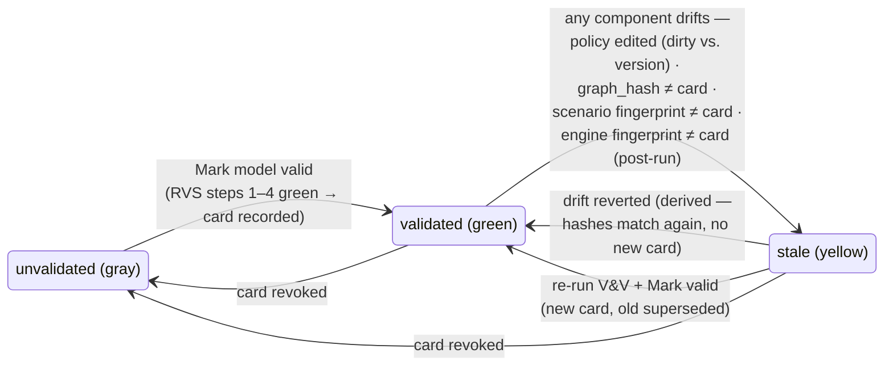

# Phase B0 — The CORE Loop: Registry-Driven Picker + Persisted Credibility

| | |
|---|---|
| **Status** | Approved design, v1.0 |
| **Date** | 2026-07-10 |
| **Serves** | Phase B0 / **G13** + the UI half of **G1** / §4.3, §6.3, §8.1–8.2, §9.5, Appendix A of `next-gen-platform-design.md` |
| **Authority** | Subordinate to the blueprint (`docs/design/next-gen-platform-design.md`). Where this design refines the blueprint (three places, listed in §6), the blueprint is updated in the same change, per the working agreement. |
| **Ships with** | `supabase/migrations/20260710000001_model_validations.sql` (the B0b data plane, executable) |

B0 is the credibility pipeline: the two workstreams that make the researcher's
journey — *configure policies → verify → validate → decide* — hold together
end-to-end. **B0a** makes policy selection registry-driven (§6.3's picker
interaction contract). **B0b** makes V&V outcomes a persisted artifact that
Lab runs inherit and display (§9.5's validated model card, closing G13).
Everything below extends artifacts that already exist; nothing is replaced.

**Scope discipline.** B0 is deliberately small: no new engine behavior, no new
policy, no bundle-native storage, no node-type default layer (all B1), no
sequential-CI service or CRN-paired validation experiments (Phase C, §9.5
roadmap placement). The complexity budget is spent entirely on *alignment*:
TS ↔ Python ↔ registry ↔ DB speaking one vocabulary, and one persistence
pattern that Phase C experiments can inherit unchanged.

---

## 1. B0a — Registry-driven policy picker

### 1.1 What exists (the rail is built; the forms don't run on it yet)

Phase A delivered the generation pipeline (§6.2 implementation note):
`scsim/scripts/gen_frontend_registry.py` emits `src/lib/policies/registry.generated.json`
(+ the edge mirror under `supabase/functions/_shared/`), CI fails on drift
(`--check`), and `src/lib/policies/registryAccess.ts` is the frontend's single
access path. But the `/policies` forms still render from the hand-written
7-family Zod vocabulary (`schemas.ts`, `columnSpecs.ts`), reconciled to the
engine through `engineBridge.json`. B0a is the switch-over: the forms adopt
the engine's plugin-by-plugin vocabulary, which is the precondition for
retiring the Zod schemas and the bridge (§6.2, §13 B0 exit).

### 1.2 Registry export payload v2 (the `RegistryExport` shape)

`scsim/scsim/io/registry_export.py::build_registry()` today exports
`{engine_version, policies[], base_data_requirements, pipeline, kpis, entities}`;
each policy carries `id, catalog_ref, stage, strategy_class,
constraint_targeted, requires_predeployment, status, milestone, summary,
hooks, params_schema, data_requirements`. v2 adds exactly the metadata the
picker contract (§6.3) and the M3 design addendum (§13) require — **additive
only**, so every existing consumer (docs gen, grading, fieldStatus) keeps
working:

```jsonc
{
  "registry_schema_version": 2,          // NEW — consumers hard-fail on unknown major
  "engine_version": "0.4.x",

  // NEW — the decision slots of §4.1/§4.4. Derived engine-side from
  // (stage × domain) over the catalog, not hand-written in TS.
  "slots": [
    {
      "id": "plant.inventory_control",   // <stage>.<domain_snake>
      "stage": "plant",
      "domain": "inventory control",
      "horizon": "tactical",             // §4.1 axis 3
      "label": "Inventory control",
      "family": "inventory",             // which JSONB family stores it (§1.5)
      "default_policy": "P-P.1",         // named default when one is registered (§4.4)
      "builtin_note": null               // or e.g. "PH-40 greedy plan until P-P.0 lands"
    }
  ],

  "policies": [
    {
      // --- everything exported today, unchanged ---
      "id": "inventory_control", "catalog_ref": "P-P.1", "stage": "plant",
      "strategy_class": "...", "status": "implemented", "milestone": null,
      "summary": "...", "hooks": [...], "data_requirements": [...],

      // --- NEW classification (§4.1 axes 2–3, thin metadata not new IDs, §4.2) ---
      "domain": "inventory control",
      "horizon": "tactical",
      "slot": "plant.inventory_control",
      "family": "inventory",

      // --- NEW: the declarative activation rule (M3 addendum item 2).
      // Which family fields select this policy and feed its params — the
      // same table project_map.py::_map_policies consumes, exported so the
      // TS side interprets it instead of mirroring it (retires engineBridge.json).
      "activation": {
        "when": [{ "field": "inventory.policy", "op": "in",
                   "value": ["min_max", "s_S", "base_stock"] }],
        "params": { "kappa": { "from": "inventory.coverage_kappa" },
                    "moq":   { "from": "materials.moq", "scope": "per_material" } }
      },

      // --- params_schema: Pydantic JSON Schema as today, properties gain
      // an x-ui block (M3 addendum item 1) rendered verbatim by the form ---
      "params_schema": {
        "properties": {
          "kappa": {
            "type": "number", "minimum": 0, "maximum": 10, "default": 1.0,
            "unit": "weeks of coverage",
            "x-ui": { "label": "Coverage κ", "group": "Sizing", "order": 10,
                      "visible_when": { "field": "variant", "in": ["min_max"] },
                      "scope": "global" }   // global | per_node | per_material | per_product
          }
        }
      }
    }
  ],

  "base_data_requirements": [...],   // unchanged (§8.1)
  "pipeline": {...}, "kpis": [...], "entities": {...}   // unchanged
}
```

Engine-side this is: `domain`/`horizon`/`slot` attributes on `CatalogEntry`
(new enum values live beside `stage`/`strategy_class` in
`scsim/scsim/entities/enums.py`, per §4.1), the activation table extracted
into `scsim/scsim/io/activation.py` (consumed by `_map_policies` **and**
exported — one definition, two consumers), and `x-ui` emitted from
`json_schema_extra` on the Pydantic `Params` fields. `pipeline`, `kpis`,
`entities` are untouched.

### 1.3 The `RegistryAccess` service contract (§6.3)

`registryAccess.ts` stays the **only** module that imports
`registry.generated.json` (now lint-gated, §1.6). It grows from field-level
accessors (`paramEnum`, `paramRange`, `paramDefault` — kept) to the slot-level
contract the picker needs:

```ts
// --- catalog navigation -----------------------------------------------------
slots(stage?: Stage): RegistrySlot[];              // ordered decision slots
policiesForSlot(slotId: string): RegistryPolicy[]; // implemented first, then
                                                   // planned (visible-disabled
                                                   // w/ milestone, A3), never
                                                   // deferred/reserved entries
// --- form rendering ----------------------------------------------------------
paramFormSpec(policyId: string): FormFieldSpec[];  // params_schema + x-ui →
                                                   // ordered, grouped fields;
                                                   // labels/units/ranges/enums/
                                                   // defaults all engine-sourced
// --- live data demands (§8.1) ------------------------------------------------
manifestFor(selection: SlotSelection[]): RegistryDataRequirement[];
   // union of data_requirements over the selected policies, condition-graded
   // exactly as _shared/grading.ts does (same reducer library) — this is what
   // the data-requirement card re-renders on every selection change
// --- activation (bridge retirement) ------------------------------------------
activationFor(policyId: string): ActivationRule;   // exported table, not TS-mirrored
resolveBundle(snapshot: PolicySnapshotV2): Bundle; // §1.5 — pure function
```

Contract laws (the §6.3 interaction contract, stated testably):

1. **Slot → catalog**: `policiesForSlot` returns exactly the registry entries
   whose `slot` matches; UI adds nothing, hides nothing implemented.
2. **Selection → form**: `paramFormSpec` is total for implemented policies;
   the form renders no field that isn't in `params_schema` and re-types no
   fact (label/unit/range/enum/default) by hand.
3. **Selection → data demands**: `manifestFor` recompiles synchronously on
   every change; each requirement links to the `/project-manager` field
   (the `dataset.column` vocabulary of `dataMap.ts` already gives us the walk-to link).
4. **Always-valid default**: a slot with no explicit choice renders its
   `default_policy` (or `builtin_note`) — the form is never empty (§4.4).
5. **Validation before save**: field validation uses the schema's own ranges;
   cross-checks reuse `feasibility()`/`check_portfolio` findings when Phase C
   surfaces them — B0 renders the schema-level tier only.

### 1.4 `/policies` evolution: 7 JSONB families → bundle-aware grid

The four-stage flow (A14) and the grid (`StagePolicyTable`, xlsx round-trip,
drafts, provenance dots) are kept. Three changes, per the M3 addendum:

1. **`registryColumns.ts`** — a registry→`ColSpec` adapter beside
   `columnSpecs.ts`: for each stage, one **policy-variant select column per
   slot** (implemented selectable; planned visible-disabled with milestone —
   generalizing today's `fieldStatus.ts` badge from fields to whole policies)
   plus parameter columns typed from `paramFormSpec`. `columnSpecs.ts` shrinks
   to data/master columns (which stay hand-curated — they describe datasets,
   not policies).
2. **Per-node = the override mechanism we already have.** A slot cell edited
   on a specific row writes a `policy_overrides` patch
   (`scope/target_key/family/patch`) exactly as parameter cells do today; the
   project-level slot choice lives in `policy_defaults.<family>`. Two
   suppliers with different `P-S.1` selection rules are two override rows —
   no new storage. (Node-type defaults, the middle cascade layer of §4.3,
   remain B1.)
3. **The data-requirement card** renders `manifestFor(currentSelection)` in
   the stage side panel and re-renders on every slot/param change — picking
   `finite_queue` makes `suppliers.capacity_per_week` required *on the spot*,
   with the walk-to link (§6.3 rule 3). Same findings vocabulary
   (`block/warn/info`) as the verification stage and the `sim-command` gate,
   because all three grade through the shared module.

Landed behind a per-stage flag; a stage flips when its registry-rendered grid
is at parity with the Zod-rendered one (drafts, xlsx, presets included).

### 1.5 Storage: families as substrate, bundles as a derived view

**Blueprint open question §14.1 is hereby decided: keep the seven JSONB
family columns as the storage substrate; bundles are a resolved view.**
Zero migration risk, zero data movement, `policy_versions` v2 snapshots stay
valid, and the presets/xlsx/draft machinery keeps writing the same rows.

The bundle is a **pure function**, not a table:

```
resolveBundle : (snapshot_v2, registry.activation) → { slot → (policy_id, params) }
```

computed identically in TS (`registryAccess.resolveBundle`, drives the picker
display and the grid's "what will run" summary) and in Python
(`project_map.py::_map_policies`, which already *is* this function — B0 just
makes both sides read the same exported activation table). Parity is
fixture-tested (§1.6).

**Why identity still holds without embedding the bundle in the snapshot:**
`policy_hash` covers the family substrate; the activation table is engine
code, covered by `engine_fingerprint` (ENGINE_VERSION today, the full §9.2
fingerprint in Phase C). Since `bundle = f(snapshot, activation)`,
`(policy_hash, engine_fingerprint)` jointly fingerprint the resolved bundle —
the property the credibility card (§2) and later the run cache require.
Snapshot `schema_version: 3` (embedding the resolved bundle, R9 upgrade path)
lands in B1 together with node-type defaults, when there is a second cascade
layer that makes embedding worth it. B0 does not touch `_build_policy_snapshot`.

**Transition path** (each step shippable alone):

| Step | Change | Retires |
|---|---|---|
| 1 | Registry export v2 (slots, activation, x-ui); regenerate snapshots | — |
| 2 | `registryAccess` v2 accessors + `resolveBundle`; parity fixtures | — |
| 3 | `registryColumns.ts` + picker components, per-stage flag | — |
| 4 | All stages flipped; presets emit through activation vocabulary | `columnSpecs.ts` policy columns |
| 5 | Grading interprets exported activation table | `engineBridge.json`, `check_registry_bridge.mjs` |
| 6 | Delete hand-written policy Zod | `schemas.ts` policy metadata (type shells may remain as generated TS) |

### 1.6 CI gates (the A13 pattern, extended)

| Gate | Status | What it protects |
|---|---|---|
| `gen_frontend_registry.py --check` | exists | committed snapshots (frontend + edge) match the engine; **B0: also fails on `registry_schema_version` mismatch with `registryAccess.ts`'s expected major** |
| `check_registry_bridge.mjs` | exists → retires at step 5 | bridge names only real engine facts, until the exported activation table replaces it |
| TS↔Python activation parity fixtures | exists (Phase A) → extended | `resolveBundle(snapshot)` in TS == `_map_policies` activations in Python, per preset × per stage |
| **`check_registry_access_purity.mjs`** | **new** | no module other than `registryAccess.ts` imports `registry.generated.json`, and no picker/form component imports the hand-written `schemas.ts` — keeps the retirement one-way |
| grading golden fixture (`grading_test.ts` + `test_validation_parity.py`) | exists | manifest grading parity browser == edge == engine, unchanged by B0a |

---

## 2. B0b — The persisted credibility artifact (`model_validations`)

### 2.1 The problem, precisely

The Run & Validate stage (RVS) already computes everything §9.5 steps 1–5 need
from **real persisted run output** (Phase A): verification findings,
engine/Welch/MSER-5 warm-up, per-KPI CI half-width adequacy, KS + Welch-t
against uploaded empirical series. But the outcome lives in component state
and `localStorage` (`policy.runcfg.v3.*`) — G13. `scenarios.warmup_mode`
stays `'auto'`, `warmup_days` stays 14, `replications` stays 10, and nothing
marks a `policy_versions` snapshot as validated. The Lab reruns decisions on
defaults the pipeline already improved on.

### 2.2 Schema (executable DDL in `20260710000001_model_validations.sql`)

```
model_validations
  id                        uuid PK
  project_id                uuid FK projects            ── discovery scope
  ── provenance triple (identity, §9.5) ──────────────────────────────────
  policy_version_id         uuid FK policy_versions     ┐ the exact snapshot
  policy_hash               text NOT NULL               ┘ (hash denormalized for display/drift)
  dataset_version_id        uuid FK dataset_versions    ┐ the exact world
  graph_hash                text NOT NULL               ┘
  scenario_hash             text NOT NULL               ── baseline fingerprint (§2.3)
  scenario_fingerprint      jsonb NOT NULL              ── the canonical fields the hash covers (audit)
  engine_fingerprint        text                        ── evidence run's code_version (advisory 4th component)
  ── adopted content (what Lab scenarios inherit) ────────────────────────
  adopted_warmup_days       int NOT NULL
  warmup_method             text  ('engine'|'welch'|'mser5')
  recommended_replications  int NOT NULL
  replication_basis         jsonb  {confidence, target_precision, per_kpi:{kpi:{mean,half,rel,n}}}
  validation_tests          jsonb  [{kpi, ks, ks_p, t, t_p, n, source, pass}]
  findings_snapshot         jsonb  verifier findings at adoption (§8.2 vocabulary)
  verdict                   text  ('validated'|'rejected')      ── stored outcome, §2.4
  basis                     text  ('statistical'|'face')        ── empirical tests ran, or face validation only
  evidence_run_id           uuid FK simulation_runs (SET NULL)  ── drill-down to the run
  ── lifecycle (A5 discipline: immutable rows, superseded not edited) ────
  status                    text ('active'|'superseded'|'revoked')
  superseded_by             uuid FK model_validations
  validated_at              timestamptz
  author_user_id / author_email / created_at

UNIQUE (policy_version_id, graph_hash, scenario_hash) WHERE status='active'
```

Column additions elsewhere (all nullable → zero migration risk):

- `scenarios.inherited_validation_id` — which card seeded this scenario's
  warm-up/replications (provenance of inheritance; distinguishes "inherited"
  from "hand-set" in the UI).
- `simulation_runs.scenario_hash` — stamped at dispatch, completing the
  run's provenance triple alongside the existing `policy_hash`/`graph_hash`.
- `simulation_runs.model_validation_id` — the card in force at dispatch, so
  a run's badge is immutable history even after later drift.
- **`policy_versions`: no column.** "Validated" is derived through the card
  (blueprint: *"policy_versions gains a derived 'validated' badge through
  it"*) — a denormalized flag would be a second source of truth that drifts.

RPCs (SECURITY DEFINER, mirroring the `snapshot_policy`/`snapshot_dataset`
pattern; the table itself is SELECT-only to clients — writes go through them):

- `record_model_validation(...)` — validates the triple's project consistency,
  computes `scenario_hash`, supersedes the same-triple active card, inserts.
- `scenario_fingerprint_hash(scenario_id)` / `_build_scenario_fingerprint` —
  the single canonicalization point (same discipline as `_build_policy_snapshot`
  and `_build_dataset_snapshot`).
- `active_model_validation(policy_version_id, graph_hash, scenario_hash)` —
  exact-triple resolution (used by `sim-command` at dispatch and by hooks).
- `apply_validation_to_scenario(scenario_id, validation_id)` — the one
  server-side definition of inheritance: `warmup_mode='manual'`,
  `warmup_days=adopted`, `replications=recommended`, `inherited_validation_id`.
- `revoke_model_validation(validation_id)`, `list_model_validations(project_id)`.

### 2.3 `scenario_hash`: the baseline fingerprint (a deliberate canonicalization)

**What the card certifies is the no-event baseline model.** Warm-up and
replication adequacy are established on the steady-state baseline; stress
tests and disruption studies are then run *on* that validated baseline — that
is the entire point of B0 ("stress tests run on unvalidated baselines" is the
risk being closed). The engine already encodes this exact reuse class:
`SnapshotStore`'s family digest keys warm state by *network + settings +
policies excluding events* (A8, §9.2 partial hits).

Therefore the card's `scenario_hash` is a **family-digest-style fingerprint**,
not a hash of the full scenario row:

| Included (world/model behavior) | Excluded (and why) |
|---|---|
| `horizon_days` | `disruption_schedule` — events are the experiment, not the model (A8 precedent) |
| `time_step` | `recovery_overrides` — inert without events; they ride the experiment |
| `demand_model` | `warmup_mode/days`, `replications`, `seed`, `stopping_rule` — these are V&V *outputs*/estimation settings; hashing them would make the card invalidate itself |
| | `primary_kpi`, `name`, `description` — cosmetic |

Consequence: **every Lab scenario that shares the baseline world inherits the
card**, including stress scenarios with disruption schedules — their runs
show `validated` because the model under stress is the validated model. This
refines §9.5/§8.4 and is folded back into the blueprint (§6 below). The
Phase C **RunKey** `scenario_hash` is a different, stricter hash (events
included — cache identity must distinguish them); the two share the
canonicalization module but not the field list. `fingerprint_version` inside
the stored `scenario_fingerprint` versions these rules (R7 discipline).

### 2.4 Badge state machine: one stored fact, three derived states

The database stores an **outcome** (`verdict`: validated/rejected, on an
immutable card). The badge states the user sees are **derived at read time**
by comparing the current context's hashes to the active card — staleness is
never stored, so it can never go stale itself, and reverting a drift
self-heals to `validated` without ceremony:



Derivation, given a context `(policy_version_id, dirty, current_graph_hash,
scenario_fingerprint_hash)`:

1. Exact active-card triple match **and** not dirty → **validated**.
2. An active card exists for this `policy_version_id` (or the version the
   dirty edits branch from) but any component mismatches → **stale**, and the
   tooltip names *which* component drifted — the actionable half of the badge.
3. No card in this version's lineage → **unvalidated**.

The engine fingerprint is the advisory fourth component: unknown at dispatch
(the worker stamps `code_version` on completion), so it cannot gate, but a
completed run whose `code_version` ≠ card's `engine_fingerprint` renders the
stale marker on that run's badge (§9.5 staleness law: engine upgrade drifts
credibility; Phase C's full §9.2 fingerprint strengthens this check).

### 2.5 Persistence flow: RVS → `model_validations`

RVS gains a fifth sub-step, **Adopt** (after Verification → Run → Warm-up →
Validation), enabled when steps 1–4 are green — or steps 1–3 plus an explicit
"face validation" acknowledgment when no empirical series exist (`basis:
'face'`, a legitimate Sargent-style outcome for greenfield models; the badge
tooltip discloses it).

```
"Mark model valid" click:
 1. version_id ← saveSnapshot() if dirty, else the selected version
    (RVS already holds saveSnapshot; runs are already version-bound)
 2. dataset_version_id ← rpc snapshot_dataset(project)      -- dedup-or-insert (§8.4)
 3. rpc record_model_validation(
      project, version_id, dataset_version_id,
      scenario_id        = the "Policy validation (auto)" scenario,
      adopted_warmup_days= warmCfg.warmup_days, warmup_method,
      recommended_replications = max over focal KPIs of adequacy n*,
      replication_basis  = {confidence, target_precision, per_kpi stats},
      validation_tests   = validationResult, findings_snapshot = findings,
      verdict='validated', basis, evidence_run_id = latestRun.id)
    → supersedes the same-triple card, returns card id
 4. UI flips the stage banner to the green badge; localStorage keeps only
    UI ergonomics (tab positions, last-used config) — never results
```

The evidence chain is fully drillable: card → `evidence_run_id` →
`run_replications` (per-rep KPIs + weekly series) — nothing on the card is
asserted that a run row cannot back (the A3 guardrail for the V&V Analyst
agent later).

### 2.6 Lab inheritance and display

**Inheritance** (blueprint: scenarios under a validated triple inherit
adopted warm-up + replication count):

- `useModelValidation(projectId)` — a hook mirroring `useDatasetVersion`:
  loads active cards + `current_graph_hash` + `current_policy_hash`, exposes
  `resolve(policyVersionId, scenario) → {state, card, drift[]}`. Realtime on
  `model_validations` keeps every surface live.
- On scenario **creation** (and on render of a never-touched scenario) in the
  Lab: if `resolve(...)` is `validated`, call
  `apply_validation_to_scenario(scenario.id, card.id)`. The setup form shows
  the values with an "inherited from validation" chip; a user who edits
  warm-up/replications by hand clears `inherited_validation_id` — explicit
  divergence, never silent.
- **Dispatch** (`sim-command`): alongside the existing `snapshot_dataset` +
  hash stamping, compute `scenario_fingerprint_hash(scenario)` and
  `active_model_validation(triple)`; stamp `scenario_hash` and
  `model_validation_id` on the run row. Best-effort like the dataset binding —
  a missing card never blocks a run; it just runs unvalidated (§9.5's product
  guarantee is *labeling*, not gating).

**Display** — one `CredibilityBadge` component (§3.2), rendered on: the Lab
run pane header (next to the version bar), `RunProgressPanel`,
`ResultsDashboard` header, the scenario rail rows (dot form), and the RVS
banner itself. Runs render from their stamped `model_validation_id` +
post-run fingerprint check (immutable history); live surfaces render from
`resolve(...)` (current truth).

---

## 3. Component sketches

### 3.1 Policy picker: per-slot selector + parameter form + data card (B0a)

```tsx
// src/components/policies/PolicySlotPicker.tsx — rendered per stage; per-node
// when given a grid row (writes overrides instead of defaults).
function PolicySlotPicker({ stage, selection, onChange, scopeRow }: Props) {
  return slots(stage).map((slot) => {
    const options  = policiesForSlot(slot.id);          // registry, not hand-written
    const selected = selection[slot.id] ?? slot.default_policy; // §4.4: never empty
    return (
      <section key={slot.id}>
        <header>{slot.label} <HorizonChip horizon={slot.horizon} /></header>
        <Select value={selected} onValueChange={(id) => onChange(slot.id, id)}>
          {options.map((p) =>
            p.status === "implemented"
              ? <SelectItem value={p.id}>{p.catalog_ref} · {p.id}</SelectItem>
              : <SelectItem value={p.id} disabled>       {/* A3: honest catalog */}
                  {p.catalog_ref} · {p.id} <MilestoneBadge m={p.milestone} />
                </SelectItem>)}
          {slot.builtin_note && <BuiltinDefaultRow note={slot.builtin_note} />}
        </Select>
        {/* form fields 100% from the registry (§6.3 rule 2) */}
        <RegistryParamForm
          spec={paramFormSpec(selected)}                 // labels/units/ranges/x-ui
          values={selection.params[slot.id]}
          onChange={(field, v) => onChange(slot.id, selected, { [field]: v })}
        />
      </section>
    );
  });
}

// Side panel — recompiles on EVERY selection/param change (§6.3 rule 3):
function DataRequirementCard({ selection }: { selection: SlotSelection[] }) {
  const reqs = manifestFor(selection);   // graded: block / warn / info
  return reqs.map((r) => (
    <RequirementRow key={r.field} level={r.level} reason={r.reason}
      onWalkTo={() => navigateToField(r.field)} />      // dataMap.ts link
  ));
}
```

### 3.2 Credibility badge + tooltip (B0b)

```tsx
type Credibility =
  | { state: "unvalidated" }
  | { state: "validated"; card: ModelValidation }
  | { state: "stale";     card: ModelValidation;
      drift: Array<"policy" | "data" | "scenario" | "engine"> };

function CredibilityBadge({ c }: { c: Credibility }) {
  // gray shield / green shield-check / yellow shield-alert
  return (
    <Tooltip content={<CredibilityTooltip c={c} />}>
      <Badge variant={c.state}>{LABEL[c.state]}</Badge>
    </Tooltip>
  );
}

// Tooltip — the drill-in the task specifies, all fields straight off the card:
//  ┌──────────────────────────────────────────────────────────┐
//  │ ✓ Model validated · 3 days ago by a.researcher           │
//  │ Policy v7 "Dual-source baseline" · this network (a41f…)  │
//  │ Warm-up: 105 days (15 wk, MSER-5) · Replications: n = 30 │
//  │ Tests: fill_rate KS p=.61 ✓ · max_backlog Welch p=.32 ✓  │
//  │ Basis: statistical · Evidence: run #8c2e… →              │
//  ├─ stale only ─────────────────────────────────────────────┤
//  │ ⚠ Network data changed since validation (graph hash      │
//  │   drifted). Re-validate to trust results. [Open R&V →]   │
//  └──────────────────────────────────────────────────────────┘
```

### 3.3 RVS Adopt step (B0b persistence)

```tsx
// RunValidateStage.tsx — STEPS gains { id: "adopt", label: "Adopt" }.
function AdoptStep() {
  const ready = blockCount === 0 && hasRealData && warmupComputed;
  const statistical = validationResult?.some((r) => r.pass);
  return (
    <Card>
      <SummaryRows warmup={warmCfg} nStar={recommendedReps} tests={validationResult} />
      {!validationResult && <FaceValidationNotice acknowledged={faceAck} onAck={setFaceAck} />}
      <Button disabled={!ready || (!statistical && !faceAck)} onClick={markValid}>
        Mark model valid
      </Button>
    </Card>
  );
}

async function markValid() {
  const versionId = isDirty ? await saveSnapshot("Validated model") : selectedVersionId;
  const datasetVersionId = await supabase.rpc("snapshot_dataset", { p_project_id: projectId });
  const { data: cardId } = await supabase.rpc("record_model_validation", {
    p_project_id: projectId, p_policy_version_id: versionId,
    p_dataset_version_id: datasetVersionId, p_scenario_id: validationScenarioId,
    p_adopted_warmup_days: warmCfg.warmup_days, p_warmup_method: warmCfg.method,
    p_recommended_replications: recommendedReps, p_replication_basis: adequacyStats,
    p_validation_tests: validationResult ?? [], p_findings: findings ?? [],
    p_verdict: "validated", p_basis: validationResult ? "statistical" : "face",
    p_evidence_run_id: latestRun?.id ?? null,
  });
  toast.success("Model card recorded — Lab scenarios now inherit this validation.");
}
```

### 3.4 Lab: inherited settings + badge (B0b consumption)

```tsx
// SimulationLab.tsx
const cred = useModelValidation(projectId);
const c = cred.resolve(policyVersionId, selected);       // Credibility (§3.2)

// Run pane header row gains the badge beside the version label:
//   [Model version: v7 "Dual-source baseline"]  [✓ validated]   [Run]
// and dirty policies now read as drift, not just "unsaved":
//   [Policy settings changed since validated v7] [⚠ stale] [Save & re-validate →]

// ScenarioSetupForm — the read-only "Steady-state & confidence" box becomes:
//   Steady state starts at: 105 days   [inherited from validation ✓]
//   Replications: 30                   [inherited from validation ✓]
//   (hand-editing either clears inherited_validation_id → chip disappears)

// Scenario creation:
onCreate: async () => {
  const s = await create(`Scenario ${n}`);
  const c = cred.resolve(policyVersionId, s);
  if (c.state === "validated")
    await supabase.rpc("apply_validation_to_scenario",
      { p_scenario_id: s.id, p_validation_id: c.card.id });
}

// ResultsDashboard header: badge from the RUN's stamped card (history), plus
// the engine-fingerprint check:
//   run.model_validation_id ? (run.code_version === card.engine_fingerprint
//     ? validated : stale("engine")) : unvalidated
```

---

## 4. Rollout order

| # | Lands | Depends on | Risk posture |
|---|---|---|---|
| 1 | Migration `20260710000001` (table + RPCs + columns) | — | additive, nullable, no behavior change. **Shipped.** |
| 2 | RVS Adopt step + `record_model_validation` wiring | 1 | new UI step; existing steps untouched. **Shipped** (with the RVS half of 3: `useModelValidation` + badges on the RVS header and run panel; the RVS run config in `localStorage` demoted to a draft cache — the active card seeds the adopted warm-up / target precision on load) |
| 3 | `useModelValidation` + badges on Lab/RVS surfaces | 1–2 | display-only. **RVS surfaces shipped**; Lab surfaces next |
| 4 | `sim-command` stamps `scenario_hash` + `model_validation_id`; `apply_validation_to_scenario` on create | 1–3 | best-effort like dataset binding |
| 5 | Registry export v2 + regenerated snapshots + gates | — (parallel to 1–4) | additive payload |
| 6 | `registryAccess` v2 + `registryColumns.ts` + picker, per-stage flag | 5 | flag-gated parity flips |
| 7 | Retirements: Zod policy vocabulary, `engineBridge.json`, bridge gate | 6 complete | only after all stages flipped |

B0 exit (§13): selecting any implemented policy shows exactly its engine
parameters and data demands live (1.3 laws 1–3); a model validated in RVS
carries warm-up + replications into every Lab scenario automatically (2.6);
validation status is visible on every result (badge surfaces list).

## 5. Traceability

| Design decision | Blueprint anchor |
|---|---|
| Slots derived from stage × domain; horizon as metadata; `.0` builtin notes | §4.1, §4.2, §4.4, Appendix A |
| Bundles = derived view over family substrate; per-node via `policy_overrides`; v3 snapshot deferred to B1 | §4.3, §14 OQ1 (decided), M3 addendum item 5, R9 |
| Picker laws 1–5 | §6.3 interaction contract (verbatim mapping) |
| Activation table exported, one definition TS+Python; bridge retires | §6.2 (registry law), M3 addendum item 2, G1 |
| Live data-requirement card via shared grading | §8.1–8.2, A13/A6 |
| CI gates incl. new purity gate | A13, R3 |
| Card bound to (policy_version, graph_hash, scenario_hash) + advisory engine fingerprint | §9.5 identity, §8.4 three-hash triangle |
| `scenario_hash` excludes events/estimation params | §9.5 consumption, A8 family digest, §9.2 partial hits |
| Verdict stored, badge derived; supersede-not-edit; evidence run drillable | §9.5 model card + staleness law, A5 |
| Inheritance via one RPC; label-not-gate at dispatch | §9.5 decision-support guarantee |
| Sequential-CI + CRN validation experiments deferred | §9.5 roadmap placement, Phase C |

## 6. Blueprint deltas (applied in this change)

1. **§14 open question 1 → decided**: families as substrate, bundles as
   resolved view (this document §1.5); bundle-native storage reconsidered
   only if B1's node-type defaults demand it.
2. **§9.5 storage shape → concrete**: implementation-note pointer to this
   document and the migration; the card's `scenario_hash` defined as the
   events-excluded baseline fingerprint (A8 precedent), distinct from the
   Phase C RunKey scenario hash; verdict stored / badge derived.
3. **§13 Phase B0 → design addendum pointer** to this document (mirroring the
   M3 addendum pattern).
