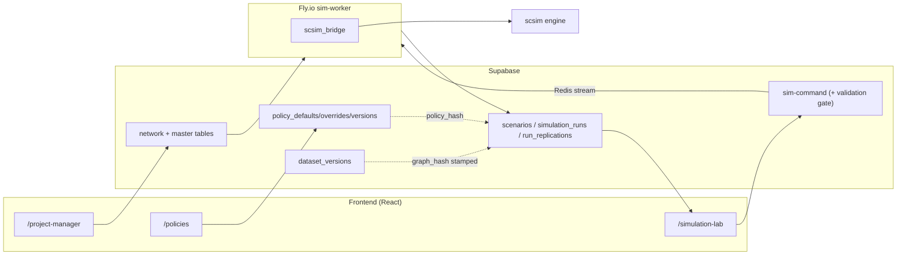
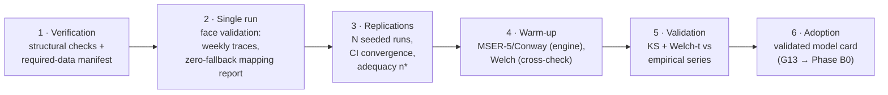

# SureSuite: An Open, Policy-Driven Platform for Supply Chain Simulation and Decision Support — Architecture Report

| | |
|---|---|
| **Status** | Report frame v1.0 — scientific-paper skeleton with real content; ⟦double-bracket⟧ marks placeholders to fill with case-study results |
| **Date** | 2026-07-06 |
| **Role** | *Descriptive* companion to the governing blueprint `docs/design/next-gen-platform-design.md`. The blueprint is normative (what to build and why); this report describes the platform as designed and built, structured so it can be lifted into a scientific paper (WSC tools track / SoftwareX style) or expanded into a thesis chapter. |
| **Authority** | Where this report and the blueprint disagree, the blueprint wins; update both in the same PR (repo working agreement). Engine mechanics: `scsim/docs/architecture.md`. |
| **Status legend** | ✅ shipped · 🔶 partial (shipped with known gaps, gap ID cited) · 🧭 designed, scheduled (blueprint phase cited) |

---

## Abstract *(draft — tighten to ~200 words at submission)*

Commercial supply chain simulation suites such as anyLogistix give practitioners a no-code
surface for configuring networks, policies, and experiments, but they are closed: engines are
not inspectable, policy libraries are not extensible without leaving the GUI paradigm, model
provenance is not content-addressed, and verification and validation (V&V) are left to user
discipline. We present **SureSuite**, an open, web-based simulation platform whose central
abstraction is the *policy*: every operational decision in the modeled supply chain — sourcing,
inventory control, safety stock, production planning, allocation, fulfillment, transport,
demand — is an explicit, replaceable plugin with a declared parameter schema, phase residency,
feasibility rules, and cost contribution. A single registry export generates the configuration
forms, validators, and documentation, so the user interface can only offer what the engine can
execute. The platform binds every run to a three-hash provenance triple (network data, policy
version, scenario), and packages simulation methodology — Welch/MSER-5 warm-up determination,
replication adequacy, common random numbers, distribution tests against empirical data — as a
guided verification-and-validation pipeline whose outcome governs downstream decision-support
use. We describe the architecture from both a supply chain management and a technical
perspective, catalog its modules, and position it against the commercial reference tool.
⟦One sentence of headline case-study results.⟧

**Keywords:** supply chain simulation; simulation software architecture; inventory policies;
verification and validation; warm-up period; digital twin; resilience; open-source.

---

## 1. Introduction

### 1.1 Motivation

Simulation is the standard instrument for evaluating supply chain policies under uncertainty —
inventory rules, sourcing structures, capacity buffers, disruption responses — because the
interactions among these decisions defeat closed-form analysis. The tooling landscape, however,
forces a choice: commercial suites (anyLogistix, Supply Chain Guru, AnyLogic) offer complete
input surfaces and turnkey experiments but closed engines and fixed policy libraries; academic
codes offer transparency and extensibility but no product surface a planner can use. SureSuite
is built on the claim that this trade-off is architectural, not essential: if the policy
catalog, its parameter schemas, and its data requirements are a single machine-readable
artifact exported by the engine, then the no-code configuration experience *and* research-grade
extensibility come from the same source.

The second motivating observation is methodological. Textbook simulation practice demands
verification, face validation, warm-up (initial-transient) determination, replication-count
justification, and statistical validation against real data before a model informs decisions
(Law 2015; Sargent 2013; Robinson 2014). Commercial tools provide replications; they do not
operationalize the discipline. SureSuite packages the full V&V sequence as a guided product
pipeline whose outcome is a persisted, provenance-bound artifact that downstream experiments
inherit — the platform's answer to "when may a simulation be trusted for decisions?"

### 1.2 Design objective

Reproduce the *experience class* of the leading commercial tool — select a policy, see exactly
the parameters it needs, run wizard-guided experiments — while surpassing it in architecture
class: modular (policies as plugins), extensible (new algorithm = one plugin file), transparent
(open engine, validated interaction contracts, decision provenance), policy-driven (no hidden
behavior), AI-native (surrogates with calibrated uncertainty), and research-grade (CRN, warm-up
detection, sequential stopping, conformal intervals as defaults). The governing blueprint
(§1, six pillars) states this in full; this report describes the resulting system.

### 1.3 Contributions

1. **A policy-plugin architecture for supply chain simulation** in which the weekly decision
   cycle is data (a validated phase pipeline), every decision is a replaceable plugin, and the
   engine never changes when a policy is added (§4.2–4.3).
2. **A single-source-of-truth configuration chain**: engine registry → generated forms,
   validators, and docs, with CI gates against drift — the mechanism that delivers the
   commercial-grade "pick a policy, fill its parameters" UX from research code (§4.3, §5).
3. **A guided V&V pipeline** — verification, single-run face validation, replication adequacy,
   warm-up determination, statistical validation — whose persisted outcome governs
   decision-support use (§6).
4. **Content-addressed provenance** for models, policies, and runs (three-hash triple), the
   substrate for run caching and surrogate validity scoping (§4.6, §8).
5. ⟦Case-study contribution sentence once results exist.⟧

### 1.4 Structure

§2 gives background and the commercial reference. §3 describes the platform in supply chain
management terms — the modeled world, decisions, and the analyst's journey — with no software
vocabulary. §4 gives the technical architecture. §5 catalogs modules and features with their
implementation status. §6 presents the V&V methodology (the platform's core). §7 covers
experimentation and decision support; §8 the AI layer. §9 specifies the case-study protocol
(placeholders). §10 discusses positioning and limitations; §11 concludes.

---

## 2. Background and reference context

### 2.1 The commercial reference: anyLogistix

anyLogistix (ALX) couples a CPLEX-based network optimizer with an AnyLogic-based discrete-event
simulator. Its simulation side offers: structured input tables for every entity (sites,
products, demand, paths, vehicles); a fixed library of inventory and sourcing policies
selectable per product–site pair from the GUI (min/max, (R,Q), (s,S), order-up-to, periodic;
single/multiple sourcing by cheapest/fastest/priority/fractions); experiment wizards
(simulation, variation, comparison, safety-stock estimation, risk analysis); and KPI
dashboards. Its strengths are the completeness of the input surface and turnkey experiment
packaging. Its structural limits: a closed engine; a non-extensible policy set (extension means
dropping into AnyLogic/Java, invisible to the GUI); no content-addressed provenance of
model + policy + scenario; replications without warm-up methodology or persisted validation
state; no AI layer. SureSuite targets parity on the input surface and the selection UX, and a
different class on extensibility, transparency, statistics, and compute economics (full
capability-by-capability table: blueprint §10.1; condensed version: §10 below).

### 2.2 Methodological foundations

The platform packages established simulation methodology rather than inventing statistics:
initial-transient (warm-up) determination by Welch's graphical procedure (Welch 1983) and the
MSER-5 truncation heuristic (White 1997) with Conway's rule as cross-check (Conway 1963);
replication-count adequacy from CI half-width targets and sequential stopping (Law 2015);
common random numbers via independent keyed streams (L'Ecuyer et al. 2002) for paired
comparisons; two-sample Kolmogorov–Smirnov and Welch-t tests for operational validation against
empirical series (Sargent 2013); Latin-hypercube and factorial designs for experimentation
(Kleijnen 2015); conformalized quantile regression for distribution-free surrogate intervals
(Romano et al. 2019). Inventory-policy semantics follow the standard taxonomy (Silver, Pyke &
Thomas 2017). The digital-twin framing of scheduled stress analysis follows Ivanov & Dolgui
(2021) and the companion criticality-ranking framework (Nguyen et al. 2026).

---

## 3. The platform from a supply chain management perspective

*This section deliberately contains no software vocabulary. It is the description a supply
chain manager, student, or reviewer from the OM community should read first.*

### 3.1 The modeled world

SureSuite models a three-echelon supply chain: **suppliers** deliver **materials** to a single
focal **plant**, which produces **products** consumed by **customers**. A bill of materials
links materials to products. Products are served **make-to-order** (produce against incoming
orders, backlog what cannot be served) or **make-to-stock** (serve from a finished-goods
buffer replenished to a target) — a network may mix both, which places the customer-order
decoupling point per product. Time advances in **weekly** planning buckets: each simulated week
the chain observes demand, updates forecasts, plans and executes production, fulfills
customers, plans materials, places purchase orders, and receives shipments — the same cadence
as an S&OP-style weekly planning cycle. Quantities are continuous (fluid), matching the
aggregate planning altitude; sub-weekly operations (machine scheduling, intraday dispatch) are
deliberately out of scope rather than faked (blueprint §2.4, §5.8).

Uncertainty enters through stochastic demand, stochastic lead times, and **disruption
scenarios**: a supplier (or the plant, or a lane) loses capacity or gains lead time for a
window of weeks, with a detection lag before the firm *knows*. Recovery behavior — expediting,
backup sourcing, overtime — is not scripted; it emerges from the policies the user configured.

### 3.2 Decisions as policies

The organizing idea, in management terms: **a supply chain node is a bundle of standing
decisions, and the platform makes every one of them explicit, named, and swappable.** A plant
"owns" a forecasting method, an inventory control rule (min/max, (s,S), base-stock, (R,Q),
periodic review), a safety-stock sizing rule (service-level, fixed-cover, King's formula,
ABC/XYZ-differentiated), a production planning rule, an allocation discipline for scarce
materials, and a fulfillment discipline. A supplier owns its capacity model, lead-time model,
allocation and shipment discipline. A customer relationship owns its demand model and its
unmet-demand behavior (lost sales vs. backorders). Cross-cutting resilience policies — backup
suppliers, multi-sourcing splits, expedited freight, overtime, recovery playbooks — sit beside
them in the same catalog, each tagged by the **planning horizon** at which it binds: strategic
(design-time), tactical (revisable at review cadence), operational (within-week reaction).

Two consequences matter to a practitioner. First, *there is no hidden behavior*: anything the
model does is a named policy visible on screen, including the defaults ("what will this node
do?" is answered by reading its policy list, never by knowing simulator internals). Second,
*selecting a policy declares its appetite for data*: choosing a finite-capacity supplier model
makes that supplier's weekly capacity a required input, and the platform blocks the run until
it is supplied — the model cannot silently invent the number (blueprint §8.1).

### 3.3 The analyst's journey: four rooms

The product is organized as a sequence the analyst walks through, each stage gated by the one
before:

1. **Project Manager — describe the chain.** Upload or edit the network: suppliers, materials,
   products, bills of material, inbound and outbound flows, and the economics (costs, prices,
   capacities, lead times). A live "data map" shows every uploaded field, what the simulation
   does with it, and whether a fallback or default is standing in for missing data.
2. **Policies — decide how the chain behaves.** Stage by stage (supplier → plant → customer),
   pick each policy and fill exactly the parameters that policy needs; or start from a preset
   that explains *why* each value was chosen from your data. Every configuration is saved as an
   immutable, named **version** — the "model as of last Tuesday" is always recoverable.
3. **Run & Validate — earn trust in the model.** A guided pipeline: check the inputs, run
   once and inspect the behavior week by week, run replications and check how many are enough,
   determine the warm-up period so steady-state KPIs are not polluted by the empty-warehouse
   start, and statistically compare model output against historical data (§6). The outcome is
   an explicit verdict: this model version, on this data version, is fit for decision use.
4. **Simulation Lab — ask decision questions.** Define scenarios (baseline, disruptions,
   stress presets), run replicated experiments, read KPI dashboards (service level, backlog,
   inventory value, revenue, lost sales, time-to-recover, time-to-survive, resilience index),
   and compare options. The Lab inherits the validated settings from step 3 🧭(G13/§9.5 of the
   blueprint: inheritance is the currently-landing piece).

### 3.4 Questions the platform answers

Representative decision-support use cases, phrased as a manager would:

- *Service vs. inventory*: what fill rate does the current policy set deliver, and at what
  average inventory value? Where is the efficient frontier as safety-stock targets move?
- *Sourcing design*: is dual sourcing worth its premium against a 6-week outage of the top
  supplier? Contingent backup vs. standing split?
- *Capacity*: does overtime capacity actually help when materials, not machines, are the
  binding constraint? *(The engine reproduces the classic negative result: it does not.)*
- *Stress testing*: which suppliers, if disrupted, hurt most? (Systematic one-at-a-time
  batteries with scorecards and a vulnerability ranking; at scale, surrogate-accelerated §8.)
- *Policy portfolios*: do stacked resilience measures reinforce or cannibalize each other?
  (Synergy decomposition with statistical significance.)
- *Recovery*: after a disruption, how long until service re-enters its normal band (TTR), and
  how long could we survive inside it (TTS)?

### 3.5 What the numbers mean

KPIs are value-weighted and windowed to the post-warm-up analysis period. The headline set:
**fill rate** (value-weighted served share of demand), **lost sales value**, **max backlog**,
**on-hand value**, **revenue**, **cost of resilience** (holding + premiums + expediting +
monitoring, ledgered per policy so every euro of resilience spend is attributable),
**TTR/TTS** (time-to-recover / time-to-survive in weeks), **service-loss area** (depth × 
duration of the service dip), and a composite **resilience index** (0–100). Full dictionary:
Appendix B.

---

## 4. Technical architecture

### 4.1 Four-tier overview

| Tier | Technology | Responsibilities |
|---|---|---|
| **Frontend** | React + Vite + shadcn/Tailwind, Mapbox | `/project-manager`, `/policies`, `/simulation-lab`, four network-analysis views; renders policy forms from the generated registry snapshot |
| **Data & control plane** | Supabase: Postgres (+RLS), edge functions (Deno), Realtime | Network/master tables; `policy_defaults`/`policy_overrides`/`policy_versions`; `dataset_versions`; `scenarios`/`simulation_runs`/`run_replications`; command gateway `sim-command` with a server-side validation gate |
| **Execution** | Fly.io worker (Python), Upstash Redis streams | Consumes run commands; maps project data to engine input; executes replications; sole authoritative writer of results; idempotent by `run_id` |
| **Engine** | `scsim` (Python, NumPy-vectorized) | Phase-pipeline weekly simulator; policy plugins; disruption injection; KPI computation; statistics (warm-up, CRN, sequential CI); stress batteries; portfolio/synergy studies |

A legacy discrete-time worker engine predates `scsim` and is frozen (blueprint §3): the
deployed worker runs `scsim` (`SCSIM_ENGINE=1` in `fly.toml`), with retirement gated on
capability parity (E1 regression-tested ✅; E2 characterized in
`docs/parity-characterization.md` ✅; E3 default flip and E4 removal scheduled).

### 4.2 The engine: a validated phase pipeline

`scsim` (v0.2.0) executes each simulated week as a fixed, named phase sequence — PH-00 week
start/disruption state → PH-10 demand + forecast → PH-20 detection → PH-30 fulfill-from-stock
(MTS) → PH-40 production planning → PH-50 production execution → PH-60 fulfillment → PH-70
material planning → PH-80 procurement → PH-90 logistics → PH-99 accounting. Each phase owns a
write-contract over named state keys; policy hooks declare which phase they reside in, what
they read, and what they write; the loader **validates all hooks at import time** for
read-before-write ordering, single-owner transient writes, authorized persistent writes, and
declared write-conflict resolution (`scsim/scsim/core/phases.py`). "The weekly cycle is data,
not code": the policy interaction graph is therefore *derivable and provably sound*, not
documented prose (blueprint §7). Execution is vectorized across materials/products/links;
reference performance 0.33 s per replication at manuscript scale.

### 4.3 The policy layer and the single source of truth

Policies are plugins subclassing one ABC (`policies/base.py`): ClassVar identity/classification
metadata (catalog ID `P-S.x`/`P-P.x`/`P-T.x`/`P-C.x`/`P-F.x`/`P-X.x`, stage, strategy class,
horizon), declared hooks, a Pydantic `Params` model (`extra="forbid"`, units/ranges/defaults),
`feasibility()` checks, `cost_contribution()` into an append-only cost ledger, keyed RNG
streams, and facet-5 **data requirements** (entity fields the policy demands, graded
required/recommended/defaulted). The registry serves 22 cataloged policies — 9 implemented and
runnable, the rest *planned*: registered with full parameter schemas but raising
`PolicyNotImplementedError` if enabled, never silently no-oping. Adding a policy = one plugin
file + a registry entry + a docs row (CI-enforced); the engine core does not change.

The **registry export** is the platform's single source of truth: one JSON payload (catalog,
per-policy parameter JSON-Schemas, data requirements, pipeline schema, KPI dictionary, entity
dictionary) generated from the engine (`gen_frontend_registry.py`), committed as
`src/lib/policies/registry.generated.json`, drift-gated in CI, and consumed by (a) the frontend
through one typed access module, (b) the server-side validation gate through a mirrored
snapshot, and (c) the generated reference docs. Consequence, stated as platform law (blueprint
§6.2): **the UI can only offer what the engine can execute, and everything the UI offers
reaches the engine.** ✅ rail + validation surfaces; 🔶 the `/policies` parameter forms still
render the transitional 7-family vocabulary until Phase B0 switches them to per-policy
registry forms (G1's UI half).

### 4.4 Data plane and lifecycle

Six datasets feed the engine — `suppliers`, `materials`, `products`, `inbound_logistics`,
`bom_single_level`, `outbound_logistics` — populated by CSV upload wizards and editable
in-grid (item masters: costs, prices, capacities, MOQs, lead-time distributions, reliability).
A documented field-mapping contract (`docs/data-simulation-mapping.md`) defines every column's
engine destination, unit normalization, and fallback chain; the UI renders these fallbacks
live (effective-economics provenance badges; the Data map grid with a registry-driven
"demanded by" column). Policy configuration is stored as project-level family defaults plus
sparse per-node/per-edge overrides, resolved at run time; **policy versions** are immutable
snapshots with a SHA-256 `policy_hash`, lineage, dirty detection, and restore.

### 4.5 Execution plane

The `sim-command` edge function is the single command gateway (dispatch, cancel, add
replications). Before dispatch it (a) grades the required-data manifest server-side against
live tables — `required` gaps reject with typed findings (HTTP 422), `recommended` gaps require
explicit acknowledgment — and (b) stamps the run with its provenance (`policy_version_id`,
`dataset_version_id`, `graph_hash`). Commands travel over a Redis stream to the worker, which
maps project rows to engine input, executes replications (streaming each finished replication
row live), and writes results idempotently — the worker is the sole writer of
`simulation_runs`/`run_replications`. Per-replication output: KPI scalars, weekly time series
(fill rate, backlog, on-hand value, revenue), seed, warm-up metadata; run-level: the engine's
mapping report and detected warm-up.

### 4.6 Provenance and reproducibility

Three content-addressed hashes bind every run: **`policy_hash`** (immutable policy snapshot),
**`graph_hash`** (immutable dataset snapshot over the canonical source rows of the six
engine-consumed tables), and the scenario definition; the keyed seed tree makes replications
reproducible and CRN-pairable (world streams independent of the policy set; policy streams
keyed by policy-ID digest). Golden-trace tests pin byte-identical determinism across engine
versions. Scheduled completions (blueprint §8.4/§9.2): scenario hashing, re-execution against
frozen snapshots, and the content-addressed run cache 🧭(Phase C).

### 4.7 Statistical machinery (engine-resident)

Warm-up detection (MSER-5 + Conway, adopted week recorded per run); sequential CI stopping for
adaptive replication counts; stratified stress batteries (ST-1 lead-time, ST-2 capacity) with
scorecards and vulnerability ranking; CRN-paired portfolio studies with bootstrap-significant
synergy decomposition; warm-state snapshot reuse keyed by a family digest (network + settings
+ policies, excluding events) so scenario sweeps skip re-simulating warm-up.

---

## 5. Modules and features

### 5.1 Frontend

| Module | Route | Features | Status |
|---|---|---|---|
| Data Manager | `/project-manager` | CSV upload wizards (suppliers, materials, products, BOM, inbound/outbound), template downloads, dataset completeness view, item-master grid editing, supplier assignment for unsourced materials, dataset freeze (`dataset_versions`) | ✅ |
| Policies | `/policies` | Four-stage flow (supplier → plant → customer → run & validate); per-stage policy grids with per-node overrides; 8 data-aware presets with per-field *why*; strategy gating (MTO/MTS); immutable version bar (save/restore/diff-dirty); Data map tab (field → engine destination, live fallback status, demanded-by); time-unit bar | ✅ grids · 🧭 per-policy registry forms + horizon lens (Phase B0/B1) |
| Run & Validate (stage 4) | `/policies` | Guided V&V stepper — see §6 | ✅ pipeline · 🔶 outcome persistence (G13 → Phase B0) |
| Simulation Lab | `/simulation-lab` | Scenario rail + library + duplication; disruption schedule editor; recovery playbook pane; stress-test presets; run panel (live replication streaming, cancel, add-reps); results dashboard (KPI stats, utilization heatmap, convergence); compare pane | ✅ core · 🔶 compare is a stub, DOE designer built-but-unrendered (G8 → Phase C) |
| Network views | 4 routes | Firm-, product-, process-level and interactive network maps; network-science metrics; node prominence; scenario handoff into the Lab | ✅ |
| Project intelligence | `/project-intelligence` | AI chat over project health/data (assist-only) | ✅ |

### 5.2 Platform services (Supabase)

| Service | Features | Status |
|---|---|---|
| `sim-command` | Command gateway; §8.2 validation gate (typed findings, 422 on required gaps, acknowledgment for warnings); provenance stamping; replication add/cancel | ✅ |
| Schema | Arc tables + item masters; policy defaults/overrides/versions (hash, lineage); dataset versions (`graph_hash`); scenarios/runs/replications (warm-up fields, time series JSONB); scenario templates | ✅ |
| Ingest & analysis functions | BOM/logistics ingestion, geocoding, network-science metrics, critical-node prediction | ✅ |

### 5.3 Worker (`sim-worker`)

Redis-stream consumer; `datamap.py` (project rows → engine payload); `scsim_bridge.py`
(scenario compile, per-replication streaming, KPI/time-series/warm-up persistence); legacy
engine (frozen, escape hatch); Dockerfile bundles `scsim`, deploy redeploys on engine changes.
Status: ✅ single-run jobs · 🧭 typed job family (battery/portfolio/surrogate) + sharding
(Phase C/D).

### 5.4 Engine (`scsim` subpackages)

| Package | Contents | Status |
|---|---|---|
| `core/` | Phase pipeline + hook validation; scenario compile; replication engine; portfolio study driver | ✅ |
| `policies/` | Plugin ABC; registry (9 implemented / 13 planned schemas); builtin/strategic/anticipation/improvisation families | ✅ (catalog completion: Phase B1) |
| `stress/` | ST-1/ST-2 batteries, scorecards, vulnerability ranking, fast scan | ✅ engine-side (productization: Phase C) |
| `synergy/` | CRN-paired decomposition, bootstrap significance, breadth ladder | ✅ engine-side (Phase C) |
| `kpi/` | KPI computation (Appendix B dictionary) | ✅ |
| `stats/` | Keyed seed tree; MSER-5/Conway warm-up; sequential CI | ✅ |
| `io/` | Project mapper (+ mapping warnings, base data requirements); registry export; warm-state snapshot store; policy snapshot versioning | ✅ |
| `tests/` (90+) | Golden traces (byte-identical determinism), conservation invariants, manuscript reproduction, E1 no-silent-fallback regression, pipeline schema snapshot | ✅ |

---

## 6. Verification, validation, and decision-support readiness

*The platform's core methodology; blueprint §9.5. Implemented as the guided "Run & Validate"
stage of `/policies`.*

### 6.1 Definitions and stance

Following Sargent (2013): **verification** asks whether the model is built right (specified,
consistent, computes what its design says); **validation** asks whether it is the right model
(reproduces the system it claims to represent, for the intended questions). SureSuite's stance
is that both must be *product mechanics with persistent outcomes*, not analyst folklore: every
step below runs on persisted engine output (never browser-synthesized previews), and the
pipeline's verdict is designed to govern downstream use (§6.4).

### 6.2 The pipeline

1. **Verification.** Structural/topology checks plus the registry-compiled required-data
   manifest: every selected policy's data demands, graded `block`/`warn`/`info`, each finding
   naming the demanding policy, the entity field, and affected nodes. Blockers stop the
   pipeline; the same manifest is enforced server-side at dispatch, so the client stage and the
   run gate cannot disagree.
2. **Single-run face validation.** One replication, fixed seed and horizon. The analyst
   inspects the engine's weekly series and the mapping report; the pass signal is behavioral
   plausibility plus *"fully specified — no fallbacks"* (no invented parameters ran).
3. **Replication study.** N seeded replications (auto seed list or explicit); per-week
   cross-replication mean with CI band; running-mean convergence per KPI; adequacy check
   n* = (z·s/(ε·x̄))² against a target relative precision ε (default 5% at 95%). Replications
   persist individually with their seeds — the evidence, not a summary, is stored.
4. **Warm-up determination.** Authoritative estimate from the engine (MSER-5 with Conway
   cross-check on the compiled scenario; `warmup_detected_at` recorded on the run);
   client-side Welch smoothing and MSER-5 over the persisted weekly series as user-visible
   cross-checks. The analyst adopts a value; steady-state KPIs exclude the transient.
5. **Statistical validation.** The analyst uploads empirical indicator series (e.g. observed
   weekly fill rate); the platform runs two-sample KS (distribution) and Welch-t (mean) tests
   of post-warm-up model output against them, per KPI, from real per-replication samples.
6. **Adoption.** The findings become the **validated model card** — see §6.4.

### 6.3 Methodological notes

Warm-up estimators are deliberately redundant (MSER-5, Conway, Welch): agreement is evidence,
divergence is a flag to lengthen the run — the standard tactic (Law 2015, ch. 9). Validation
tests are screens, not proofs: a failed KS at n≈10 replications is actionable; a passed one is
necessary-not-sufficient (discussed as a limitation, §10.2). CRN-paired validation experiments
and server-side sequential-CI stopping are the scheduled upgrades (Phase C) once the
experimentation layer is productized.

### 6.4 The validated model card and the readiness guarantee

The pipeline's outcome is persisted as an immutable artifact bound to the exact provenance
triple it was established on — (`policy_hash`, `graph_hash`, engine fingerprint) — holding the
adopted warm-up (value, method, evidence), the replication recommendation per focal KPI, and
the validation verdicts. Simulation Lab scenarios under a validated triple inherit warm-up and
replication defaults; every result surface shows `validated ✓` / `stale` / `unvalidated`; any
hash drift (policy edit, data re-upload, engine upgrade) flips the badge to stale — credibility
is never inferred across change. The product guarantee: **a KPI shown for decision-making is
either produced under a validated model card, or visibly labeled as unvalidated.**
Status: pipeline steps 1–5 ✅ shipped; step 6 is 🧭 Phase B0 (gap G13) — today the adopted
values persist only client-side, which is precisely why the card was elevated into the
blueprint as the first Phase B workstream.

---

## 7. Experimentation and decision support

**Shipped:** scenario studies — baseline and disruption scenarios (schedule editor, library,
stress presets), replicated runs with live streaming, KPI dashboards, recovery scoring, and
disruption/recovery panes; per-scenario primary KPI; add-replications on a finished run.

**Engine-ready, productization scheduled (Phase C, blueprint §9):** typed experiments on the
`experiments` umbrella — CRN-paired **comparison** (valid paired statistics enforced: two runs
comparable iff same seed spec and RunKeys differing in exactly one component), **DOE sweeps**
(full-factorial/LHS; the designer component exists, unrendered), **stress batteries** (ST-1/
ST-2 with vulnerability rankings), **portfolio/synergy studies** (does dual sourcing +
safety stock deliver more or less than the sum?); the content-addressed **run cache** ("never
simulate the same thing twice") and warm-state reuse; typed worker jobs with sweep sharding.

The decision-support claim of the platform is the composition of §6 and §7: questions are
asked *of a validated model*, answered by *replicated, provenance-bound experiments*, with
*paired statistics where comparison is the question*.

---

## 8. AI-native layer

Two roles, one guardrail (blueprint §11–12). **Surrogate acceleration** 🧭(Phase D): the
adaptive simulation–surrogate loop for full-network criticality ranking — structural features
per supplier, stratified partition, direct simulation of a subset (cache-aware, adaptive
stopping), conformalized quantile regressors for the rest, and a dual reliability gate
(interval width + novelty) that routes uncertain predictions back to simulation; surrogates
are registered models with lineage, validity scoped to the exact policy/network family they
were trained on, retrained on drift triggers. Reference validation: Spearman ρ = 0.844,
perfect top-10 coverage, 39% run reduction (Nguyen et al. 2026). **LLM assistance** 🧭:
configuration proposals and decision-trace explanation only — every proposal passes the same
schema/feasibility/manifest gates as human input. Guardrail as platform law: *simulation
results, KPIs, and rankings are never AI-generated; the AI layer sits beside the provenance
fabric, never inside it.*

---

## 9. Illustrative case study *(protocol — fill when executed)*

**Reference model.** ⟦Network: n suppliers, m materials, p products (MTO/MTS mix), BoM
structure, horizon, demand parameters — recommend the BoM-peer-bottleneck reference network
already used by `scripts/parity_characterization.py`, or an anonymized industrial dataset.⟧

**Protocol.**
1. Data load and completeness (screenshot: Data map, zero required gaps).
2. Policy configuration from preset ⟦which⟧ + documented deviations (policy version ⟦hash⟧).
3. V&V pipeline end-to-end: verification findings ⟦table⟧; single-run traces ⟦figure⟧;
   replication adequacy ⟦n* per KPI at ε = 5%⟧; warm-up ⟦MSER-5 vs Conway vs Welch, adopted
   value; Welch plot⟧; validation vs ⟦empirical series⟧: KS D/p, Welch-t ⟦table⟧.
4. Decision study: ⟦e.g. dual sourcing vs +2 weeks FG safety stock under a 6-week top-supplier
   outage — CRN-paired ΔFR, ΔC^res, TTR with CIs; tornado/synergy figure⟧.
5. Reproducibility demonstration: rerun from the three hashes; assert identical output.

**Reporting.** Tables: KPI means ± CI per scenario; validation statistics. Figures: weekly
fill-rate band with warm-up line; running-mean convergence; paired-delta chart. Each labeled
with its provenance triple — the case study doubles as a demonstration of §4.6.

---

## 10. Discussion

### 10.1 Positioning vs. the commercial reference (condensed)

| Dimension | anyLogistix | SureSuite |
|---|---|---|
| Engine | Closed (AnyLogic-based) | Open, phase-pipeline, load-time-validated contracts, golden-trace determinism |
| Policy library | Fixed; extension = Java, invisible to GUI | Extensible plugin catalog; new policy = plugin + registry row, instantly a first-class GUI citizen |
| Configuration UX | GUI tables per product–site | Registry-generated forms; data-aware presets with rationale; required-data manifest blocks underspecified runs |
| Provenance | Project files | Three content-addressed hashes; immutable versions; runs triple-bound |
| Statistics & V&V | Replications; user discipline | Guided V&V pipeline; MSER-5/Welch warm-up; CRN pairing; sequential stopping; persisted validation state |
| Network optimization (MILP/GFA) | **Mature — ALX ahead** | Out of scope by design (honest concession) |
| AI | None | Surrogate loop with calibrated uncertainty + gated fallback; assist-only LLM |
| Compute economics | Every experiment simulates | Run cache + warm-state reuse + surrogate prediction (marginal cost falls with use) |

### 10.2 Limitations *(state these; they are the credibility of the rest)*

Weekly buckets and fluid quantities — sub-weekly operational scheduling is out of scope, and
policies whose essence is sub-weekly are deferred, not faked. Single focal plant, three
echelons in v1 (warehouse/DC echelon and multi-plant: Phase E). 9 of 22+ cataloged policies
currently executable; the catalog-completion phase is where the input-surface parity claim is
cashed. No MILP network optimizer. Validation tests are two-sample screens at modest
replication counts, not full accreditation; the validated-model card records *what was
established*, not more. V&V outcome persistence (the card itself) is the currently-landing
piece — the pipeline is shipped, its governance of the Lab is Phase B0.

### 10.3 Threats to validity *(for the paper's case study)*

⟦Single reference network; preset-derived parameters; empirical validation series length;
engine-migration behavioral drift (mitigated by parity characterization + golden traces).⟧

---

## 11. Conclusion

SureSuite demonstrates that the commercial-grade configuration experience — pick a policy, see
its parameters, run wizard-guided experiments — and research-grade openness are not competing
goals but the same artifact viewed from two sides, provided the policy catalog is a single
machine-readable source of truth exported by the engine. Its second claim is methodological:
V&V, warm-up determination, and replication adequacy belong in the product as a guided,
persisted pipeline that governs decision use — not in the appendix of a methods textbook. The
roadmap (blueprint §13) completes the node-owned policy catalog (Phase B), productizes the
experimentation layer with content-addressed caching (Phase C), and lands the adaptive
simulation–surrogate loop for network-scale criticality analysis (Phase D).
⟦Closing sentence tied to case-study results.⟧

---

## References

- AnyLogic Company. *anyLogistix Documentation*. https://anylogistix.help (accessed 2026).
- Chen, T., and C. Guestrin. 2016. "XGBoost: A Scalable Tree Boosting System." In *Proc. 22nd ACM SIGKDD*, 785–794.
- Conway, R. W. 1963. "Some Tactical Problems in Digital Simulation." *Management Science* 10(1): 47–61.
- Ivanov, D., and A. Dolgui. 2021. "A Digital Supply Chain Twin for Managing the Disruption Risks and Resilience in the Era of Industry 4.0." *Production Planning & Control* 32(9): 775–788.
- Kleijnen, J. P. C. 2015. *Design and Analysis of Simulation Experiments*. 2nd ed. Springer.
- Law, A. M. 2015. *Simulation Modeling and Analysis*. 5th ed. McGraw-Hill.
- L'Ecuyer, P., R. Simard, E. J. Chen, and W. D. Kelton. 2002. "An Object-Oriented Random-Number Package with Many Long Streams and Substreams." *Operations Research* 50(6): 1073–1075.
- Nguyen, P., V. Borodin, A. Dolgui, and D. Ivanov. 2026. "An Adaptive Simulation–Surrogate Framework for Supply Chain Criticality Ranking." Companion manuscript, WSC'26 submission. ⟦Update citation on acceptance.⟧
- Robinson, S. 2014. *Simulation: The Practice of Model Development and Use*. 2nd ed. Palgrave Macmillan.
- Romano, Y., E. Patterson, and E. J. Candès. 2019. "Conformalized Quantile Regression." In *Advances in Neural Information Processing Systems* 32.
- Sargent, R. G. 2013. "Verification and Validation of Simulation Models." *Journal of Simulation* 7(1): 12–24.
- Silver, E. A., D. F. Pyke, and D. J. Thomas. 2017. *Inventory and Production Management in Supply Chains*. 4th ed. CRC Press.
- Welch, P. D. 1983. "The Statistical Analysis of Simulation Results." In *The Computer Performance Modeling Handbook*, edited by S. S. Lavenberg, 268–328. Academic Press.
- White, K. P., Jr. 1997. "An Effective Truncation Heuristic for Bias Reduction in Simulation Output." *Simulation* 69(6): 323–334.

---

## Appendix A — SCM ↔ technical glossary

| Management term (§3) | Technical artifact (§4–5) |
|---|---|
| A node's standing decisions | PolicyBundle: `{slot → (policy_id, params)}`, resolved from defaults + overrides |
| "Pick a policy, fill its parameters" | Registry `params_schema` → generated form (picker contract, blueprint §6.3) |
| Policy's appetite for data | Facet-5 `data_requirements` → required-data manifest → dispatch gate |
| Model version ("as of last Tuesday") | `policy_versions` snapshot + SHA-256 `policy_hash` |
| Frozen network data | `dataset_versions` snapshot + `graph_hash` |
| Weekly planning cycle | Phase pipeline PH-00…PH-99 with validated hook contracts |
| Fair comparison of two options | CRN pairing via the keyed seed tree; RunKeys differing in one component |
| Warm-up period | MSER-5/Conway (engine) + Welch (cross-check); adopted week truncates KPI windows |
| "Is the model trustworthy?" | Run & Validate pipeline → validated model card (blueprint §9.5) |
| Which suppliers hurt most? | ST batteries → `vulnerability_ranking`; at scale, the surrogate loop (§8) |

## Appendix B — KPI dictionary (engine registry export, v0.2.0)

| KPI | Symbol | Unit | Definition |
|---|---|---|---|
| Fill rate | FR | % | Value-weighted served demand, Σ u_p·served_p / Σ u_p·D_p, over the analysis window |
| Lost sales value | — | € | Σ u_p·L_p over the window |
| Max backlog | — | units | Peak Σ_p B_p within the window |
| On-hand value | — | € | Average valued inventory position |
| Revenue | — | € | Valued fulfillment over the window |
| Cost of resilience | C^res | € | Material-SS holding + backup premiums + multi-sourcing premiums + expediting + overtime + monitoring, per-policy ledgered |
| Δ cost / Δ revenue | ΔC^res, ΔR | % | CRN-paired deltas vs. baseline, per replication |
| Time to recover | TTR | weeks | Disruption start until weekly FR re-enters the pre-disruption band |
| Time to survive | TTS | weeks | Weeks FR survives inside the band from disruption start |
| Service-loss area | SLA | %·weeks | ∫ max(0, FR_clean − FR_disrupted) dt, CRN-paired |
| Lost inbound units | — | units | Inbound rejected under overflow rule `reject` |
| Synergy (R, C) | — | pp | Δ_portfolio − Σ Δ_components, CRN-paired, bootstrap significance |
| Resilience index | RI | 0–100 | 100·[w₁(1−ŠLA) + w₂(1−ŤTR) + w₃·ŤTS + w₄(1−Č)], default w = (.35, .25, .15, .25) |

## Appendix C — Policy catalog

The authoritative catalog (26 v1-active policies; IDs, domains, horizons, status, hooks) is
blueprint Appendix A, generated-docs-gated against the engine registry. Do not duplicate it
here; cite it. For the paper, include the condensed per-stage tables of blueprint §5.1–5.5.
