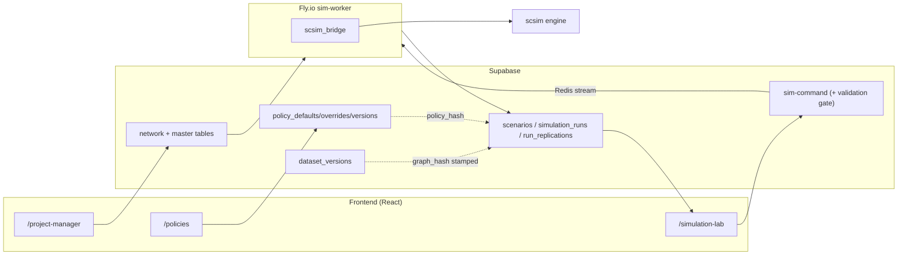
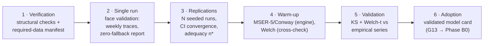

# SureSuite: An Open, Policy-Driven Platform for Supply Chain Simulation and Decision Support — Architecture Report

| | |
|---|---|
| **Status** | Report frame v2.0 — scientific-report skeleton with real content and code-verified claims; ⟦double-bracket⟧ marks placeholders to fill with case-study results |
| **Date** | 2026-07-06 |
| **Role** | *Descriptive* companion to the governing blueprint `docs/design/next-gen-platform-design.md`. The blueprint is normative (what to build and why); this report describes the platform as designed and built, structured to lift into a scientific paper (WSC tools track / SoftwareX style) or expand into a thesis chapter. |
| **Evidence discipline** | Every architectural claim in §4 is annotated with the repository artifact that implements it, and every status is marked. A reader (or reviewer) can audit any statement against the code. |
| **Authority** | Where this report and the blueprint disagree, the blueprint wins; update both in the same PR (repo working agreement). Engine mechanics: `scsim/docs/architecture.md`. |
| **Status legend** | ✅ implemented and deployed · 🔶 partial (shipped with a named gap) · 🧭 designed, scheduled (blueprint phase cited) |

---

## Abstract *(draft — tighten to ~200 words at submission)*

Commercial supply chain simulation suites such as anyLogistix give practitioners a no-code
surface for configuring networks, policies, and experiments, but they are closed: engines are
not inspectable, policy libraries are not extensible without leaving the GUI paradigm, model
provenance is not content-addressed, and verification and validation (V&V) are left to user
discipline. We present **SureSuite**, an open, web-based simulation platform whose central
abstraction is the *policy*: every operational decision in the modeled supply chain is an
explicit, replaceable plugin with a declared parameter schema, phase residency, feasibility
rules, and cost contribution. A single registry export generates the configuration forms,
validators, and documentation, so the user interface can only offer what the engine can
execute. Every run is bound to a content-addressed provenance triple (network data, policy
version, scenario), and simulation methodology — warm-up determination, replication adequacy,
common random numbers, statistical validation against empirical data — is packaged as a guided
V&V pipeline whose outcome governs decision-support use. We describe the architecture and,
distinctively, the *rationale*: each structural decision is traced to the failure mode it
eliminates, several of which the platform's own development history exhibited before the
mechanism landed. We argue the design competes with the commercial state of the art not by
feature parity but by architecture class, and outline the AI layer — a surrogate-acceleration
loop and a five-agent assistant roster — that the provenance fabric makes safe.
⟦One sentence of headline case-study results.⟧

**Keywords:** supply chain simulation; simulation software architecture; inventory policies;
verification and validation; warm-up period; digital twin; resilience; LLM agents;
surrogate models.

---

## 1. Introduction

### 1.1 Motivation

Simulation is the standard instrument for evaluating supply chain policies under uncertainty —
inventory rules, sourcing structures, capacity buffers, disruption responses — because the
interactions among these decisions defeat closed-form analysis. The tooling landscape forces a
choice: commercial suites (anyLogistix, Supply Chain Guru) offer complete input surfaces and
turnkey experiments but closed engines and fixed policy libraries; academic codes offer
transparency and extensibility but no product surface a planner can use. SureSuite is built on
the claim that this trade-off is architectural, not essential: if the policy catalog, its
parameter schemas, and its data requirements are one machine-readable artifact exported by the
engine, then the no-code configuration experience *and* research-grade extensibility come from
the same source.

The second motivation is methodological. Textbook practice demands verification, face
validation, warm-up determination, replication justification, and statistical validation
before a model informs decisions (Law 2015; Sargent 2013; Robinson 2014). Commercial tools
provide replications; they do not operationalize the discipline. SureSuite packages the full
V&V sequence as a guided pipeline whose outcome is a persisted, provenance-bound artifact that
downstream experiments inherit.

### 1.2 Contributions

1. A **policy-plugin architecture** for supply chain simulation in which the weekly decision
   cycle is data (a contract-validated phase pipeline), every decision is a replaceable
   plugin, and the engine never changes when a policy is added (§4.2–4.3).
2. A **single-source-of-truth configuration chain** — engine registry → generated forms,
   validators, docs, with CI drift gates — that delivers the commercial-grade "pick a policy,
   fill its parameters" experience from research code (§4.3, §5-D6).
3. A **guided V&V pipeline** whose persisted outcome governs decision-support use (§7).
4. **Content-addressed provenance** (three-hash run identity) as a single primitive from which
   reproducibility, run caching, surrogate validity scoping, and model-credibility staleness
   all derive (§4.6, §5-D7).
5. An explicit **design-rationale account** (§5): each architectural decision stated with its
   rejected alternative and the failure mode it eliminates — several documented from the
   platform's own history, which functions as a natural experiment.
6. A **guarded AI architecture**: statistical surrogates with calibrated uncertainty and a
   sized, task-scoped agent roster, both constrained to operate through the same validation
   gates as human users (§10).
7. ⟦Case-study contribution sentence once results exist.⟧

### 1.3 Structure

§2: background and the commercial reference. §3: the platform in supply chain management
terms. §4: the technical architecture **as implemented, with evidence**. §5: why it is built
this way — the design rationale. §6: module and feature catalog. §7: the V&V methodology.
§8: experimentation and decision support. §9: the state-of-the-art argument. §10: the AI
layer and agent roster. §11: case-study protocol. §12: limitations. §13: conclusion.

---

## 2. Background and reference context

### 2.1 The commercial reference: anyLogistix

anyLogistix (ALX) couples a CPLEX-based network optimizer with an AnyLogic-based discrete-event
simulator. Its simulation side offers structured input tables for every entity (sites,
products, demand, paths, vehicles); a fixed library of inventory and sourcing policies
selectable per product–site pair from the GUI (min/max, (R,Q), (s,S), order-up-to, periodic;
single/multiple sourcing by cheapest/fastest/priority/fractions); experiment wizards
(simulation, variation, comparison, safety-stock estimation, risk analysis); and KPI
dashboards. Its strengths are completeness of the input surface and turnkey experiment
packaging. Its structural limits: a closed engine; a non-extensible policy set (extension
means AnyLogic/Java, invisible to the GUI); no content-addressed provenance; replications
without warm-up methodology or persisted validation state; no AI layer. §9 develops the
comparison as a set of falsifiable claims rather than a feature checklist.

### 2.2 Methodological foundations

The platform packages established methodology rather than inventing statistics: warm-up
determination by Welch's procedure (Welch 1983) and MSER-5 (White 1997) with Conway's rule as
cross-check (Conway 1963); replication adequacy from CI half-width targets and sequential
stopping (Law 2015); common random numbers via independent keyed streams (L'Ecuyer et al.
2002); two-sample Kolmogorov–Smirnov and Welch-t tests for operational validation (Sargent
2013); Latin-hypercube and factorial designs (Kleijnen 2015); conformalized quantile
regression for distribution-free surrogate intervals (Romano et al. 2019). Inventory-policy
semantics follow the standard taxonomy (Silver, Pyke & Thomas 2017). The digital-twin framing
of scheduled stress analysis follows Ivanov & Dolgui (2021) and the companion
criticality-ranking framework (Nguyen et al. 2026).

---

## 3. The platform from a supply chain management perspective

*This section contains no software vocabulary. It is what a supply chain manager, student, or
OM reviewer should read first.*

### 3.1 The modeled world

SureSuite models a three-echelon supply chain: **suppliers** deliver **materials** to a single
focal **plant**, which produces **products** consumed by **customers**; a bill of materials
links the two sides. Products are served **make-to-order** (produce against orders, backlog
the rest) or **make-to-stock** (serve from a finished-goods buffer replenished to a target) —
a network may mix both, placing the customer-order decoupling point per product. Time advances
in **weekly** planning buckets: each simulated week the chain observes demand, updates
forecasts, plans and executes production, fulfills customers, plans materials, places purchase
orders, and receives shipments — the cadence of an S&OP-style weekly cycle. Quantities are
continuous, matching the aggregate-planning altitude; sub-weekly operations are deliberately
out of scope rather than faked (blueprint §2.4, §5.8).

Uncertainty enters through stochastic demand, stochastic lead times, and **disruption
scenarios**: a supplier, the plant, or a lane loses capacity or gains lead time for a window
of weeks, with a detection lag before the firm *knows*. Recovery behavior — expediting, backup
sourcing, overtime — is not scripted; it emerges from the policies the user configured.

### 3.2 Decisions as policies

The organizing idea, in management terms: **a supply chain node is a bundle of standing
decisions, and the platform makes every one of them explicit, named, and swappable.** A plant
owns a forecasting method, an inventory control rule (min/max, (s,S), base-stock, (R,Q),
periodic review), a safety-stock sizing rule (service-level, fixed-cover, King's formula,
ABC/XYZ-differentiated), a production planning rule, an allocation discipline for scarce
materials, and a fulfillment discipline. A supplier owns its capacity model, lead-time model,
allocation and shipment discipline. A customer relationship owns its demand model and its
unmet-demand behavior. Cross-cutting resilience policies — backup suppliers, multi-sourcing
splits, expedited freight, overtime, recovery playbooks — sit in the same catalog, each tagged
by the **planning horizon** at which it binds: strategic, tactical, or operational.

Two consequences matter to a practitioner. First, *there is no hidden behavior*: anything the
model does is a named policy visible on screen, including defaults. Second, *selecting a
policy declares its appetite for data*: choosing a finite-capacity supplier model makes that
supplier's weekly capacity a required input, and the platform blocks the run until it is
supplied — the model cannot silently invent the number.

### 3.3 The analyst's journey: four rooms

1. **Project Manager — describe the chain.** Upload or edit the network and its economics. A
   live data map shows every field, what the simulation does with it, and whether a fallback
   is standing in for missing data.
2. **Policies — decide how the chain behaves.** Stage by stage, pick each policy and fill
   exactly the parameters it needs, or start from a preset that explains *why* each value was
   chosen from your data. Every configuration is an immutable, named **version**.
3. **Run & Validate — earn trust in the model.** A guided pipeline: check inputs, run once and
   inspect weekly behavior, run replications and check how many are enough, determine the
   warm-up period, and statistically compare model output against historical data (§7).
4. **Simulation Lab — ask decision questions.** Scenarios, replicated experiments, KPI
   dashboards, comparisons — inheriting the validated settings from step 3 🧭(the
   currently-landing piece, blueprint §9.5/G13).

### 3.4 Questions the platform answers

*Service vs. inventory*: what fill rate does the current policy set deliver, at what average
inventory value, and where is the frontier as safety-stock targets move? *Sourcing design*: is
dual sourcing worth its premium against a 6-week outage of the top supplier — contingent
backup or standing split? *Capacity*: does overtime help when materials, not machines, bind?
*(the engine reproduces the classic negative result: it does not)*. *Stress testing*: which
suppliers, if disrupted, hurt most — systematically, with a vulnerability ranking? *Policy
portfolios*: do stacked resilience measures reinforce or cannibalize each other? *Recovery*:
how long until service re-enters its normal band (TTR); how long could we survive inside it
(TTS)?

### 3.5 What the numbers mean

KPIs are value-weighted and windowed to the post-warm-up analysis period: fill rate, lost
sales, max backlog, on-hand value, revenue, a per-policy-ledgered **cost of resilience**,
TTR/TTS, service-loss area, and a composite resilience index. Full dictionary: Appendix B.

---

## 4. Technical architecture — as implemented

### 4.1 Overview and evidence

| Tier | Technology | Responsibilities |
|---|---|---|
| **Frontend** | React + Vite + shadcn/Tailwind, Mapbox | `/project-manager`, `/policies`, `/simulation-lab`, four network views; policy forms fed by the generated registry snapshot |
| **Data & control plane** | Supabase: Postgres (+RLS), edge functions (Deno), Realtime | Network/master tables; policy defaults/overrides/versions; dataset versions; scenarios/runs/replications; command gateway `sim-command` with a server-side validation gate |
| **Execution** | Fly.io worker (Python), Upstash Redis streams | Consumes commands; maps project data to engine input; executes replications; **sole writer of results**; idempotent by `run_id` |
| **Engine** | `scsim` (Python, NumPy-vectorized) | Phase-pipeline weekly simulator; policy plugins; disruptions; KPIs; statistics; stress batteries; portfolio studies |

**Figure 1 is not an aspiration diagram.** Every box and edge is implemented and deployed;
Table 1 maps each edge to the artifact that implements it. This auditability is itself a
design point: the report's architecture claims are checkable against the repository.

**Table 1 — Edge-by-edge evidence for Figure 1.**

| Edge | Implementing artifact | Verified behavior | Status |
|---|---|---|---|
| `/project-manager` → tables | `supabase/functions/ingest-*`, upload wizard, item-master grids (`useItemMasters`) | CSV wizards + in-grid edits populate the six engine-read tables (`suppliers`, `materials`, `products`, `inbound_logistics`, `bom_single_level`, `outbound_logistics`) | ✅ |
| `/policies` → policy stores | `src/hooks/usePolicies.tsx` | Family defaults, per-node/edge overrides, immutable `policy_versions` snapshots with SHA-256 `policy_hash`, dirty detection, restore | ✅ |
| `/simulation-lab` → `sim-command` | `src/hooks/useSimulationRun.tsx` → `supabase.functions.invoke("sim-command")` | Dispatch, cancel, add-replications commands | ✅ |
| `sim-command` validation gate | `supabase/functions/_shared/validationGate.ts` + mirrored registry snapshot | Required-data gaps reject the run (HTTP 422, typed findings); `recommended` gaps require explicit acknowledgment | ✅ |
| `sim-command` → Redis stream | `sim-command/index.ts` (`XADD` to Upstash REST) | Commands published to a per-project stream; cancel and add-reps are further messages | ✅ |
| Provenance stamping (dashed edges) | `sim-command/index.ts` run insert | `policy_version_id` + `policy_hash` + `dataset_version_id` + `graph_hash` written onto `simulation_runs` at dispatch | ✅ |
| Stream → worker | `sim_worker/worker.py` (`xreadgroup` consumer group, `xack`) | At-least-once consumption; processing idempotent by `run_id`, so redelivery is safe | ✅ |
| Tables → worker | `GraphCache` + `sim_worker/datamap.py` | Project rows fetched, unit-normalized, mapped to the engine payload per the documented mapping contract | ✅ |
| Bridge → engine | `sim_worker/scsim_bridge.py` | Compiles the scenario, executes scsim replications, records warm-up metadata and weekly series | ✅ |
| Worker → results | `worker.py` upserts | Sole authoritative writer of `simulation_runs` / `run_replications`; per-replication rows streamed live as each finishes | ✅ |
| Results → Lab | `useSimulationRun.tsx` Supabase Realtime channel | Live per-replication UI updates without polling | ✅ |

One deliberate asymmetry: a **legacy** in-worker engine predates `scsim` and is frozen
(blueprint §3); the deployed configuration runs `scsim` (`SCSIM_ENGINE=1` in
`sim-worker/fly.toml`, engine bundled in the Docker image). Retirement is gated on evidence,
not dates: mapping-loss elimination is regression-tested (gate E1 ✅), engine differences are
characterized and accepted as corrections (`docs/parity-characterization.md`, gate E2 ✅),
default flip and deletion follow (E3/E4 🧭).

### 4.2 The engine: a contract-validated phase pipeline

`scsim` (v0.2.0) executes each simulated week as a fixed, named phase sequence — PH-00 week
start/disruption state → PH-10 demand + forecast → PH-20 detection → PH-30 fulfill-from-stock
(MTS) → PH-40 production planning → PH-50 production execution → PH-60 fulfillment → PH-70
material planning → PH-80 procurement → PH-90 logistics → PH-99 accounting. Each phase owns a
write-contract over named state keys; policy hooks declare their phase residency, reads, and
writes; the loader **validates all hooks at import time** for read-before-write ordering,
single-owner transient writes, authorized persistent writes, and declared conflict resolution
(`scsim/scsim/core/phases.py`). "The weekly cycle is data, not code." Execution is vectorized
across materials/products/links; reference performance 0.33 s per replication at manuscript
scale. 90+ tests include byte-identical golden traces and conservation invariants.

### 4.3 The policy layer and the single source of truth

Policies subclass one ABC (`scsim/scsim/policies/base.py`): catalog identity
(`P-S.x`/`P-P.x`/`P-T.x`/`P-C.x`/`P-F.x`/`P-X.x`, stage, strategy class, horizon), declared
hooks, a Pydantic `Params` model (`extra="forbid"`, units/ranges/defaults), `feasibility()`,
`cost_contribution()` into an append-only ledger, keyed RNG streams, and **data
requirements** (entity fields the policy demands, graded required/recommended/defaulted). The
registry serves 22 cataloged policies — 9 implemented, the rest *planned*: registered with
full schemas but raising `PolicyNotImplementedError` if enabled, never silently no-oping.
Adding a policy = one plugin file + a registry entry + a docs row (CI-enforced); the engine
core does not change.

The **registry export** is the platform's single source of truth: one JSON payload (catalog,
parameter schemas, data requirements, pipeline schema, KPI and entity dictionaries) generated
from the engine, committed as `src/lib/policies/registry.generated.json`, drift-gated in CI,
and consumed by the frontend (one typed access module), the server-side validation gate (a
mirrored snapshot), and the generated docs. Platform law (blueprint §6.2): **the UI can only
offer what the engine can execute, and everything the UI offers reaches the engine.**
✅ rail + validation surfaces; 🔶 the `/policies` parameter forms still render a transitional
7-family vocabulary until Phase B0 switches them to per-policy registry forms.

### 4.4 Data plane and lifecycle

Six datasets feed the engine, populated by CSV wizards and editable in-grid. A documented
field-mapping contract (`docs/data-simulation-mapping.md`) defines every column's engine
destination, unit normalization, and fallback chain; the UI renders the fallbacks live
(effective-economics provenance badges; a data-map grid with a registry-driven "demanded by"
column). Policy configuration = project-level family defaults + sparse per-node overrides,
resolved at run time; policy versions are immutable snapshots with hash, lineage, and restore.
Dataset versions snapshot the canonical source rows of the six tables under a content-derived
`graph_hash`.

### 4.5 Execution plane

`sim-command` is the single command gateway. Before dispatch it (a) grades the required-data
manifest server-side against live tables and (b) stamps the run's provenance. Commands travel
over a durable Redis stream to the worker, which maps project rows to engine input, executes
replications (streaming each finished replication row), and writes results idempotently.
Per-replication output: KPI scalars, weekly time series (fill rate, backlog, on-hand value,
revenue), seed, warm-up metadata; run-level: the engine's mapping report and detected warm-up.

### 4.6 Provenance and reproducibility

Three content-addressed identities bind every run: `policy_hash` (immutable policy snapshot),
`graph_hash` (immutable dataset snapshot), and the scenario definition; the keyed seed tree
makes replications reproducible and CRN-pairable (world streams independent of the policy
set; policy streams keyed by policy-ID digest). Golden traces pin determinism across engine
versions. Scheduled completions: scenario hashing, re-execution against frozen snapshots, the
content-addressed run cache 🧭(Phase C).

### 4.7 Statistical machinery (engine-resident)

MSER-5 + Conway warm-up detection with the adopted week recorded per run; sequential-CI
stopping; stress batteries (ST-1 lead-time, ST-2 capacity) with scorecards and vulnerability
ranking; CRN-paired portfolio studies with bootstrap-significant synergy decomposition;
warm-state snapshot reuse keyed by a family digest so scenario sweeps skip re-simulating
warm-up.

---

## 5. Design rationale: why it is built this way

*The architecture in §4 is not a stack of default choices. Each decision below is stated with
the alternative it rejected, the property it buys, and — where the repository's own history
supplies one — the concrete failure it eliminates. The platform's development functions as a
natural experiment: several of these mechanisms exist because their absence was observed to
fail.*

**D1 — Web platform on a managed Postgres control plane, not a desktop application.**
*Alternative:* a desktop tool like the commercial reference. *Why:* zero-install access for
teams and classrooms; row-level security gives multi-tenancy without an auth service; managed
Realtime pushes each finished replication into the UI without polling (Table 1, last row);
edge functions colocate the dispatch gate with the data it validates, so the gate can never
read stale inputs; schema history lives in versioned SQL migrations. *What it buys:* the
collaboration and provenance features of §4.6 are natural in a shared database and awkward in
per-seat project files.

**D2 — Simulation in a dedicated Python worker, not in the web tier.**
*Alternative:* compute in edge functions or the browser. *Why:* the engine is CPU-bound
vectorized NumPy; Deno edge functions have CPU/time budgets an hour-long replication study
violates; and a browser cannot produce *authoritative* results. *Observed failure eliminated:*
early versions of the validation stage rendered browser-synthesized preview statistics —
precisely the credibility hole Phase A closed by making every chart read persisted worker
output. Compute isolation also means an engine crash cannot take the control plane down, and
workers scale horizontally for Phase C sweep sharding.

**D3 — Command transport is a durable stream, not a synchronous call.**
*Alternative:* the edge function invokes the worker over HTTP and waits. *Why:* replication
studies outlive HTTP timeouts; consumer groups (`xreadgroup`/`xack`) give at-least-once
delivery across worker restarts; idempotency by `run_id` makes redelivery harmless;
cancellation and add-replications are just further messages on the same stream; and a worker
*pool* (Phase C sharding) needs no new transport. *What it buys:* runs survive infrastructure
churn, and the orchestration layer for batteries and sweeps is an extension, not a rewrite.

**D4 — The engine is a standalone, versioned package, not worker code.**
*Alternative:* simulation logic inside the worker service. *Observed failure eliminated:* the
platform lived this counterfactual — the legacy engine grew inside the worker, entangled with
transport and persistence, untestable in isolation, and is now frozen for retirement
(blueprint §3, gap G2). `scsim` inverts it: pip-installable, fully testable offline (golden
traces run in CI with no cloud dependency), usable in notebooks for research, and versioned —
`ENGINE_VERSION` enters run provenance, so "which code produced this number" is always
answerable. Any hosted run can be reproduced locally from its snapshots.

**D5 — A phase pipeline with load-time-validated contracts, not free-form discrete-event code.**
*Alternative:* a general DES event calendar (the AnyLogic paradigm). *Why:* the weekly S&OP
cadence is the domain's native rhythm, and fixing it enables vectorization across the entity
dimension (0.33 s/replication). The deeper reason is *machine-checkable composition*: because
every policy declares what it reads and writes and the loader enforces ordering, ownership,
and conflict resolution, the policy-interaction graph is **derivable and provably sound at
load time** — interference between policies is a build error, not a subtle result anomaly
discovered during analysis. No closed engine, and no free-form event code, offers this
property (blueprint §7).

**D6 — One generated source of truth for the policy vocabulary.**
*Alternative:* hand-written UI schemas mirroring the engine. *Observed failure eliminated:*
the platform lived this counterfactual too — the hand-written 7-family vocabulary drifted
from the engine and **silently discarded user configuration** (gap G1: absolute reorder
points ignored, whole families never consumed), eroding exactly the trust a simulation tool
sells. Registry-generated forms/validators/docs plus a CI drift gate kill the bug *class*;
the E1 regression test asserts a fully-specified project maps with zero silent fallbacks.
*What it buys:* the ALX-style "select a policy → its parameters appear" experience is
*derived* from the engine, and "what you configured is what ran" becomes a checkable
property rather than a hope.

**D7 — Content-addressed provenance, not file-based projects.**
*Alternative:* project files that mutate in place. *Observed failure eliminated:* the network
was read live at run time, so re-uploading a CSV silently changed the world behind every past
run (gap G5) — now closed by immutable `dataset_versions` under `graph_hash`. *What it buys:*
one primitive, four features — bit-reproducibility of any run from its hashes; the run cache
("never simulate the same thing twice", Phase C); surrogate validity scoping (a model is
served only inside the lineage it was trained on, Phase D); and model-card staleness (V&V
credibility never survives silent change, Phase B0). This is the report's clearest example of
architecture-class thinking: a commercial tool would ship the four features as four wizards.

**D8 — The worker is the sole writer of results.**
*Alternative:* clients or edge functions write result rows. *Why:* one authority means no
read-modify-write races, no client-fabricated numbers, and a single audit point; combined
with D2, every number the UI shows is persisted engine output. The same discipline
(single-writer + immutable snapshots + hashes) repeats across the platform — policies,
datasets, runs, and (scheduled) surrogate models — which is why new stores keep landing
cheaply: they reuse a proven pattern rather than inventing one.

*Summary:* D1–D3 are the platform shape; D4–D5 the engine shape; D6–D8 the trust shape. Six
of the eight are justified not by taste but by a failure that occurred or a measured property
(vectorized performance, CI-gated drift, regression-tested mapping loss). This is the answer
to "why was it designed this way": each rule was paid for.

---

## 6. Modules and features

### 6.1 Frontend

| Module | Route | Features | Status |
|---|---|---|---|
| Data Manager | `/project-manager` | CSV upload wizards (six datasets), templates, completeness view, item-master grid editing, supplier assignment for unsourced materials, dataset freeze | ✅ |
| Policies | `/policies` | Four-stage flow (supplier → plant → customer → run & validate); per-stage policy grids with per-node overrides; 8 data-aware presets with per-field *why*; MTO/MTS strategy gating; immutable version bar; data-map tab (field → engine destination, live fallback status, demanded-by); time-unit bar | ✅ grids · 🧭 per-policy registry forms + horizon lens (Phase B0/B1) |
| Run & Validate | `/policies` stage 4 | Guided V&V stepper — §7 | ✅ pipeline · 🔶 outcome persistence (G13 → Phase B0) |
| Simulation Lab | `/simulation-lab` | Scenario rail/library/duplication; disruption schedule editor; recovery playbook pane; stress presets; run panel (live streaming, cancel, add-reps); results dashboard (KPI stats, utilization heatmap, convergence); compare pane | ✅ core · 🔶 compare stub, DOE designer built-but-unrendered (G8 → Phase C) |
| Network views | 4 routes | Firm/product/process-level and interactive maps; network-science metrics; node prominence; scenario handoff into the Lab | ✅ |
| Project intelligence | `/project-intelligence` | AI chat over project health/data (assist-only) | ✅ |

### 6.2 Platform services (Supabase)

`sim-command` (gateway + §8.2 validation gate + provenance stamping) ✅; schema (arc tables,
item masters, policy stores, dataset versions, scenario/run/replication stores with warm-up
fields and time-series JSONB) ✅; ingestion and network-analysis functions ✅.

### 6.3 Worker and engine

Worker: stream consumer, data mapper, scsim bridge with live replication streaming; legacy
engine frozen behind an escape hatch. ✅ single-run jobs · 🧭 typed job family
(battery/portfolio/surrogate) + sharding (Phase C/D). Engine subpackages: `core` (pipeline,
compile, replication driver, portfolio studies) ✅ · `policies` (ABC, registry, 9 implemented
/ 13 planned) ✅ · `stress` (ST-1/ST-2, scorecards, ranking) ✅ engine-side · `synergy`
(CRN-paired decomposition, bootstrap stars) ✅ engine-side · `kpi` ✅ · `stats` (seed tree,
warm-up, sequential CI) ✅ · `io` (mapper + warnings, registry export, snapshot stores) ✅ ·
tests (90+, golden traces, conservation, E1 regression, pipeline schema snapshot) ✅.

---

## 7. Verification, validation, and decision-support readiness

*The platform's core methodology; blueprint §9.5. Implemented as the guided "Run & Validate"
stage of `/policies`.*

### 7.1 Definitions and stance

Following Sargent (2013): **verification** asks whether the model is built right;
**validation** asks whether it is the right model for the intended questions. SureSuite's
stance: both must be *product mechanics with persistent outcomes*, not analyst folklore.
Every step below runs on persisted engine output — never browser-synthesized previews — and
the pipeline's verdict governs downstream use.

### 7.2 The pipeline

1. **Verification.** Structural checks plus the registry-compiled required-data manifest:
   every selected policy's data demands, graded `block`/`warn`/`info`, each finding naming
   the demanding policy, entity field, and affected nodes. Blockers stop the pipeline; the
   identical manifest is enforced server-side at dispatch, so client stage and run gate
   cannot disagree.
2. **Single-run face validation.** One replication, fixed seed. The analyst inspects the
   engine's weekly series and mapping report; the pass signal is behavioral plausibility plus
   *"fully specified — no fallbacks"* (no invented parameters ran).
3. **Replication study.** N seeded replications; per-week cross-replication mean with CI
   band; running-mean convergence; adequacy n* = (z·s/(ε·x̄))² against target precision
   (default 5% at 95%). Replications persist individually with seeds — the evidence, not a
   summary, is stored.
4. **Warm-up determination.** Engine-authoritative MSER-5 with Conway cross-check
   (`warmup_detected_at` recorded per run); client-side Welch smoothing and MSER-5 over the
   persisted weekly series as visible cross-checks. The analyst adopts a value; steady-state
   KPIs exclude the transient.
5. **Statistical validation.** Uploaded empirical indicator series are tested against
   post-warm-up model output per KPI: two-sample KS (distribution) and Welch-t (mean), from
   real per-replication samples.
6. **Adoption.** The findings become the **validated model card** (§7.4).

### 7.3 Methodological notes

Warm-up estimators are deliberately redundant (MSER-5, Conway, Welch): agreement is evidence,
divergence is a flag to lengthen the run (Law 2015, ch. 9). Validation tests are screens, not
proofs: a failed KS at n≈10 replications is actionable; a passed one is
necessary-not-sufficient (§12). CRN-paired validation experiments and server-side
sequential-CI stopping are the scheduled upgrades (Phase C).

### 7.4 The validated model card and the readiness guarantee

The pipeline's outcome persists as an immutable artifact bound to the exact provenance triple
it was established on — (`policy_hash`, `graph_hash`, engine fingerprint) — holding the
adopted warm-up (value, method, evidence), the replication recommendation per focal KPI, and
the validation verdicts. Lab scenarios under a validated triple inherit warm-up and
replication defaults; every result surface shows `validated ✓` / `stale` / `unvalidated`; any
hash drift flips the badge — credibility is never inferred across change. The product
guarantee: **a KPI shown for decision-making is either produced under a validated model card,
or visibly labeled as unvalidated.** Status: steps 1–5 ✅; step 6 🧭 Phase B0 (gap G13) —
today the adopted values persist only client-side, which is exactly why the card was elevated
to the first Phase B workstream.

---

## 8. Experimentation and decision support

**Shipped:** scenario studies — baseline and disruption scenarios (schedule editor, library,
stress presets), replicated runs with live streaming, KPI dashboards, recovery scoring;
add-replications on finished runs. **Engine-ready, productization scheduled (Phase C):**
typed experiments — CRN-paired **comparison** (two runs comparable iff same seed spec and
identities differing in exactly one component — paired statistics enforced, not implied),
**DOE sweeps** (full-factorial/LHS; designer exists, unrendered), **stress batteries** with
vulnerability rankings, **portfolio/synergy studies**; the content-addressed **run cache**
and warm-state reuse; typed worker jobs with sweep sharding.

The decision-support claim is the composition of §7 and §8: questions are asked *of a
validated model*, answered by *replicated, provenance-bound experiments*, with *paired
statistics where comparison is the question*.

---

## 9. Can this beat the state of the art? A falsifiable argument

*The honest form of the question is not "does v1 have more features than anyLogistix?" (it
does not) but "does the architecture produce a compounding advantage the incumbent's
architecture cannot?" We answer in three parts: where parity is required, where the class
advantage lies, and what is conceded — each stated so it can be tested.*

### 9.1 Parity requirements (necessary, not sufficient)

The commercial baseline experience — structured input tables, per-node policy selection with
parameter forms, experiment wizards, KPI dashboards — is table stakes. SureSuite reaches it
*structurally*: the input surface from the data manager + item masters + data map ✅; the
policy-selection experience from registry-generated forms 🧭(B0 — the rail is built, the
switch is scheduled); experiment packaging from the typed-experiment layer 🧭(C). Parity
claims are auditable per feature in §6's status column — no feature is claimed that is not
marked.

### 9.2 Class advantages (the actual bet)

Each row names the mechanism, the user-visible payoff, and the falsifiable test a skeptic
can run.

| # | Mechanism (exists ✅ / scheduled 🧭) | Payoff | Falsifiable test |
|---|---|---|---|
| C1 | Policy plugins + registry codegen ✅ | New algorithm = one plugin file; appears in the GUI with forms, validation, docs — no UI code | Implement a published inventory policy as a plugin; measure time-to-GUI. ALX equivalent requires Java and never becomes a GUI citizen |
| C2 | Required-data manifest + dispatch gate ✅ | Underspecified models cannot run; no silently invented parameters | Delete a required field; the run is rejected with a typed finding naming the demanding policy. Reference tools default silently |
| C3 | Three-hash provenance ✅ + run re-execution 🧭 | Any result re-derivable; "what produced this number" always answerable | Re-run from hashes; assert identical output (golden-trace discipline already proves the engine half) |
| C4 | Guided V&V pipeline ✅ + model card 🧭 | Decision surfaces carry credibility state; warm-up and replication adequacy are product mechanics | Show a KPI without validation state — the design forbids it (§7.4 guarantee) |
| C5 | CRN seed tree + paired comparison semantics ✅ engine / 🧭 product | Policy deltas with valid paired CIs, not eyeballed dashboards | Compare identical policies under CRN: delta ≈ 0 with tight CI; break pairing and watch variance inflate |
| C6 | Run cache + warm-state reuse + surrogates 🧭 | Marginal cost of experimentation falls with use; network-scale stress testing becomes tractable | Reference case: Spearman ρ = 0.844, perfect top-10 coverage, 39% run reduction (Nguyen et al. 2026); repeat-quarter stress test ≈ cache lookups |
| C7 | Load-time interaction contracts ✅ | Policy interference is a build error, not an analysis-time anomaly | Register two policies writing one key without declared resolution: the engine refuses to load |

The compounding claim: C1 grows the catalog cheaply, C3+C6 make each question cheaper than
the last, C4 makes results *defensible* — properties that strengthen with use. A closed
catalog and per-seat desktop files are static by comparison. That is the argument for
"different architecture class," and it is an argument about derivatives, not levels.

### 9.3 What is conceded, deliberately

MILP network optimization / greenfield analysis (ALX's genuine strength — out of scope by
design); sub-weekly operational scheduling (fidelity boundary, stated rather than faked);
breadth of transport modeling until lanes are first-class (Phase B/E); multi-echelon
distribution (Phase E); and the maturity/polish of a decade-old commercial product. The
bottom line a reviewer should hold us to: **v1 does not out-feature the incumbent; it
out-architects it, and the roadmap converts that into features at a rate a closed system
cannot match.** ⟦Strengthen with measured case-study numbers.⟧

---

## 10. The AI layer: surrogates and a five-agent assistant roster

*AI enters the platform in two forms with one shared guardrail: statistical models that
**predict** simulation outcomes under calibrated uncertainty, and language-model agents that
**operate the platform** on the user's behalf. The guardrail is platform law (blueprint §12):
AI output is always a proposal that passes the same validation gates as human input;
simulation results, KPIs, and rankings are never AI-generated. The provenance fabric is
read-only to the AI layer.*

### 10.1 Statistical AI: the adaptive simulation–surrogate loop 🧭(Phase D)

Full-network criticality ranking at a fraction of exhaustive cost: structural features per
supplier from the versioned graph → stratified partition → direct simulation of a subset
(cache-aware, adaptive replication stopping) → conformalized quantile regressors for the
rest → a **dual reliability gate** (interval width ≤ τ *and* novelty ≤ κ) that routes
uncertain predictions back to simulation. Surrogates are registered models with lineage
(dataset version, policy version, training RunKeys), validity scoped to that lineage,
drift-triggered retraining, and provenance labels on every ranking row. Reference validation:
Spearman ρ = 0.844, perfect top-10 coverage, 39% run reduction (Nguyen et al. 2026). This is
the AI-native generalization of the engine's existing `vulnerability_ranking` — same output
contract, radically cheaper at scale.

### 10.2 Why agents, and why exactly five

The platform's guided journey (§3.3) has four rooms; each room has exactly one artifact class
an assistant can *produce a reviewable proposal for* (a data fix, a policy diff, a model
card, an experiment spec), plus one cross-cutting need (explanation). The roster is therefore
**five task-scoped agents — one per room plus an explainer — behind a single copilot entry
point.** Not one monolith: a monolithic copilot cannot be given least-privilege tool access
or evaluated against a stable task distribution. Not a larger swarm: an agent that owns no
artifact class adds surface without capability; the roster grows only when Phase E adds new
artifact classes (e.g. a network-design room). Each agent's tool surface is a *subset of the
platform's existing public interfaces* — no privileged path exists for AI.

**Table 2 — The agent roster.**

| # | Agent | Room | Consumes (read) | Produces (proposal) | Hard gate before effect | Phase |
|---|---|---|---|---|---|---|
| A1 | **Data Steward** | Project Manager | Dataset status, data map, manifest findings, uploaded files | Item-master value drafts with source citations; mapping-fix diffs | Same validated mutations as manual edits; diff review; provenance badge shows agent origin | B (manifest exists ✅) |
| A2 | **Policy Configurator** | Policies | Registry catalog + schemas, presets, project data | Bundle diffs from natural-language intent ("resilient to a 6-week outage of supplier X, budget-neutral") as candidate policy versions | Registry schema validation + `feasibility()` + portfolio checks + required-data manifest; user applies the version | B (the blueprint's LLM diff proposer, M8) |
| A3 | **V&V Analyst** | Run & Validate | Pipeline outputs: findings, traces, warm-up estimates, test statistics | Interpretation and next-step recommendations (lengthen horizon, more replications, estimator-divergence flags); drafted model-card narrative | Card content is computed, never asserted, by the agent; adoption is a user action | B0/B (needs the card) |
| A4 | **Experiment Designer** | Simulation Lab | Validated model card, scenario library, KPI dictionary, run history | Typed experiment specs (comparison/DOE/battery) with CRN pairing; decision briefs where every number carries its run identity | Specs execute through `sim-command`'s gate like any run; briefs cite only persisted results | C (typed experiments) |
| A5 | **Explainer** | Cross-cutting | Decision-trace records (facet 11), KPI definitions, policy docs, run provenance | Grounded answers ("why did fill rate drop in week 37?") with citations to actual policy firings | Citation-mandatory; refuses when the trace does not support an answer | B/C (needs facet-11 traces) |

### 10.3 How the roster supports the user, concretely

The end-to-end assisted journey the roster enables: a planner uploads messy CSVs → **A1**
drafts the missing economics with citations and the manifest goes green → the planner states
an intent → **A2** proposes a bundle diff that already passes feasibility → **A3** walks the
V&V pipeline and drafts the model card → the planner asks the decision question → **A4**
compiles it into a CRN-paired experiment and returns a brief whose every number is
provenance-bound → at any point, **A5** answers "why?" from decision traces instead of
plausible fiction. Human judgment remains at every adoption point; the agents compress the
*labor* between judgments. Per-agent success metrics are product metrics, not LLM metrics:
time-to-complete-model (A1), accepted-proposal rate (A2), models reaching validated state
(A3), question-to-brief latency (A4), citation coverage (A5).

### 10.4 Engineering the roster

Agents are stateless per task; context is assembled from the project's artifacts (registry
snapshot, manifest findings, persisted runs) rather than conversation memory, so behavior is
reproducible and auditable. Every agent action lands as a *reviewable artifact* — a diff, a
candidate version, a spec, a draft — never a direct state mutation; the platform's existing
immutability and single-writer disciplines (§5-D7/D8) therefore contain the blast radius of
any agent error by construction. Evaluation mirrors the platform's own CI philosophy: a
golden task suite per agent (fixed project, fixed intent, expected proposal properties)
gates roster changes the way golden traces gate engine changes.

---

## 11. Illustrative case study *(protocol — fill when executed)*

**Reference model.** ⟦Network: n suppliers, m materials, p products (MTO/MTS mix), BoM
structure, horizon, demand parameters — recommend the BoM-peer-bottleneck reference network
used by `scripts/parity_characterization.py`, or an anonymized industrial dataset.⟧

**Protocol.** (1) Data load and completeness (Data map, zero required gaps). (2) Policy
configuration from preset ⟦which⟧ + documented deviations (policy version ⟦hash⟧). (3) V&V
pipeline end-to-end: verification findings ⟦table⟧; single-run traces ⟦figure⟧; replication
adequacy ⟦n* per KPI at ε = 5%⟧; warm-up ⟦MSER-5 vs Conway vs Welch, adopted value; Welch
plot⟧; validation vs ⟦empirical series⟧: KS D/p, Welch-t ⟦table⟧. (4) Decision study:
⟦e.g. dual sourcing vs +2 weeks FG safety stock under a 6-week top-supplier outage —
CRN-paired ΔFR, ΔC^res, TTR with CIs⟧. (5) Reproducibility: re-run from the three hashes;
assert identical output. **Reporting:** KPI means ± CI per scenario; validation statistics;
weekly fill-rate band with warm-up line; running-mean convergence; paired-delta chart — every
table and figure labeled with its provenance triple, so the case study doubles as a
demonstration of §4.6.

---

## 12. Limitations and threats to validity

Weekly buckets and fluid quantities — sub-weekly scheduling is out of scope and deferred, not
faked. Single focal plant, three echelons in v1. 9 of 22+ cataloged policies currently
executable; the input-surface parity claim is cashed in Phase B. No MILP optimizer.
Validation tests are two-sample screens at modest replication counts, not accreditation; the
model card records what was established, no more. V&V outcome persistence is the
currently-landing piece (G13/B0). The agent roster (§10.2) is designed, not yet deployed;
its safety argument currently rests on the gate architecture, not on operational history.
Threats for the case study: ⟦single reference network; preset-derived parameters; empirical
series length; engine-migration drift (mitigated: parity characterization + golden traces)⟧.

---

## 13. Conclusion

SureSuite demonstrates that the commercial-grade configuration experience and research-grade
openness are the same artifact viewed from two sides, provided the policy catalog is a single
machine-readable source of truth exported by the engine. Its architecture is defended not by
taste but by receipts: each structural rule traces to a failure mode it eliminates, several
observed in the platform's own history (§5). Its competitive claim is about derivatives, not
levels: provenance, caching, plugin extensibility, and gated AI compound with use, where a
closed catalog is static (§9). And its methodological claim is that V&V belongs in the
product as a guided, persisted pipeline that governs decision use (§7). The roadmap completes
the node-owned catalog (Phase B), productizes experimentation with content-addressed caching
(Phase C), and lands the surrogate loop and agent roster (Phase D). ⟦Closing sentence tied to
case-study results.⟧

---

## References

- AnyLogic Company. *anyLogistix Documentation*. https://anylogistix.help (accessed 2026).
- Chen, T., and C. Guestrin. 2016. "XGBoost: A Scalable Tree Boosting System." In *Proc. 22nd ACM SIGKDD*, 785–794.
- Conway, R. W. 1963. "Some Tactical Problems in Digital Simulation." *Management Science* 10(1): 47–61.
- Ivanov, D., and A. Dolgui. 2021. "A Digital Supply Chain Twin for Managing the Disruption Risks and Resilience in the Era of Industry 4.0." *Production Planning & Control* 32(9): 775–788.
- Kleijnen, J. P. C. 2015. *Design and Analysis of Simulation Experiments*. 2nd ed. Springer.
- Law, A. M. 2015. *Simulation Modeling and Analysis*. 5th ed. McGraw-Hill.
- L'Ecuyer, P., R. Simard, E. J. Chen, and W. D. Kelton. 2002. "An Object-Oriented Random-Number Package with Many Long Streams and Substreams." *Operations Research* 50(6): 1073–1075.
- Nguyen, P., V. Borodin, A. Dolgui, and D. Ivanov. 2026. "An Adaptive Simulation–Surrogate Framework for Supply Chain Criticality Ranking." Companion manuscript, WSC'26 submission. ⟦Update citation on acceptance.⟧
- Robinson, S. 2014. *Simulation: The Practice of Model Development and Use*. 2nd ed. Palgrave Macmillan.
- Romano, Y., E. Patterson, and E. J. Candès. 2019. "Conformalized Quantile Regression." In *Advances in Neural Information Processing Systems* 32.
- Sargent, R. G. 2013. "Verification and Validation of Simulation Models." *Journal of Simulation* 7(1): 12–24.
- Silver, E. A., D. F. Pyke, and D. J. Thomas. 2017. *Inventory and Production Management in Supply Chains*. 4th ed. CRC Press.
- Welch, P. D. 1983. "The Statistical Analysis of Simulation Results." In *The Computer Performance Modeling Handbook*, edited by S. S. Lavenberg, 268–328. Academic Press.
- White, K. P., Jr. 1997. "An Effective Truncation Heuristic for Bias Reduction in Simulation Output." *Simulation* 69(6): 323–334.

---

## Appendix A — SCM ↔ technical glossary

| Management term (§3) | Technical artifact (§4–5) |
|---|---|
| A node's standing decisions | PolicyBundle: `{slot → (policy_id, params)}`, resolved from defaults + overrides |
| "Pick a policy, fill its parameters" | Registry `params_schema` → generated form (picker contract, blueprint §6.3) |
| Policy's appetite for data | `data_requirements` → required-data manifest → dispatch gate |
| Model version ("as of last Tuesday") | `policy_versions` snapshot + SHA-256 `policy_hash` |
| Frozen network data | `dataset_versions` snapshot + `graph_hash` |
| Weekly planning cycle | Phase pipeline PH-00…PH-99 with validated hook contracts |
| Fair comparison of two options | CRN pairing via the keyed seed tree; identities differing in one component |
| Warm-up period | MSER-5/Conway (engine) + Welch (cross-check); adopted week truncates KPI windows |
| "Is the model trustworthy?" | Run & Validate pipeline → validated model card (blueprint §9.5) |
| Which suppliers hurt most? | ST batteries → `vulnerability_ranking`; at scale, the surrogate loop (§10.1) |
| "Do it for me, I'll review" | The agent roster: reviewable proposals through human gates (§10.2) |

## Appendix B — KPI dictionary (engine registry export, v0.2.0)

| KPI | Symbol | Unit | Definition |
|---|---|---|---|
| Fill rate | FR | % | Value-weighted served demand, Σ u_p·served_p / Σ u_p·D_p, over the analysis window |
| Lost sales value | — | € | Σ u_p·L_p over the window |
| Max backlog | — | units | Peak Σ_p B_p within the window |
| On-hand value | — | € | Average valued inventory position |
| Revenue | — | € | Valued fulfillment over the window |
| Cost of resilience | C^res | € | Material-SS holding + backup premiums + multi-sourcing premiums + expediting + overtime + monitoring, per-policy ledgered |
| Δ cost / Δ revenue | ΔC^res, ΔR | % | CRN-paired deltas vs. baseline, per replication |
| Time to recover | TTR | weeks | Disruption start until weekly FR re-enters the pre-disruption band |
| Time to survive | TTS | weeks | Weeks FR survives inside the band from disruption start |
| Service-loss area | SLA | %·weeks | ∫ max(0, FR_clean − FR_disrupted) dt, CRN-paired |
| Lost inbound units | — | units | Inbound rejected under overflow rule `reject` |
| Synergy (R, C) | — | pp | Δ_portfolio − Σ Δ_components, CRN-paired, bootstrap significance |
| Resilience index | RI | 0–100 | 100·[w₁(1−ŠLA) + w₂(1−ŤTR) + w₃·ŤTS + w₄(1−Č)], default w = (.35, .25, .15, .25) |

## Appendix C — Policy catalog

The authoritative catalog (26 v1-active policies; IDs, domains, horizons, status, hooks) is
blueprint Appendix A, generated-docs-gated against the engine registry. Cite it rather than
duplicating; for the paper, include the condensed per-stage tables of blueprint §5.1–5.5.
